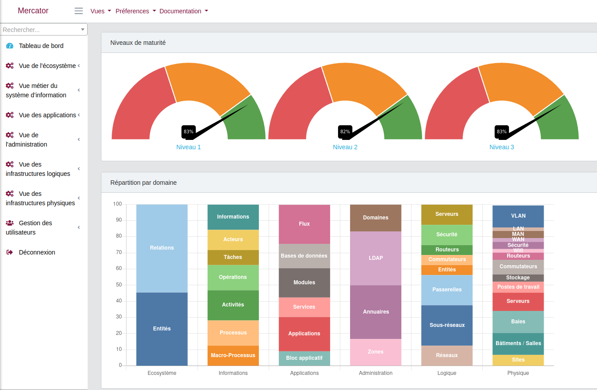
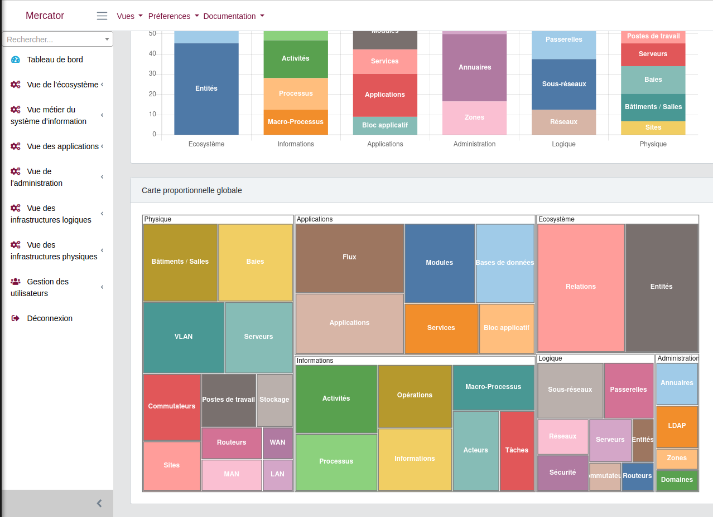
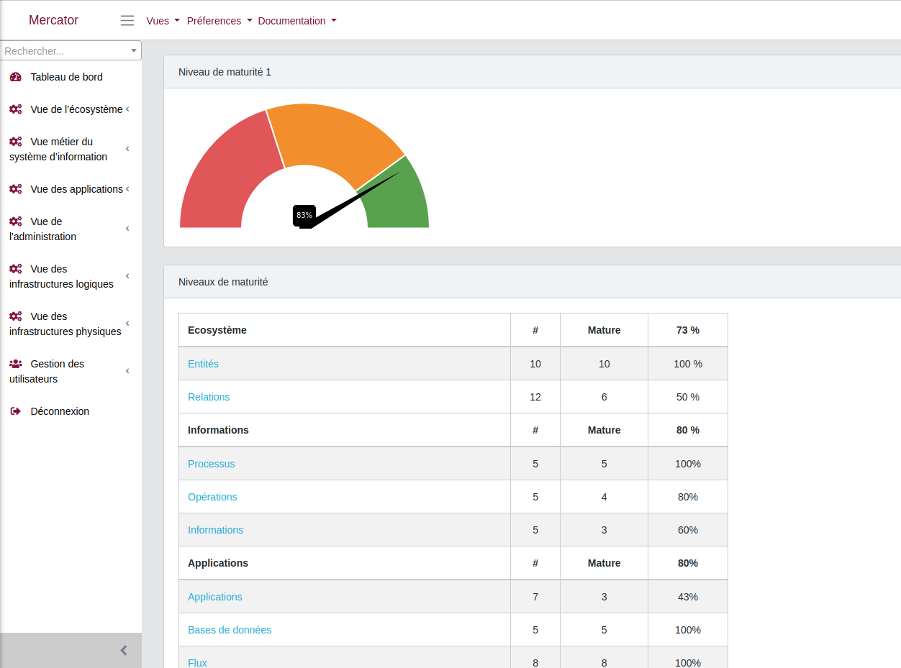
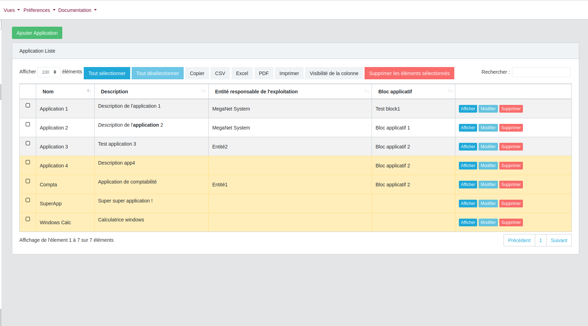
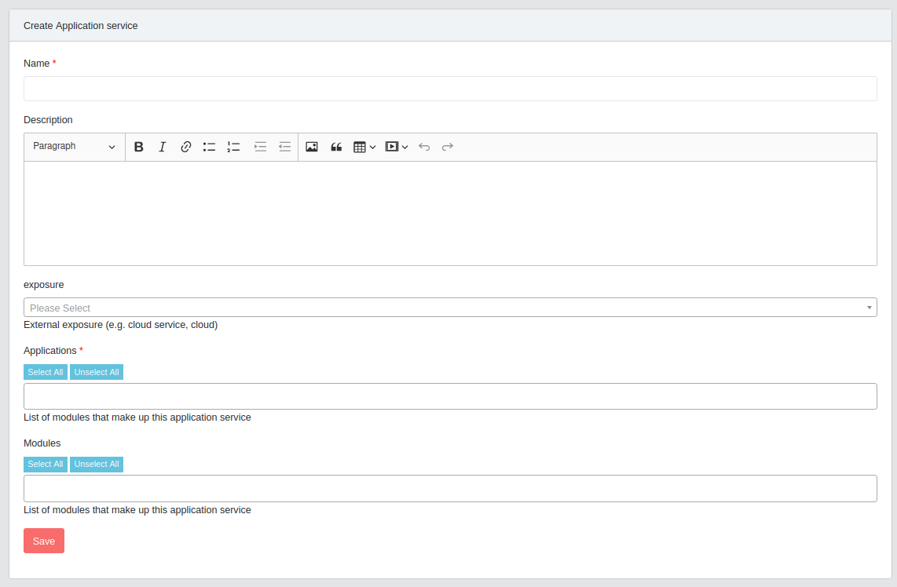
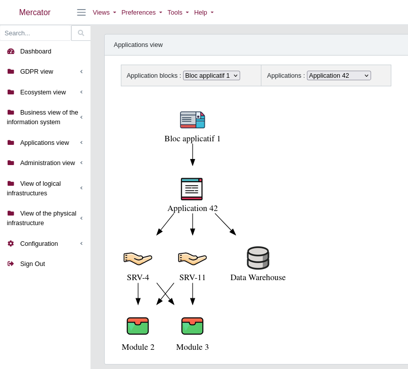
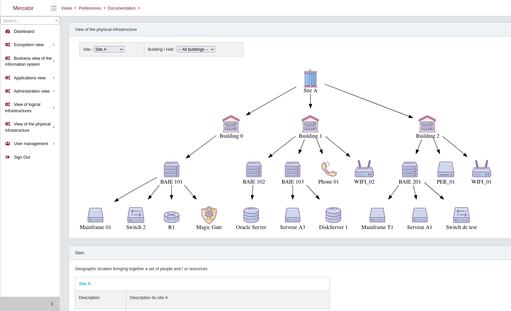
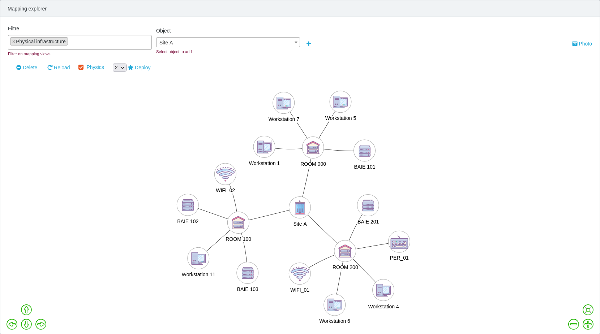
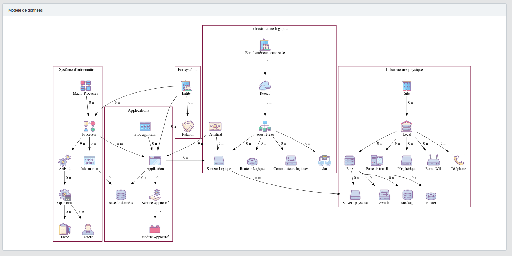

# Mercator

[](https://github.com/dbarzin/mercator/releases/latest)


[](https://artifacthub.io/packages/search?repo=mercator)
[](https://projects.ow2.org/view/mercator/)

### Introduction

À mesure que les systèmes d'information gagnent en complexité, les organisations peinent à maintenir une vision claire et à jour de ce qu'elles possèdent, de la façon dont les composants s'interconnectent et de leurs dépendances mutuelles. Sans cette visibilité, la gestion des risques, la conformité et la réponse aux incidents relèvent davantage de l'intuition que de la maîtrise.

Mercator est une application web Open Source qui répond à ce problème en permettant la cartographie structurée et dynamique de votre système d'information. Il offre aux équipes sécurité, aux architectes et aux responsables informatiques une représentation commune et vivante de leur environnement numérique — des processus métier jusqu'à l'infrastructure physique.

Mercator permet de visualiser les dépendances, d'identifier les actifs critiques, de suivre la conformité et d'alimenter les démarches d'audit et de gestion des risques — depuis une plateforme unique et cohérente. Il s'aligne sur les principaux référentiels et standards, dont le [Guide de cartographie de l'ANSSI](https://cyber.gouv.fr/publications/cartographie-du-systeme-dinformation), NIS2 et l'ISO 27001.

Reconnu pour sa pertinence opérationnelle et adopté par des organisations dans les secteurs de la santé, du secteur public et des infrastructures critiques, Mercator est l'outil Open Source de référence pour la gouvernance des systèmes d'information.


📚 [Explorer la Documentation](https://dbarzin.github.io/mercator/) | 🔍 [Voir les Sources de l'Application](https://github.com/dbarzin/mercator/tree/master/app)

📖 _Lire ceci dans d'autres langues :_ [Anglais](README.md)

## 🌟 **Principales fonctionnalités**

- 🖥️ **Visualisations Complètes :** Générer des représentations graphiques de votre écosystème, y compris les vues logiques, administratives et de l'infrastructure physique.
- 📝 **Rapports d'Architecture :** Créez automatiquement des rapports détaillés sur l'architecture de votre système d'information.
- 🗺️ **Diagrammes de Cartographie :** Dessinez et exportez des diagrammes de cartographie pour communiquer visuellement l'architecture du système.
- ✅ **Suivi de la Conformité :** Évaluez et calculez les niveaux de conformité de vos systèmes.
- 🔒 **Intégrations de Sécurité :** Recherchez des vulnérabilités en utilisant l'intégration [CVE-Search](https://github.com/cve-search/cve-search).
- 📊 **Exportation de Données :** Exportez des données dans divers formats, y compris Excel, CSV et PDF.
- 🌐 **API REST :** Intégrez facilement avec d'autres systèmes en utilisant l'API REST avec support JSON.
- 👥 **Gestion Multi-Utilisateurs :** Contrôle d'accès basé sur les rôles pour les environnements collaboratifs.
- 🌍 **Support Multilingue :** Disponible en plusieurs langues pour les équipes internationales.
- 🔗 **Intégration LDAP/Active Directory :** Connectez-vous avec des annuaires d'utilisateurs existants pour une authentification simplifiée.
- 🛠️ **Support CPE :** Exploitez [Common Platform Enumeration (CPE)](https://nvd.nist.gov/products/cpe) pour une identification améliorée du système.

## 🖼️ **Captures d'écran**

### 🏠 **Tableau de bord principal**
[](public/screenshots/mercator1.png) [](public/screenshots/mercator2.png)

### 📊 **Niveaux de Conformité**
[](public/screenshots/mercator3.png)

### 🔧 **Écrans de Saisie**
[](public/screenshots/mercator4.png) [](public/screenshots/mercator5.png)

### 🗺️ **Cartographie**
[](public/screenshots/mercator6.png) [](public/screenshots/mercator7.png)

### 🔍 **Exploration de Données**
[](public/screenshots/mercator9.png)

### 🗂️ **Modèle de Données**
[](public/screenshots/mercator8.png)

## 🛠️ **Technologies Utilisées**

- **Backend:** PHP, Laravel
- **Frontend:** JavaScript
- **Bases de Données:** MariaDB, MySQL, PostgreSQL, and SQLite ([Voir Documentation Laravel Database](https://laravel.com/docs/master/database#introduction))
- **Bibliothèques Supplémentaires:** WebAssembly, Graphviz, ChartJS

## 📦 **Installation**

### 🔧 Installation Manuelle

Pour des instructions détaillées, veuillez vous référer aux guides d'installation :
- [Installation sur Ubuntu](https://github.com/dbarzin/mercator/blob/master/guides/INSTALL_VM.fr.md)
- [Installation sur RedHat](https://github.com/dbarzin/mercator/blob/master/guides/INSTALL.RedHat.fr.md)

### 🐳 Installation via Docker

Démarrez rapidement avec Docker. Exécutez une instance locale en mode développement avec la base de données de démonstration :

```bash
docker run -it --rm -e USE_DEMO_DATA=1 -p 8080:8080 --name mercator ghcr.io/dbarzin/mercator:latest
```

Si vous ne souhaitez pas utiliser la base de données de démonstration, la première fois que vous démarrez Docker, vous devez initialiser la base de données pour créer l'utilisateur administrateur avec l'option SEED_DATABASE:

```bash
docker run -it --rm -e SEED_DATABASE=1 -p 8080:8080 --name mercator ghcr.io/dbarzin/mercator:latest
```

Pour rendre vos données persistantes avec SQLite :

```bash
touch ./db.sqlite && chmod a+w ./db.sqlite
docker run -it --rm -e APP_ENV=development -p 8080:8080 -v $PWD/db.sqlite:/var/www/mercator/sql/db.sqlite ghcr.io/dbarzin/mercator:latest
```

Populez la base de données avec des données de démonstration :

```bash
docker run -it --rm \
           -e APP_ENV=development \
           -p 8080:8080 \
           -v $PWD/db.sqlite:/var/www/mercator/sql/db.sqlite \
           -e USE_DEMO_DATA=1 \
           ghcr.io/dbarzin/mercator:latest
```

Accédez à votre instance via [http://127.0.0.1:8080](http://127.0.0.1:8080).

    user : admin@admin.com
    password : password

Pour un environnement de production prêt à l'emploi avec HTTPS et une configuration automatisée, consultez le dossier [docker-compose](docker-compose/).

## 📜 **Changelog**

Restez informé des dernières améliorations et mises à jour dans le [Changelog](https://github.com/dbarzin/mercator/blob/master/CHANGELOG.md).

## 📄 **Licence**

Mercator est un logiciel open-source distribué sous la licence [GPL](https://www.gnu.org/licenses/licenses.html).

## 🤝 Partenariats

Mercator est un projet open source soutenu par l'[organisation OW2](https://www.ow2.org/view/Mercator/), qui promeut des logiciels libres fiables, industriels et interopérables.

[](https://projects.ow2.org/view/mercator)
