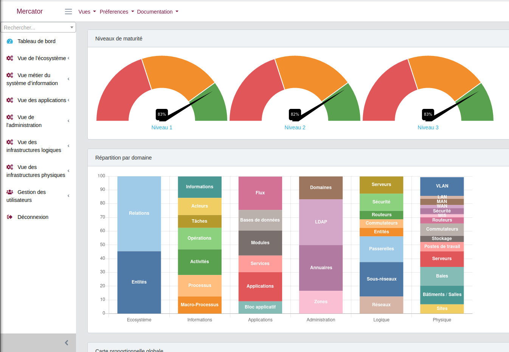
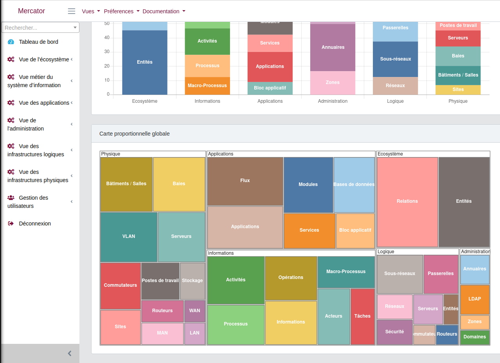
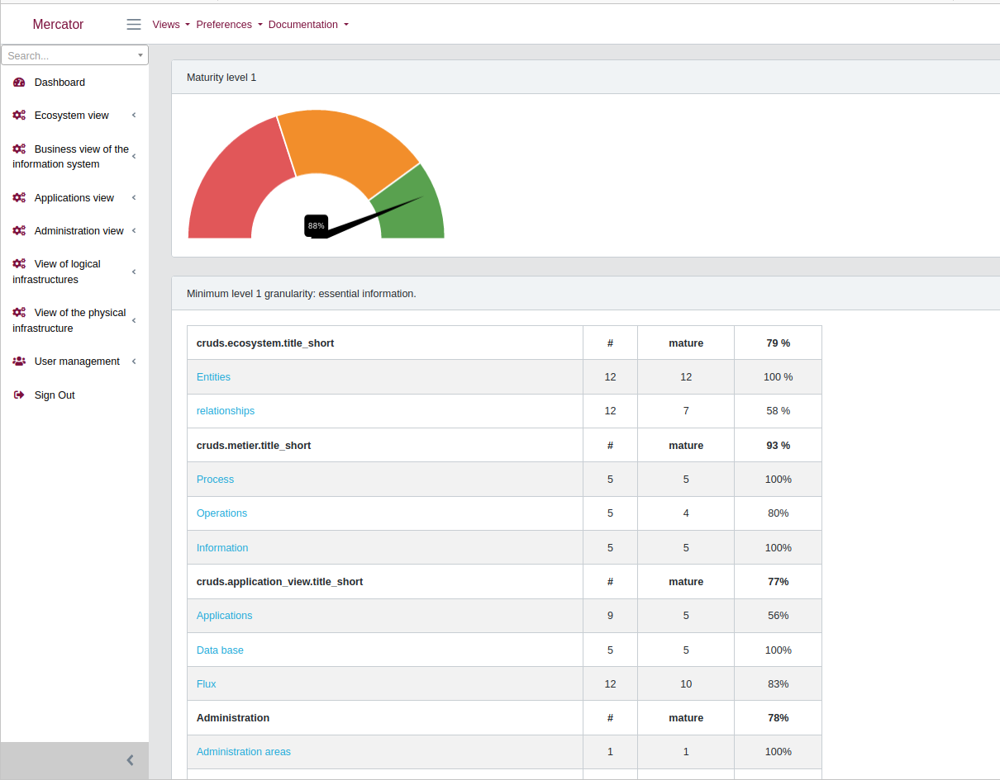
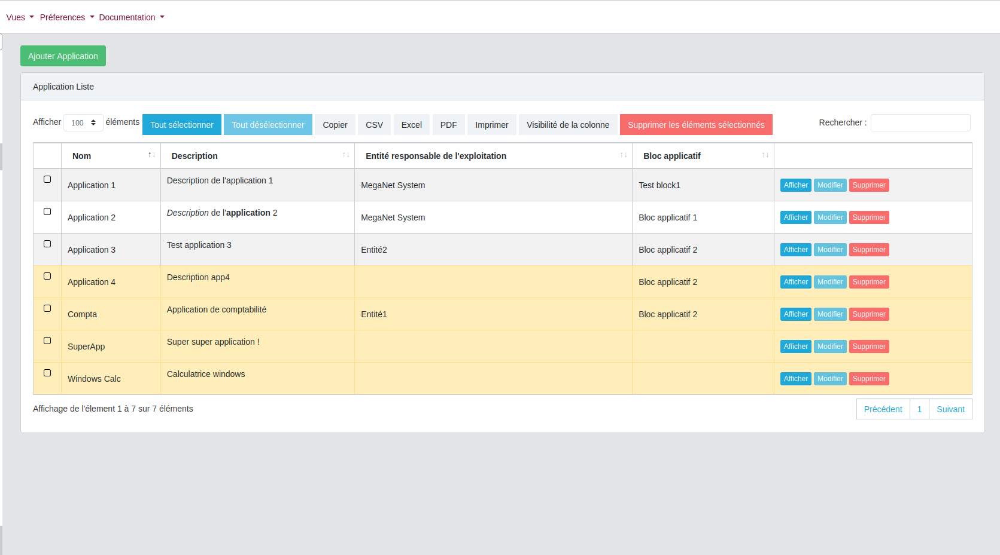
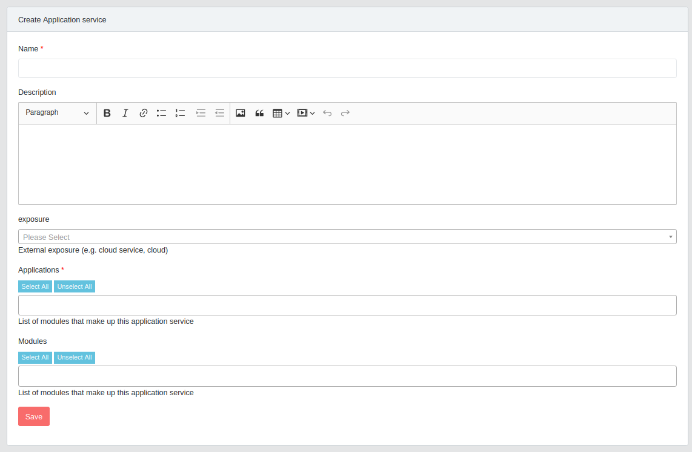
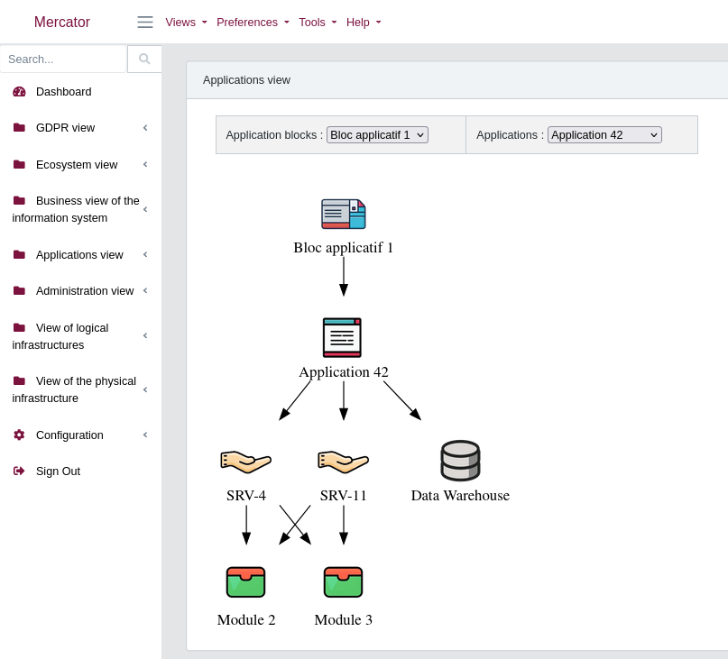
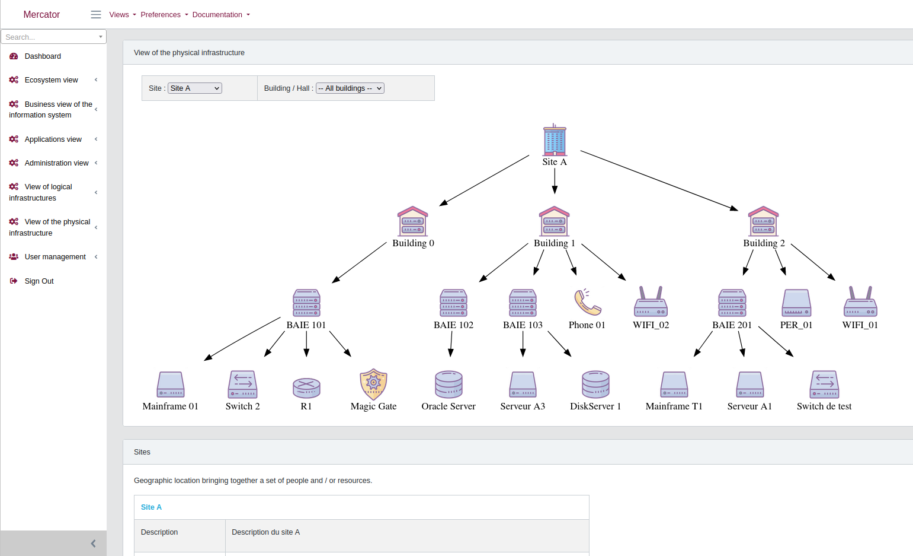
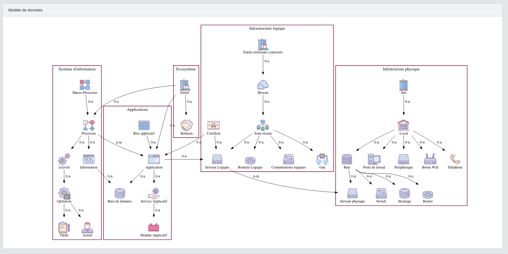

# Mercator

Mercator is a web application allowing to manage the mapping of an information system as described in the 
[Mapping The Information System Guide](https://www.ssi.gouv.fr/en/guide/mapping-the-information-system/) 
of the [ANSSI](https://www.ssi.gouv.fr/). 

Read this in other languages: [French](README.fr.md)

## Introduction

Computer attacks occur in a constantly changing environment. 
To meet these challenges, it is necessary to implement a global approach to risk management within the organization. 

The mapping of the Information System allows to have a global view of all the elements which constitute the information 
system to obtain a better readability, and thus a better control. 

The elaboration of a cartography participates in the protection, the defense and the resilience of the information system. 
It is an essential tool for the control of its information system (IS) and is an obligation for Operators of Vital Importance (OVI) 
and is part of a global risk management and a global risk management approach.

## Major functions
- View management (ecosystem, information system, administration, logical, applications, and physical)
- Generation of the Information System Architecture report
- Drawing of mapping diagrams
- Calculation of compliance levels
- Extraction in Excel, CSV, PDF ... of all lists
- Multi-user with role management
- Multilingual

## Screens

Main page

Compliance Levels

Input screen

Drawing of the cartography

Data model

## Technologies
- PHP, Javascript, Laravel
- Supported databases: MySQL, Postgres, SQLite, SQL Server
- WebAssembly + Graphviz
- ChartJS

## TODO
- user documentation
- develop REST APIs to populate the database

## Installation

- [Installation](https://github.com/dbarzin/mercator/blob/master/INSTALL.md) 
- Deployment under [Docker](https://github.com/dbarzin/mercator/blob/master/docker/README.md)

## Changelog

All notable changes to this project are [documented](https://github.com/dbarzin/mercator/blob/master/CHANGELOG.md).

## License

Mercator is an open source software distributed under [GPL](https://www.gnu.org/licenses/licenses.fr.html).

