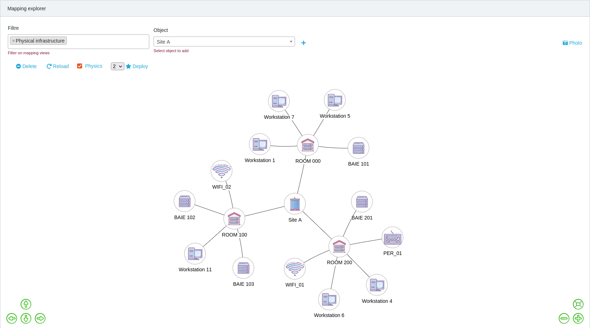

# Mercator

Mercator is an Open Source web application to manage the mapping of an information system as described in the [Mapping The Information System Guide](https://www.ssi.gouv.fr/en/guide/mapping-the-information-system/) of the [ANSSI](https://www.ssi.gouv.fr/en/).
The [documentation](https://dbarzin.github.io/mercator/) and [application sources](https://dbarzin.github.io/mercator/) are published on GitHub.

[](https://github.com/dbarzin/mercator/releases/latest)


Read this in other languages: [French](README.fr.md)

## Introduction

Computer attacks occur in a constantly changing environment. To meet these challenges, it is necessary to implement a global approach to risk management within the organization.

The mapping of the Information System allows to have a global view of all the elements which compose the information system to obtain a better readability, and thus a better control.

The elaboration of a cartography participates in the protection, the defense and the resilience of the information system. It is an essential tool for the control of its information system and is an obligation for operators of vital importance and is part of a global risk management approach.

## Major functions

- Graphical views of the ecosystem, information system, administration, logical, applications, and physical infrastructure
- Generate information system architecture report
- Draw mapping diagrams
- Compute compliance levels
- Search for CVE with [CVE-Search](https://github.com/cve-search/cve-search)
- Extraction in Excel, CSV, PDF ... of all lists
- REST API with JSON
- Multi-user with role management
- Multilingual
- Connection to LDAP or Active Directory
- [CPE](https://nvd.nist.gov/products/cpe) - Common Platform Enumeration

## Screens

Main page

[](public/screenshots/mercator1.png) [](public/screenshots/mercator2.png)

Compliance Levels

[](public/screenshots/mercator3.png)

Input screen

[](public/screenshots/mercator4.png) [](public/screenshots/mercator5.png)

Drawing of the cartography

[](public/screenshots/mercator6.png) [](public/screenshots/mercator7.png)

Explore

[](public/screenshots/mercator9.png)

Data model

[](public/screenshots/mercator8.png)

## Technologies

- PHP, Javascript, Laravel
- Supported databases: MySQL, Postgres, SQLite, SQL Server (see: [Laravel/Databases/introduction](https://laravel.com/docs/master/database#introduction) )
- WebAssembly + Graphviz
- ChartJS

## Installation

### Manual

- See [Installation](https://github.com/dbarzin/mercator/blob/master/INSTALL.md) on Ubuntu
- See [Installation](https://github.com/dbarzin/mercator/blob/master/INSTALL.RedHat.md) on RedHat

### Docker

First download the docker image.

```shell
docker pull ghcr.io/dbarzin/mercator:latest
```

Then you can run an ephemeral local instance in development mode (i.e. http):

```shell
docker run -it --rm --name mercator -e USE_DEMO_DATA=1 -p "127.0.0.1:8000":80 ghcr.io/dbarzin/mercator:latest
```

By default it uses an SQLite backend. If you want to make data persistent:

```shell
touch ./db.sqlite && chmod a+w ./db.sqlite
docker run -it --rm --name mercator -e APP_ENV=development -p "127.0.0.1:8000":80 -v $PWD/db.sqlite:/var/www/mercator/sql/db.sqlite ghcr.io/dbarzin/mercator:latest
```

Finally you can populate the database with demo data through the `USE_DEMO_DATA` environment variable:

```shell
touch ./db.sqlite && chmod a+w ./db.sqlite
docker run -it --rm \
           --name mercator \
           -e APP_ENV=development \
           -p "127.0.0.1:8000":80 \
           -v $PWD/db.sqlite:/var/www/mercator/sql/db.sqlite \
           -e USE_DEMO_DATA=1 \
           ghcr.io/dbarzin/mercator:latest
```

Visit http://127.0.0.1:8000 !

If you are looking for a more robust (https) and automated environment, please have a look on [docker-compose](docker-compose/) folder.

## Changelog

All notable changes to this project are [documented](https://github.com/dbarzin/mercator/blob/master/CHANGELOG.md).

## License

Mercator is an open source software distributed under [GPL](https://www.gnu.org/licenses/licenses.html).
