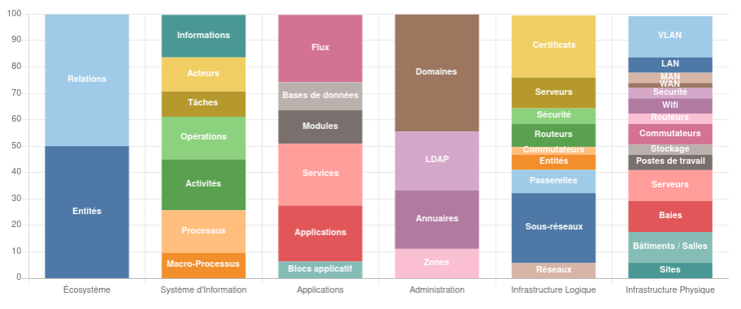
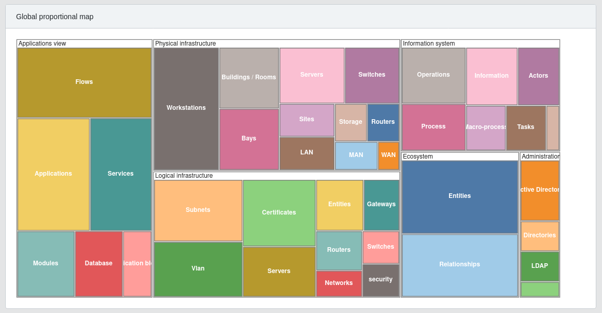
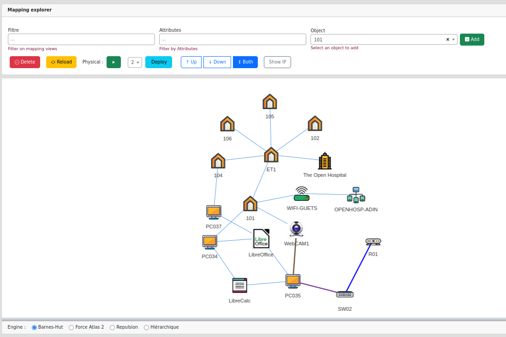

# Application

🇫🇷 [Lire en français](/mercator/fr/application)

### Main page

The main page is divided into three parts:

* Compliance levels

   

* The distribution of cartography objects by domain. 

   

* The global proportional map of cartography objects.

   

Each item is selectable and gives access to the list of selected map objects.

### Menus

* The left side menu provides access to:
    * the dashboard
    * through the views, to the various cartographic object management screens
    * role and user management screens
    * the logout button
* The top menu gives access to :
    * Views
    * Preferences
    * Documentation and reports
* Search tool

### Explorer

It is possible to explore the cartography. This function is available via the "documentation" menu.

- The filter drop-down menu allows you to limit exploration to one or more areas.
- The "Object" field is used to select an element of the cartography and add it to the exploration.
- The "Delete" button is used to remove an element from the cartography exploration.

   

Double-click on an object to display all its connections.

