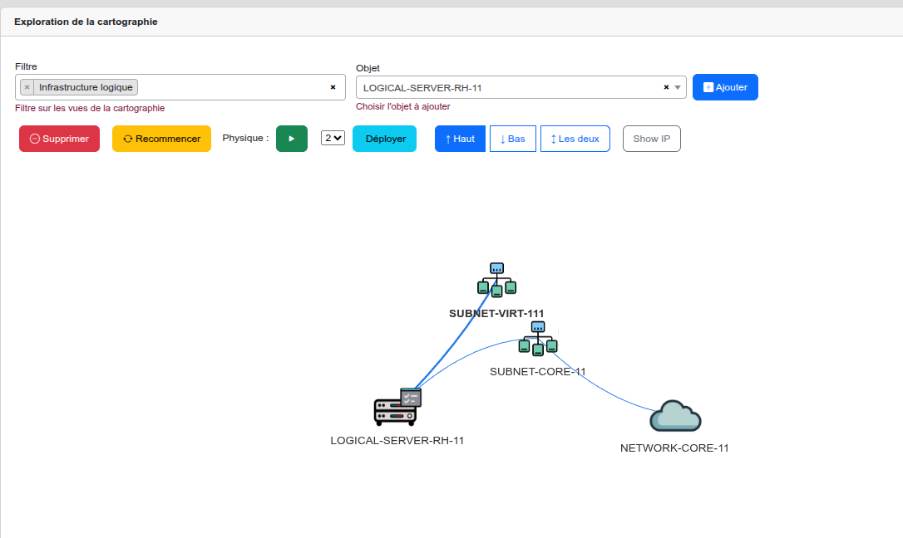

## Fonctionnalité Exploration

L'outil **Exploration** (`Outils → Exploration`) permet de naviguer dynamiquement dans le graphe de relations entre les
assets. Il révèle les dépendances entre couches : vers le **haut** (abstrait / métier) ou vers le **bas** (concret /
physique).

## 1. Interface

[](images/explorer.fr.png)

| Élément UI       | Type             | Rôle                                                         |
|------------------|------------------|--------------------------------------------------------------|
| **Filtre**       | Champ texte      | Filtre sur les vues de la cartographie (ex : `Applications`) |
| **Objet**        | Liste déroulante | Sélection de l'asset à explorer (ex : `RH-Solution`)         |
| **Ajouter**      | Bouton bleu      | Ajoute l'asset sélectionné dans la fenêtre graphique         |
| **Physique**     | Toggle vert      | Active/désactive l'affichage des liaisons physiques          |
| **Niveau (1–5)** | Sélecteur        | Nombre de niveaux de relations à déployer                    |
| **Déployer**     | Bouton vert      | Lance l'exploration selon les paramètres définis             |
| **↑ Haut**       | Bouton cyan      | Déploie vers les couches supérieures (abstrait / métier)     |
| **↓ Bas**        | Bouton cyan      | Déploie vers les couches inférieures (concret / physique)    |
| **↕ Les deux**   | Bouton cyan      | Déploie dans les deux sens simultanément                     |
| **Supprimer**    | Bouton rouge     | Retire l'asset sélectionné du graphe                         |
| **Recommencer**  | Bouton jaune     | Réinitialise entièrement le graphe                           |
| **Show IP**      | Bouton gris      | Affiche les adresses IP sur les assets réseau                |

---

## 2. Comprendre le champ Filtre

> ⚠️ **Point critique** : le champ Filtre a un double effet qu'il est essentiel de comprendre avant d'explorer le graphe.

### 2.1 Effet 1 — Restreindre la liste déroulante "Objet"

C'est l'usage le plus intuitif. En saisissant une vue dans le champ Filtre (ex : `Applications`), la liste déroulante "Objet" n'affiche plus que les assets appartenant à cette vue. Cela évite de chercher un asset dans l'intégralité de la CMDB.

### 2.2 Effet 2 — Limiter la visibilité des assets dans le graphe (piège fréquent)

C'est l'effet le moins attendu, et la source d'erreurs la plus courante. **Le filtre ne se contente pas de restreindre la liste "Objet" : il conditionne également les types d'assets qui s'afficheront dans le graphe lors de l'exploration.**

Concrètement : si vous explorez un `logical-server` avec uniquement `Infrastructure logique` dans le filtre, les applications liées à ce serveur n'apparaîtront **jamais** dans le graphe, même si elles existent dans Mercator et sont correctement associées. Elles sont simplement exclues car leur type n'est pas couvert par le filtre actif.

**Exemple illustré :**

| Filtre actif             | Asset exploré           | Résultat dans le graphe                                                      |
|--------------------------|-------------------------|------------------------------------------------------------------------------|
| `Infrastructure logique` | `LOGICAL-SERVER-RH-11`  | On voit : `NETWORK-CORE-11`, `SUBNET-CORE-11`, `SUBNET-VIRT-111` — mais pas `RH-Solution` |
| `Applications` + `Infrastructure logique` | `LOGICAL-SERVER-RH-11` | On voit en plus : `RH-Solution` et `DB-RH-PROD`                |
| *(vide)*                 | N'importe quel asset    | Tous les assets liés sont visibles, toutes couches confondues                |

[](images/exploration_filtre_infra.fr.png)
*Avec filtre "Infrastructure logique" uniquement : RH-Solution n'apparaît pas.*

[](images/exploration_filtre_full.fr.png)
*Avec filtres "Applications" + "Infrastructure logique" : RH-Solution et DB-RH-PROD apparaissent.*

### 2.3 Règle pratique : quel filtre choisir ?

| Objectif                                                        | Filtre recommandé                                         |
|-----------------------------------------------------------------|-----------------------------------------------------------|
| Trouver rapidement un asset dans une vue précise                | Saisir uniquement la vue ciblée (ex : `Applications`)     |
| Exploration cross-couches (application + infrastructure)        | Saisir **toutes** les vues concernées, ou laisser vide    |
| Analyse d'impact complète (toutes couches)                      | **Laisser le filtre vide** pour ne rien exclure           |
| Exploration limitée à une seule couche (ex : réseau uniquement) | Saisir uniquement la vue de cette couche                  |

> 💡 **Conseil** : en cas de doute sur ce que l'on cherche, commencez toujours avec le filtre **vide**. Vous pouvez le restreindre ensuite si le graphe devient trop dense.

---

## 3. Sémantique des boutons directionnels

La direction est relative à la **hiérarchie des couches Mercator**, alignée sur ArchiMate :

```
↑ HAUT  ═══════════════════════════════════════════════  vers 100 (Métier)
         Couche 1 : Entités, Processus, Acteurs (100–260)
         Couche 2 : Applications, Modules, BDD  (300–340)
         Couche 3 : IAM, Active Directory        (400–460)
         Couche 4 : Réseaux, VMs, Conteneurs     (500–580)
         Couche 5 : Physique, Sites, Baies        (600–675)
↓ BAS   ═══════════════════════════════════════════════  vers 675 (Physique)
```

| Bouton         | Direction                    | Signification                                                                       | Exemple depuis `RH-Solution`                        |
|----------------|------------------------------|-------------------------------------------------------------------------------------|-----------------------------------------------------|
| **↑ Haut**     | Vers les couches supérieures | Remonte vers le métier, les processus et les acteurs qui utilisent cet asset        | `Application → Processus RH → Acteurs DRH`          |
| **↓ Bas**      | Vers les couches inférieures | Descend vers l'infrastructure, les serveurs et les réseaux qui supportent cet asset | `Application → VM → Serveur physique → Baie → Site` |
| **↕ Les deux** | Bidirectionnel               | Vue complète : qui utilise cet asset ET sur quoi il repose                          | `Processus ← Application → Serveur → Physique`      |

---

## 4. Procédure d'utilisation pas à pas

```
Étape 1 ─ Saisir un filtre (optionnel)
          └─ Champ "Filtre" : ex. "Applications"
             Restreint la liste des objets à une vue spécifique

Étape 2 ─ Sélectionner l'asset de départ
          └─ Liste déroulante "Objet" : ex. "RH-Solution"

Étape 3 ─ Ajouter l'asset au graphe
          └─ Cliquer sur le bouton bleu "Ajouter"
             L'asset apparaît dans la fenêtre graphique

Étape 4 ─ Sélectionner l'asset dans le graphe
          └─ Cliquer sur l'icône de l'asset dans la zone graphique
             (il doit être actif / sélectionné)

Étape 5 ─ Choisir la direction
          └─ Cliquer sur : ↑ Haut  |  ↓ Bas  |  ↕ Les deux

Étape 6 ─ Définir le nombre de niveaux
          └─ Sélecteur numérique : 1 à 5
             Commencer par 1 ou 2 pour les assets très connectés

Étape 7 ─ Déployer
          └─ Cliquer sur le bouton vert "Déployer"
             Le graphe se construit avec les relations trouvées

Étape 8 ─ Itérer (optionnel)
          └─ Cliquer sur un autre nœud du graphe
             Répéter à partir de l'étape 4
```

---

## 5. Exemples d'Exploration

### 5.1 Impact métier d'une application

> **Contexte :** Quels processus métier et acteurs dépendent de `RH-Solution` ?

| Paramètre | Valeur         |
|-----------|----------------|
| Filtre    | `Applications` |
| Objet     | `RH-Solution`  |
| Direction | **↑ Haut**     |
| Niveaux   | `3`            |

**Résultat attendu :**

```
RH-Solution
 └── APPLI-RH-MOD-1 (module)
      └── Processus Gestion RH
           └── Acteur : Direction RH
```

Vous obtenez la liste de tous les processus et acteurs qui dépendent fonctionnellement de cette application.

---

### 5.2 Infrastructure supportant une application

> **Contexte :** Sur quel matériel physique repose `RH-Solution` ? (pour PRA, analyse d'impact ITIL, CMDB)

| Paramètre | Valeur         |
|-----------|----------------|
| Filtre    | `Applications` |
| Objet     | `RH-Solution`  |
| Direction | **↓ Bas**      |
| Niveaux   | `3`            |

**Résultat attendu :**

```
RH-Solution
 ├── APPLI-RH-SRV-1 (service applicatif)
 └── DB-RH-PROD (base de données)
      └── VM-APP-RH-01 (serveur logique)
           └── SRV-PROD-01 (serveur physique)
                └── RACK-A3 (baie)
                     └── Site DC-Paris
```

Vous obtenez la chaîne complète depuis l'application jusqu'au site physique.

---

### 5.3 Analyse d'impact complète (avant maintenance / incident)

> **Contexte :** Vue complète de TOUTES les dépendances de `RH-Solution` avant une maintenance.

| Paramètre | Valeur         |
|-----------|----------------|
| Filtre    | `Applications` |
| Objet     | `RH-Solution`  |
| Direction | **↕ Les deux** |
| Niveaux   | `3`            |

**Résultat attendu :**

```
         Macro-processus : Gestion du Personnel
              └── Processus RH → Acteur DRH
                       ↑
              [RH-Solution]  ← asset central
                       ↓
         APPLI-RH-SRV-1 · APPLI-RH-MOD-1 · DB-RH-PROD
              └── Serveurs logiques → Physiques → Baies → Site
```

Idéal pour les **dossiers d'architecture** et les **analyses d'impact**.

---

### 5.4 Sélection de la direction selon le cas d'usage

| Cas d'usage                             | Direction  | Couches traversées                                |
|-----------------------------------------|------------|---------------------------------------------------|
| Qui utilise cette application ?         | ↑ Haut     | Application → Processus → Acteurs                 |
| Sur quoi repose ce serveur ?            | ↓ Bas      | Serveur logique → Physique → Baie → Site          |
| Analyse d'impact complète               | ↕ Les deux | Métier ↔ Application ↔ Infrastructure             |
| Quels processus dépendent d'une BDD ?   | ↑ Haut     | Base de données → Application → Processus         |
| Quels équipements réseau sous un VLAN ? | ↓ Bas      | VLAN → Switch → Routeur physique                  |
| Cartographie d'un domaine AD            | ↕ Les deux | Forest AD → Domaine → Zone Admin → Serveurs       |
| Quels assets un acteur utilise-t-il ?   | ↓ Bas      | Acteur → Processus → Application → Infrastructure |

---

## 6. Correspondance BPMN — ArchiMate — Mercator

| Asset Mercator               | BPMN 2.0           | ArchiMate 3.1         | TOGAF                 |
|------------------------------|--------------------|-----------------------|-----------------------|
| `entities` (100)             | Pool / Lane        | Business Actor        | Organizational Unit   |
| `macro-processuses` (200)    | Process (niveau 1) | Business Process      | Business Function     |
| `processes` (210)            | Sub-Process        | Business Process      | Business Service      |
| `activities` (220)           | Task / Activity    | Business Function     | Business Function     |
| `tasks` (240)                | Task (atomique)    | Business Interaction  | —                     |
| `actors` (250)               | Lane / Performer   | Business Role         | Business Actor        |
| `information` (260)          | Data Object        | Business Object       | Data Entity           |
| `applications` (310)         | —                  | Application Component | Application Component |
| `application-services` (320) | —                  | Application Service   | Application Service   |
| `databases` (340)            | Data Store         | Data Object           | Data Store            |
| `logical-servers` (580)      | —                  | System Software       | Platform Service      |
| `physical-servers` (615)     | —                  | Device                | Technology Component  |
| `sites` (600)                | —                  | Location              | Geography             |

### Relations ArchiMate dans Mercator

| Relation ArchiMate           | Direction Exploration | Exemple Mercator                             |
|------------------------------|-----------------------|----------------------------------------------|
| **Serving** (sert)           | ↑ Haut                | Application Service sert un Business Process |
| **Realization** (réalise)    | ↕ Les deux            | Application réalise un Business Service      |
| **Assignment** (affecté à)   | ↓ Bas                 | Logical Server assigné à Physical Server     |
| **Composition** (composé de) | ↓ Bas                 | Site contient Buildings contient Bays        |
| **Association**              | ↕ Les deux            | Application associée à Database              |

---

## 7. Bonnes Pratiques

### 7.1 Recommandations pour l'exploration

**Commencer par le niveau 1 ou 2**
Pour les assets très connectés (ex : application centrale), démarrer avec 1 ou 2 niveaux évite un graphe illisible.
Augmenter ensuite progressivement.

**Utiliser le filtre avec discernement**
Comme expliqué au chapitre 2, le filtre conditionne non seulement la liste des objets disponibles, mais aussi les assets visibles dans le graphe. Pour une exploration cross-couches, pensez à ajouter toutes les vues pertinentes ou à laisser le filtre vide.

**Mode Physique**
Activer le toggle Physique uniquement quand vous souhaitez visualiser les liaisons réseau physiques (WAN/LAN/MAN).
Désactivé, l'exploration reste au niveau logique.

### 7.2 Recommandations pour la saisie des assets

- Respecter la numérotation Mercator : créer les assets de la couche physique (600+) avant de les associer aux couches
  logiques.
- La relation de containment physique doit être saisie dans l'ordre : **Site → Building → Bay → Physical Server**.
- Un `logical-server` (VM) doit toujours être rattaché à un `physical-server` pour que la navigation ↓ Bas fonctionne
  correctement.
- Les `certificates` (570) sont transverses : les associer aux applications ET aux serveurs logiques pour une
  exploration complète.
- Les `external-connected-entities` (540) peuvent être rattachées à la couche métier (partenaires) ou réseau (
  connexions) selon le contexte.

### 7.3 Cas d'usage par profil utilisateur

| Profil                      | Direction privilégiée | Cas d'usage typique                                          |
|-----------------------------|-----------------------|--------------------------------------------------------------|
| Architecte d'entreprise     | ↑ Haut                | Tracer l'alignement entre infrastructure et processus métier |
| Architecte infrastructure   | ↓ Bas                 | Identifier la chaîne physique supportant une application     |
| RSSI / Risk Manager         | ↕ Les deux            | Cartographier les dépendances pour l'analyse de risque       |
| Responsable CMDB            | ↓ Bas                 | Vérifier la complétude du chaînage physique                  |
| Gestionnaire de crise / PRA | ↕ Les deux            | Analyse d'impact avant/après incident                        |

---

## Références

- [GitHub Mercator](https://github.com/dbarzin/mercator)
- [ArchiMate 3.1](https://www.opengroup.org/archimate-forum/archimate-overview)
- [TOGAF ADM](https://www.opengroup.org/togaf)
- [BPMN 2.0](https://www.omg.org/spec/BPMN/2.0/)
