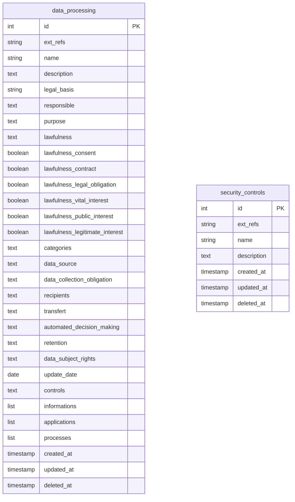
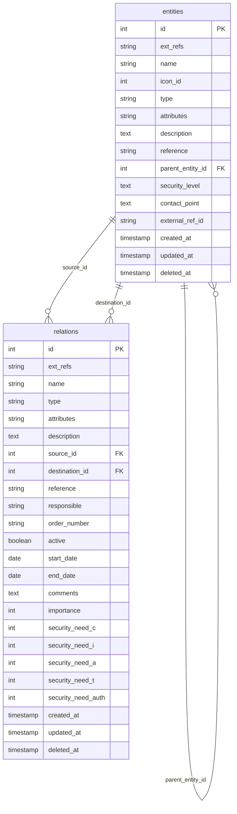
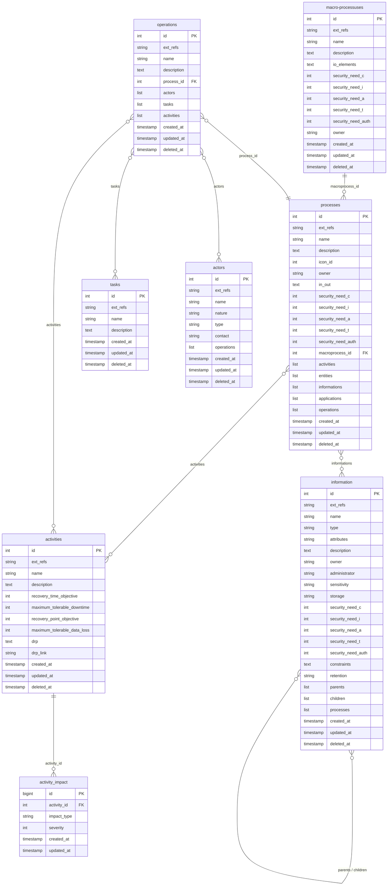
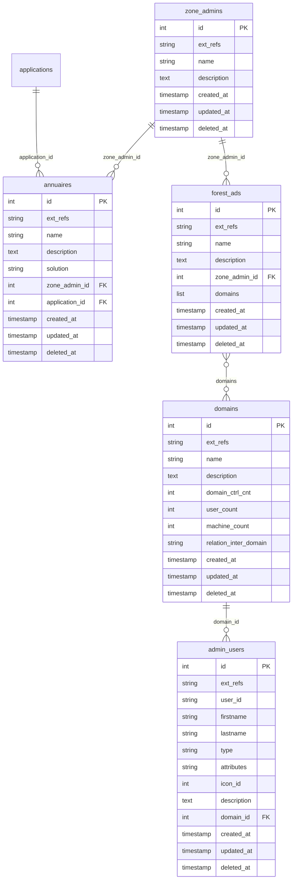
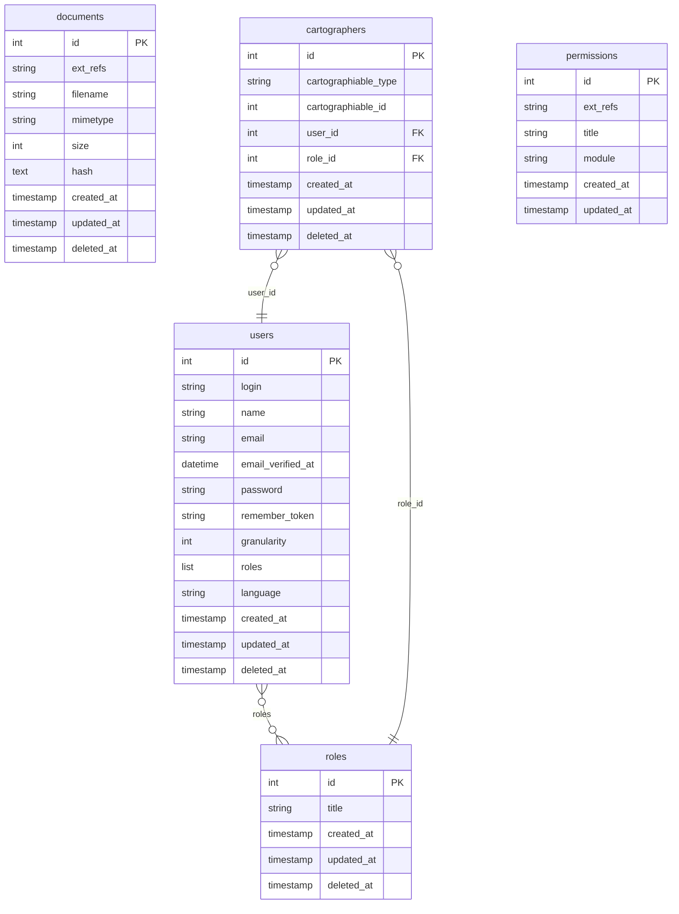

# Modèle de données

Schéma simplifier du modèle de données 

[](images/model.fr.png)

## Vue du RGPD

La vue du RGPD contient l'ensemble des données nécessaires au maintien du registre des traitements et fait le lien avec
les processus, applications et informations utilisées par le système d'information.

Cette vue permet de remplir les obligations prévues à l’article 30 du RGPD.



Il n'y a pas de relation directe entre `data_processing` et `security_controls` au sein de cette vue : les deux
tables sont rattachées aux processus et aux applications, qui appartiennent à d'autres vues (voir
[vue métier](#processus) et [vue des applications](#applications)).

### Registre

Le registre des activités de traitement contient les informations prévues à l'article 30.1 du RGPD.

| Table                                               | api                     |
|:----------------------------------------------------|:------------------------|
| <span style="color: blue;">*data_processing*</span> | `/api/data-processings` |

| Champ                          | Type         | Description                                                                                                     |
|:-------------------------------|:-------------|:----------------------------------------------------------------------------------------------------------------|
| id                             | int unsigned | auto_increment                                                                                                  |
| ext_refs | varchar(255) | Référence(s) externe(s) vers des objets d'autres systèmes. Format : {ID_SOURCE}ID_OBJET, valeurs multiples séparées par « \| » |
| name                           | varchar(255) | Nom du traitement                                                                                               |
| description                    | longtext     | Description du traitement                                                                                       |
| legal_basis                    | varchar(255) | Base légale du traitement                                                                                       |
| responsible                    | longtext     | Responsable du traitement                                                                                       |
| purpose                        | longtext     | Finalités du traitement                                                                                         |
| lawfulness                     | text         | Licéité du traitement                                                                                           |
| lawfulness_consent             | tinyint(1)   | Licéité basée sur le consentement                                                                               |
| lawfulness_contract            | tinyint(1)   | Licéité contractuelle                                                                                           |
| lawfulness_legal_obligation    | tinyint(1)   | Licéité basée sur une obligation légale                                                                         |
| lawfulness_vital_interest      | tinyint(1)   | Licéité basée sur un intérêt vital                                                                              |
| lawfulness_public_interest     | tinyint(1)   | Licéité basée sur un intérêt public                                                                             |
| lawfulness_legitimate_interest | tinyint(1)   | Licéité basée sur un intérêt légitime                                                                           |
| categories                     | longtext     | Catégories de destinataires                                                                                     |
| data_source                    | longtext     | Source de données                                                                                               |
| data_collection_obligation     | longtext     | Caractère obligatoire ou facultatif du recueil des données et conséquences en cas de non-fourniture des données |
| recipients                     | longtext     | Destinataires des données                                                                                       |
| transfert                      | longtext     | Transferts de données                                                                                           |
| automated_decision_making      | longtext     | Prise de décision automatisée                                                                                   |
| retention                      | longtext     | Durées de rétention                                                                                             |
| data_subject_rights            | longtext     | Droits des personnes concernées                                                                                 |
| update_date                    | date         | Date de mise à jour du registre                                                                                 |
| controls                       | longtext     | Mesures de sécurité                                                                                             |
| informations                   | List int [,] | Liste d'id des informations liées                                                                               |
| applications                   | List int [,] | Liste d'id des applications liées                                                                               |
| processes                      | List int [,] | Liste d'id des processus liés                                                                                   |
| created_at                     | timestamp    | Date de création                                                                                                |
| updated_at                     | timestamp    | Date de mise à jour                                                                                             |
| deleted_at                     | timestamp    | Date de suppression                                                                                             |

Le champ "controls" n'est pas utilisé et est donc absent de l'application.

L'export du modèle de données référence les processus, les informations, les applications et les documents
rattachés à un traitement de données.

Dans l'application, un processus peut être rattaché à un traitement de données depuis un objet traitement
de données.  
Une information peut être rattachée à un traitement de données depuis un objet traitement de données.

Une application peut être rattachée à un traitement de données depuis un objet traitement de données.  
Un document peut être rattaché à un traitement de données depuis un objet traitement de données.

### Mesures de sécurité

Cette table permet d'identifier les mesures de sécurité appliquées aux processus et applications.

Par défaut cette table est complétée avec les mesures de sécurité de la norme ISO 27001:2022.

| Table                                                 | api                      |
|:------------------------------------------------------|:-------------------------|
| <span style="color: blue;">*security_controls*</span> | `/api/security-controls` |

| Champ       | Type         | Description              |
|:------------|:-------------|:-------------------------|
| id          | int unsigned | auto_increment           |
| ext_refs | varchar(255) | Référence(s) externe(s) vers des objets d'autres systèmes. Format : {ID_SOURCE}ID_OBJET, valeurs multiples séparées par « \| » |
| name        | varchar(255) | Nom de la mesure         |
| description | longtext     | Description de la mesure |
| created_at  | timestamp    | Date de création         |
| updated_at  | timestamp    | Date de mise à jour      |
| deleted_at  | timestamp    | Date de suppression      |

## Vue de l’écosystème

La vue de l’écosystème décrit l’ensemble des entités ou systèmes qui gravitent autour du système d’information considéré
dans le cadre de la cartographie.

Cette vue permet à la fois de délimiter le périmètre de la cartographie, mais aussi de disposer d’une vision d’ensemble
de l’écosystème sans se limiter à l’étude individuelle de chaque entité.



### Entités

Les entités sont une partie de l’organisme (ex. : filiale, département, etc.) ou en relation avec le système
d’information qui vise à être cartographié.

Les entités sont des départements, des fournisseurs, des partenaires avec lesquels des informations sont échangées au
travers de relations.

| Table                                        | api             |
|:---------------------------------------------|:----------------|
| <span style="color: blue;">*entities*</span> | `/api/entities` |

| Champ            | Type         | Description                                   |
|:-----------------|:-------------|:----------------------------------------------|
| id               | int unsigned | auto_increment                                |
| ext_refs | varchar(255) | Référence(s) externe(s) vers des objets d'autres systèmes. Format : {ID_SOURCE}ID_OBJET, valeurs multiples séparées par « \| » |
| name             | varchar(255) | Nom de l'entité                               |
| icon_id          | int unsigned | Référence vers une image spécifique           |
| type             | varchar(255) | Type d'entité                                 |
| attributes       | varchar(255) | Attributs (#tag...). Une entité externe à l'organisme porte l'attribut `extern` |
| description      | longtext     | Description de l'entité                       |
| reference        | varchar(255) | Numéro de référence de l'entité (facturation) |
| parent_entity_id | int unsigned | Entité parente                                |
| security_level   | longtext     | Niveau de sécurité                            |
| contact_point    | longtext     | Point de contact                              |
| external_ref_id  | varchar(255) | Lien vers une entité extérieure connectée     |
| created_at       | timestamp    | Date de création                              |
| updated_at       | timestamp    | Date de mise à jour                           |
| deleted_at       | timestamp    | Date de suppression                           |

Le champ "external_ref_id" n'est pas utilisé et est donc absent de l'application.

L'export du modèle de données référence les processus et applications rattachées à une entité.

Dans l'application, un processus peut être rattaché à une entité depuis ces deux objets.  
Une application peut être rattachée à une entité (en tant que responsable de l'exploitation) depuis ces deux objets.

Dans l'application, une base de données peut être rattachée à une entité (en tant que responsable de l'exploitation)
depuis ces deux objets.

### Relations

Les relations représentent un lien entre deux entités ou systèmes.

Les relations sont des contrats, accords de services, des obligations légales... qui ont une influence sur le système
d’information.

| Table                                         | api              |
|:----------------------------------------------|:-----------------|
| <span style="color: blue;">*relations*</span> | `/api/relations` |

| Champ              | Type         | Description                                      |
|:-------------------|:-------------|:-------------------------------------------------|
| id                 | int unsigned | auto_increment                                   |
| ext_refs | varchar(255) | Référence(s) externe(s) vers des objets d'autres systèmes. Format : {ID_SOURCE}ID_OBJET, valeurs multiples séparées par « \| » |
| name               | varchar(255) | Nom de la relation                               |
| type               | varchar(255) | Type (Nature) de la relation                     |
| description        | longtext     | Description de la relation                       |
| attributes         | varchar(255) | Attributs (tags) de la relation                  |
| source_id          | int unsigned | Référence vers l'entité source                   |
| destination_id     | int unsigned | Référence vers l'entité destinataire             |
| reference          | varchar(255) | Numéro de référence de la relation (facturation) |
| responsible        | varchar(255) | Responsable de la relation                       |
| order_number       | varchar(255) | Numéro de commande (facturation)                 |
| active             | tinyint(1)   | La relation est encore active                    |
| start_date         | date         | Début de la relation                             |
| end_date           | date         | Fin de la relation                               |
| comments           | text         | Commentaires sur l'état de la relation           |
| importance         | int          | Importance de la relation                        |
| security_need_c    | int          | Confidentialité                                  |
| security_need_i    | int          | Intégrité                                        |
| security_need_a    | int          | Disponibilité                                    |
| security_need_t    | int          | Traçabilité                                      |
| security_need_auth | int          | Authenticité                                     |
| created_at         | timestamp    | Date de création                                 |
| updated_at         | timestamp    | Date de mise à jour                              |
| deleted_at         | timestamp    | Date de suppression                              |

Dans l'application, le besoin en authenticité est masqué par défaut. Il est obligatoire dans le cas
d'une entité soumise à la directive UE 2022/2554 (DORA).  
Il s'active depuis le menu Configuration > Paramètres.

L'export du modèle de données référence les documents de référence rattachés à une relation.  
Dans l'application, un document peut être rattaché à une relation depuis un objet relations.

Les valeurs financières d'un contrat peuvent être indiquées dans des champs dédiés.

---

## Vue métier du système d’information

La vue métier du système d’information décrit l’ensemble des processus métiers de l’organisme avec les acteurs qui y
participent, indépendamment des choix technologiques faits par l’organisme et des ressources mises à sa disposition.

La vue métier est essentielle, car elle permet de repositionner les éléments techniques dans leur environnement métier
et ainsi de comprendre leur contexte d’emploi.



*Remarque : les entités, applications et bases de données référencées par les processus/activités/informations
appartiennent à d'autres vues (Écosystème, Applications) et ne sont donc pas représentées dans ce schéma.*

### Macro-processus

Les macro-processus représentent des ensembles de processus.

| Table                                                 | api                      |
|:------------------------------------------------------|:-------------------------|
| <span style="color: blue;">*macro-processuses*</span> | `/api/macro-processuses` |

| Champ              | Type         | Description                    |
|:-------------------|:-------------|:-------------------------------|
| id                 | int unsigned | auto_increment                 |
| ext_refs | varchar(255) | Référence(s) externe(s) vers des objets d'autres systèmes. Format : {ID_SOURCE}ID_OBJET, valeurs multiples séparées par « \| » |
| name               | varchar(255) | Nom du macro processus         |
| description        | longtext     | Description du macro-processus |
| io_elements        | longtext     | Elements entrant et sortants   |
| security_need_c    | int          | Confidentialité                |
| security_need_i    | int          | Intégrité                      |
| security_need_a    | int          | Disponibilité                  |
| security_need_t    | int          | Traçabilité                    |
| security_need_auth | int          | Authenticité                   |
| owner              | varchar(255) | Propriétaire                   |
| created_at         | timestamp    | Date de création               |
| updated_at         | timestamp    | Date de mise à jour            |
| deleted_at         | timestamp    | Date de suppression            |

Dans l'application, le besoin en authenticité est masqué par défaut. Il est obligatoire dans le cas
d'une entité soumise à la directive UE 2022/2554 (DORA).  
Il s'active depuis le menu Configuration > Paramètres.

Dans l'application, un processus peut être rattaché à un macro-processus depuis ces deux objets.

### Processus

Les processus sont un ensemble d’activités concourant à un objectif. Le processus produit des informations (de sortie) à
valeur ajoutée (sous forme de livrables) à partir d’informations (d’entrées) produites par d’autres processus.

Les processus sont composés d’activités, des entités qui participent à ce processus et des informations traitées par
celui-ci.

| Table                                         | api              |
|:----------------------------------------------|:-----------------|
| <span style="color: blue;">*processes*</span> | `/api/processes` |

| Champ              | Type         | Description                         |
|:-------------------|:-------------|:------------------------------------|
| id                 | int unsigned | auto_increment                      |
| ext_refs | varchar(255) | Référence(s) externe(s) vers des objets d'autres systèmes. Format : {ID_SOURCE}ID_OBJET, valeurs multiples séparées par « \| » |
| name               | varchar(255) | Nom du processus                    |
| description        | longtext     | Description du processus            |
| icon_id            | int unsigned | Référence vers une image spécifique |
| owner              | varchar(255) | Propriétaire du processus           |
| in_out             | longtext     | Elements entrant et sortants        |
| security_need_c    | int          | Confidentialité                     |
| security_need_i    | int          | Intégrité                           |
| security_need_a    | int          | Disponibilité                       |
| security_need_t    | int          | Traçabilité                         |
| security_need_auth | int          | Authenticité                        |
| macroprocess_id    | int unsigned | Référence vers le macro-processus   |
| activities         | List int [,] | Liste d'id des activités liées     |
| entities           | List int [,] | Liste d'id des entitées liées       |
| informations       | List int [,] | Liste d'id des informations liées   |
| applications       | List int [,] | Liste d'id des applications liées   |
| operations         | List int [,] | Liste d'id des operations liées     |
| created_at         | timestamp    | Date de création                    |
| updated_at         | timestamp    | Date de mise à jour                 |
| deleted_at         | timestamp    | Date de suppression                 |

Dans l'application, le besoin en authenticité est masqué par défaut. Il est obligatoire dans le cas
d'une entité soumise à la directive UE 2022/2554 (DORA).  
Il s'active depuis le menu Configuration > Paramètres.

L'export du modèle de données référence les :

- entités,
- activités,
- informations,
- applications,
- traitements de données,
- et mesures de sécurité

rattachées à un processus.

Dans l'application, une entité associée à un processus peut être rattachée à un processus depuis ces deux objets.  
Une activité peut être rattachée à un processus depuis ces deux objets.  
Une information peut être rattachée à un processus depuis ces deux objets.

Une application peut être rattachée à un processus depuis ces deux objets.  
Un traitement du registre RGPD peut être rattachée à un processus depuis un objet traitement du registre.

Une mesure de sécurité peut être rattachée à une application depuis le bouton "Assigner une mesure de sécurité".  
Ce bouton est présent dans la vue du RGDP et visible dans la liste des objets Mesures de sécurité.

### Activités

Une activité est une étape nécessaire à la réalisation d’un processus. Elle correspond à un savoir-faire spécifique et
pas forcément à une structure organisationnelle de l’entreprise.

| Table                                          | api               |
|:-----------------------------------------------|:------------------|
| <span style="color: blue;">*activities*</span> | `/api/activities` |

| Champ                       | Type         | Description                                      |
|:----------------------------|:-------------|:-------------------------------------------------|
| id                          | int unsigned | auto_increment                                   |
| ext_refs | varchar(255) | Référence(s) externe(s) vers des objets d'autres systèmes. Format : {ID_SOURCE}ID_OBJET, valeurs multiples séparées par « \| » |
| name                        | varchar(255) | Nom de l'activité                                |
| description                 | longtext     | Description de l'activité                        |
| recovery_time_objective     | int signed   | RTO, Temps cible de rétablissement de l'activité |
| maximum_tolerable_downtime  | int signed   | Durée Maximale Tolérable de perturbation (DMTP)  |
| recovery_point_objective    | int signed   | RPO, Point temporel de restauration des données  |
| maximum_tolerable_data_loss | int signed   | Perte de Données Maximale Admissible (PDMA)       |
| drp                         | text         | Description du plan de reprise d'activité (PRA)  |
| drp_link                    | varchar(255) | Lien (URL) vers le PRA                           |
| created_at                  | timestamp    | Date de création                                 |
| updated_at                  | timestamp    | Date de mise à jour                              |
| deleted_at                  | timestamp    | Date de suppression                              |

DMTP : Temps d'interruption maximale avant que les conséquences ne se soient critiques ou ne deviennent inacceptables.  
PDMA : perte de données maximales avant des conséquences critiques ou inacceptables.

L'export du modèle de données référence les processus, opérations et applications rattachées à une activité.

Dans l'application, un processus peut être rattaché à une activité depuis ces deux objets.  
Une opération peut être rattachée à une activité depuis ces deux objets.  
Une application peut être rattachée à une activité depuis ces deux objets.

Dans l'application, les champs "Type d'impact" et "Gravité" sont gérés dans une table à part.

#### Impacts

Les impacts sont les conséquences de la survenue d'un risque lors d'une activité.  
Les impacts ne sont accessibles qu'à travers les objets activités.

Ils ne sont ni importables, ni exportables à travers l'outil graphique.

| Table                                                | api |
|:-----------------------------------------------------|:----|
| <span style="color: blue;">*activity_impact*</span> |     |

| Champ       | Type          | Description                                           |
|:------------|:--------------|:------------------------------------------------------|
| id          | bigint signed | auto_increment                                        |
| activity_id | int unsigned  | Référence vers l'activité liée à l'impact             |
| impact_type | varchar(255)  | Type d'impact (financier, image, environnement, etc.) |
| severity    | tinyint(4)    | Description de l'impact                               |
| created_at  | timestamp     | Date de création                                      |
| updated_at  | timestamp     | Date de mise à jour                                   |

### Opérations

Une opération est composée d’acteurs et de tâches.

| Table                                          | api               |
|:-----------------------------------------------|:------------------|
| <span style="color: blue;">*operations*</span> | `/api/operations` |

| Champ       | Type         | Description                                              |
|:------------|:-------------|:---------------------------------------------------------|
| id          | int unsigned | auto_increment                                           |
| ext_refs | varchar(255) | Référence(s) externe(s) vers des objets d'autres systèmes. Format : {ID_SOURCE}ID_OBJET, valeurs multiples séparées par « \| » |
| name        | varchar(255) | Nom de l'opération                                       |
| description | longtext     | Description de l'opération                               |
| process_id  | int unsigned | Référence vers le processus dont fait partie l'opération |
| actors      | List int [,] | Liste d'id des acteurs liés                              |
| tasks       | List int [,] | Liste d'id des taches liées                              |
| activities  | List int [,] | Liste d'id des activités liées                          |
| created_at  | timestamp    | Date de création                                         |
| updated_at  | timestamp    | Date de mise à jour                                      |
| deleted_at  | timestamp    | Date de suppression                                      |

L'export du modèle de données référence les activités, les acteurs et les tâches rattachées à une opération.

Dans l'application, une activité peut être rattachée à une opération depuis ces deux objets.  
Un acteur peut être rattaché à une opération depuis l'objet opérations.  
Une tâche peut être rattachée à une opération depuis l'objet opérations.

### Tâches

Une tâche est une activité élémentaire exercée par une fonction organisationnelle et constituant une unité indivisible
de travail dans la chaîne de valeur ajoutée d’un processus.

| Table                                     | api          |
|:------------------------------------------|:-------------|
| <span style="color: blue;">*tasks*</span> | `/api/tasks` |

| Champ       | Type         | Description          |
|:------------|:-------------|:---------------------|
| id          | int unsigned | auto_increment       |
| ext_refs | varchar(255) | Référence(s) externe(s) vers des objets d'autres systèmes. Format : {ID_SOURCE}ID_OBJET, valeurs multiples séparées par « \| » |
| name        | varchar(255) | Nom de la tâche      |
| description | longtext     | Description de tâche |
| created_at  | timestamp    | Date de création     |
| updated_at  | timestamp    | Date de mise à jour  |
| deleted_at  | timestamp    | Date de suppression  |

L'export du modèle de données référence les opérations rattachées à une tâche.

Dans l'application, une opération peut être rattachée à une tâche depuis l'objet opérations.

### Acteurs

Un acteur est un représentant d’un rôle métier qui exécute des opérations, utilise des applications et prend des
décisions dans le cadre des processus. Ce rôle peut être porté par une personne, un groupe de personnes ou une entité.

| Table                                      | api           |
|:-------------------------------------------|:--------------|
| <span style="color: blue;">*actors*</span> | `/api/actors` |

| Champ      | Type         | Description                     |
|:-----------|:-------------|:--------------------------------|
| id         | int unsigned | auto_increment                  |
| ext_refs | varchar(255) | Référence(s) externe(s) vers des objets d'autres systèmes. Format : {ID_SOURCE}ID_OBJET, valeurs multiples séparées par « \| » |
| name       | varchar(255) | Nom de l'acteur                 |
| nature     | varchar(255) | Nature de l'acteur              |
| type       | varchar(255) | Type d'acteur                   |
| contact    | varchar(255) | Contact de l'acteur             |
| operations | List int [,] | Liste d'id des operations liées |
| created_at | timestamp    | Date de création                |
| updated_at | timestamp    | Date de mise à jour             |
| deleted_at | timestamp    | Date de suppression             |

L'export du modèle de données référence les opérations rattachées à un acteur.

Dans l'application, une opération peut être rattachée à un acteur depuis l'objet opérations.

### Information

Une information est une donnée faisant l’objet d’un traitement informatique.
Une information peut être héritée d'une ou plusieurs informations parentes.
Les informations peuvent former des hiérarchies parent-enfant via des liaisons explicites.

| Table                                           | api                |
|:------------------------------------------------|:-------------------|
| <span style="color: blue;">*information*</span> | `/api/information` |

| Champ              | Type         | Description                                          |
|:-------------------|:-------------|:-----------------------------------------------------|
| id                 | int unsigned | auto_increment                                       |
| ext_refs | varchar(255) | Référence(s) externe(s) vers des objets d'autres systèmes. Format : {ID_SOURCE}ID_OBJET, valeurs multiples séparées par « \| » |
| name               | varchar(255) | Nom de l'information                                 |
| type               | varchar(255) | Type de l'information                                |
| attributes         | varchar(255) | Attributs (#tag...)                                  |
| description        | longtext     | Description de l'information                         |
| owner              | varchar(255) | Propriétaire de l'information                        |
| administrator      | varchar(255) | Administrateur de l'information                      |
| sensitivity        | varchar(255) | Sensibilité de l'information                         |
| storage            | varchar(255) | Stockage de l'information                            |
| security_need_c    | int          | Confidentialité                                      |
| security_need_i    | int          | Intégrité                                            |
| security_need_a    | int          | Disponibilité                                        |
| security_need_t    | int          | Traçabilité                                          |
| security_need_auth | int          | Authenticité                                         |
| constraints        | longtext     | Contraintes légales et réglementaires                |
| retention          | varchar(255) | Durée de rétention de l'information                  |
| parents            | List int [,] | Liste d'id des informations parentes liées           |
| children           | List int [,] | Liste d'id des informations enfants liées            |
| processes          | List int [,] | Liste d'id des processus utilisant cette information |
| created_at         | timestamp    | Date de création                                     |
| updated_at         | timestamp    | Date de mise à jour                                  |
| deleted_at         | timestamp    | Date de suppression                                  |

Le champ "retention" n'est pas utilisé pour le moment et est donc absent de l'application.

Dans l'application, le besoin en authenticité est masqué par défaut. Il est obligatoire dans le cas
d'une entité soumise à la directive UE 2022/2554 (DORA).  
Il s'active depuis le menu Configuration > Paramètres.

L'export du modèle de données référence les bases de données et processus rattachés à une information.  
Dans l'application, une base de donnée peut être rattachée à une information depuis l'objet base de données.  
Un processus peut être rattachée à une information depuis ces deux objets.

*Note: le lien processes est une représentation du résultat généré par le endpoint [processes](#processus) et son
champ **informations***

---

## La vue des applications

La vue des applications permet de décrire une partie de ce qui est classiquement appelé le « système informatique ».

Cette vue décrit les solutions technologiques qui supportent les processus métiers, principalement les applications.

```mermaid
erDiagram
    "application-blocks" {
        int id PK
        string ext_refs
        string name
        text description
        string responsible
        timestamp created_at
        timestamp updated_at
        timestamp deleted_at
    }
    applications {
        int id PK
        string ext_refs
        string name
        int application_block_id FK
        string attributes
        text description
        int icon_id
        string responsible
        string functional_referent
        string editor
        string users
        string technology
        string type
        string external
        string status
        date prod_date
        date install_date
        date update_date
        date next_update
        string documentation
        int security_need_c
        int security_need_i
        int security_need_a
        int security_need_t
        int security_need_auth
        int rto
        int rpo
        string vendor
        string product
        string version
        int patching_frequency
        string hosting
        string urls
        list entities
        list processes
        list services
        list databases
        list logical_servers
        list activities
        list containers
        timestamp created_at
        timestamp updated_at
        timestamp deleted_at
    }
    application_events {
        int id PK
        string ext_refs
        int user_id FK
        int application_id FK
        text message
        timestamp created_at
        timestamp updated_at
    }
    application_services {
        int id PK
        string ext_refs
        string name
        text description
        string exposition
        list modules
        list applications
        timestamp created_at
        timestamp updated_at
        timestamp deleted_at
    }
    application_modules {
        int id PK
        string ext_refs
        string name
        text description
        list entities
        list application_services
        timestamp created_at
        timestamp updated_at
        timestamp deleted_at
    }
    databases {
        int id PK
        string ext_refs
        string name
        text description
        string type
        int entity_resp_id FK
        string responsible
        int icon_id
        int security_need_c
        int security_need_i
        int security_need_a
        int security_need_t
        int security_need_auth
        string external
        timestamp created_at
        timestamp updated_at
        timestamp deleted_at
    }
    application_flows {
        int id PK
        string ext_refs
        string name
        string attributes
        text description
        int application_source_id FK
        int service_source_id FK
        int module_source_id FK
        int database_source_id FK
        int application_dest_id FK
        int service_dest_id FK
        int module_dest_id FK
        int database_dest_id FK
        boolean crypted
        boolean bidirectional
        string type
        timestamp created_at
        timestamp updated_at
        timestamp deleted_at
    }

    "application-blocks" ||--o{ applications : "application_block_id"
    applications ||--o{ application_events : "application_id"
    applications }o--o{ application_services : "services"
    applications }o--o{ databases : "databases"
    application_services }o--o{ application_modules : "modules"
    application_flows }o--|| applications : "source / destination"
    application_flows }o--|| application_services : "source / destination"
    application_flows }o--|| application_modules : "source / destination"
    application_flows }o--|| databases : "source / destination"
```



*Remarque : les entités, processus, activités, serveurs logiques et conteneurs référencés par les applications
appartiennent à d'autres vues et ne sont donc pas représentés dans ce schéma.*

### Blocs applicatif

Un bloc applicatif représente un ensemble d’application.

Un bloc applicatif peut être : les applications bureautique, de gestion, d’analyse, de développement, ...

| Table                                                  | api                       |
|:-------------------------------------------------------|:--------------------------|
| <span style="color: blue;">*application-blocks*</span> | `/api/application-blocks` |

| Champ       | Type         | Description                    |
|:------------|:-------------|:-------------------------------|
| id          | int unsigned | auto_increment                 |
| ext_refs | varchar(255) | Référence(s) externe(s) vers des objets d'autres systèmes. Format : {ID_SOURCE}ID_OBJET, valeurs multiples séparées par « \| » |
| name        | varchar(255) | Nom de l'information           |
| description | longtext     | Description du bloc applicatif |
| responsible | varchar(255) | Responsable du bloc applicatif |
| created_at  | timestamp    | Date de création               |
| updated_at  | timestamp    | Date de mise à jour            |
| deleted_at  | timestamp    | Date de suppression            |

Dans l'application, une application peut être rattachée à un bloc applicatif depuis ces deux objets.

### Applications

Une application est un ensemble cohérent d’objets informatiques (exécutables, programmes, données...). Elle constitue un
regroupement de services applicatifs.

Une application peut être déployée sur un ou plusieurs serveurs logiques.

Lorsqu'il n'y a pas d'environnement virtualisé, il n'y a pas plusieurs serveurs logiques par serveur physique mais il y
a un serveur logique par serveur physique.

| Table                                            | api                 |
|:-------------------------------------------------|:--------------------|
| <span style="color: blue;">*applications*</span> | `/api/applications` |

| Champ                | Type         | Description                                                         |
|:---------------------|:-------------|:--------------------------------------------------------------------|
| id                   | int unsigned | auto_increment                                                      |
| ext_refs             | varchar(255) | Référence(s) externe(s) vers des objets d'autres systèmes. Format : {ID_SOURCE}ID_OBJET, valeurs multiples séparées par « \| » |
| name                 | varchar(255) | Nom de l'application                                                |
| application_block_id | int unsigned | Lien vers la bloc applicatif                                        |
| attributes           | varchar(255) | Attributs (tags) d'une application                                  |
| description          | longtext     | Description de l'application                                        |
| icon_id              | int unsigned | Référence vers une image spécifique                                 |
| status               | varchar(255) | Statut de l'application                                             |
| responsible          | varchar(255) | Responsable de l'application                                        | 
| functional_referent  | varchar(255) | Référent fonctionnel / métier de l'application                      |
| editor               | varchar(255) | Editeur de l'application                                            |
| users                | varchar(255) | Nombre d'utilisateurs et type                                       |
| technology           | varchar(255) | Technologie                                                         |
| type                 | varchar(255) | Type d'application                                                  |
| external             | varchar(255) | Externe                                                             |
| hosting              | varchar(255) | Hébergement                                                         |
| urls                 | varchar(255) | URLs de l'application                                               |
| install_date         | datetime     | Date d'installation de l'application                                |
| prod_date            | date         | Date de mise en production                                          |
| update_date          | datetime     | Date de mise à jour de l'application                                |
| next_update          | date         | Date de prochaine mise à jour                                       |
| documentation        | varchar(255) | Lien vers la documentation                                          |
| security_need_c      | int          | Confidentialité                                                     |
| security_need_i      | int          | Intégrité                                                           |
| security_need_a      | int          | Disponibilité                                                       |
| security_need_t      | int          | Traçabilité                                                         |
| security_need_auth   | int          | Authenticité                                                        |
| rto                  | int          | Temps cible de rétablissement de l'application                      |
| rpo                  | int          | Point temporel de restauration des données                          |
| vendor               | varchar(255) | Vendeur / éditeur pour recherche CPE                                |
| product              | varchar(255) | Produit d'un éditeur pour recherche CPE                             |
| version              | varchar(255) | Version d'un produit pour recherche CPE                             |
| patching_frequency   | int          | Fréquence des mises à jour en part. de sécurité                     |
| entities             | List int [,] | Liste d'id de(s) entité(s) liée(s)                                 |
| processes            | List int [,] | Liste d'id de(s) process(es) lié(s)                                 |
| services             | List int [,] | Liste d'id de(s) service(s) lié(s)                                  |
| databases            | List int [,] | Liste d'id de(s) database(s) liée(s)                                |
| logical_servers      | List int [,] | Liste d'id de(s) serveur(s) logique(s) servant(s) cette application |
| activities           | List int [,] | Liste d'id de(s) activité(s) associée(s)                           |
| containers           | List int [,] | Liste d'id de(s) containers associé(s)                              |
| created_at           | timestamp    | Date de création                                                    |
| updated_at           | timestamp    | Date de mise à jour                                                 |
| deleted_at           | timestamp    | Date de suppression                                                 |

RTO : *Recovery Time Objective*  
RPO : *Recovery Point Objective*

Les champs "patching_frequency" et "next_update" ne sont pas utilisés pour le moment et sont donc absent de
l'application.

Dans l'application, le besoin en authenticité est masqué par défaut. Il est obligatoire dans le cas
d'une entité soumise à la directive UE 2022/2554 (DORA).  
Il s'active depuis le menu Configuration > Paramètres.

L'export du modèle de données référence :

- les entités utilisatrices (champ *entities*),
- les processus soutenus,
- les activités soutenues,
- les services applicatifs,
- les bases de données,
- les postes de travail,
- les serveurs logiques,
- les équipements de sécurité logiques,
- les administrateurs (objet Utilisateurs de la vue de l'administration),
- et les mesures de sécurité

rattachées à une application.

Dans l'application, une entité utilisatrice peut être rattachée à une application depuis un objet application.  
Un processus peut être rattaché à une application depuis ces deux objets.  
Une activité peut être rattachée à une application depuis ces deux objets.

Un service applicatif peut être rattaché à une application depuis ces deux objets.  
Une base de données peut être rattachée à une application depuis ces deux objets.  
Un poste de travail peut être rattaché à une application depuis un objet poste de travail.

Un serveur logique peut être rattaché à une application depuis ces deux objets.  
Un équipement de sécurité logique peut être rattaché à une application depuis ces deux objets.  
Un administrateur peut être rattaché à une application depuis un objet application.

Une mesure de sécurité peut être rattachée à une application depuis le bouton "Assigner une mesure de sécurité".  
Ce bouton est présent dans la vue du RGDP et visible dans la liste des objets Mesures de sécurité.

Dans l'application, un conteneur peut être rattaché à une application depuis ces deux objets.  
Dans l'application, le champ *évènements majeurs* est géré dans une table à part.

#### Évènements majeurs

Les évènements majeurs sont les principaux évènements subis par une application au cours de son exploitation.  
Les évènements majeurs ne sont accessibles qu'à travers les objets applications.

Ils ne sont ni importables, ni exportables à travers l'outil graphique.

| Table                                                  | api |
|:-------------------------------------------------------|:----|
| <span style="color: blue;">*application_events*</span> | S/O |

| Champ          | Type         | Description                                         |
|:---------------|:-------------|:----------------------------------------------------|
| id             | int unsigned | auto_increment                                      |
| ext_refs | varchar(255) | Référence(s) externe(s) vers des objets d'autres systèmes. Format : {ID_SOURCE}ID_OBJET, valeurs multiples séparées par « \| » |
| user_id        | int unsigned | Utilisateur de Mercator ayant renseigné l'évènement |
| application_id | int unsigned | Référence vers l'application ayant subi l'évènement |
| message        | longtext     | Description de l'évènement                          |
| created_at     | timestamp    | Date de création                                    |
| updated_at     | timestamp    | Date de mise à jour                                 |

### Services applicatif

Un service applicatif est un élément de découpage de l’application mis à disposition de l’utilisateur final dans le
cadre de son travail.

Un service applicatif peut, par exemple, être un service dans le nuage (Cloud).

| Table                                                    | api                         |
|:---------------------------------------------------------|:----------------------------|
| <span style="color: blue;">*application_services*</span> | `/api/application-services` |

| Champ        | Type         | Description                         |
|:-------------|:-------------|:------------------------------------|
| id           | int unsigned | auto_increment                      |
| ext_refs | varchar(255) | Référence(s) externe(s) vers des objets d'autres systèmes. Format : {ID_SOURCE}ID_OBJET, valeurs multiples séparées par « \| » |
| name         | varchar(255) | Nom du service applicatif           |
| description  | longtext     | Description du service applicatif   |
| exposition   | varchar(255) | Exposition du service applicatif    |
| modules      | List int [,] | Liens vers les applications-modules |
| applications | List int [,] | Liens vers les applications         |
| created_at   | timestamp    | Date de création                    |
| updated_at   | timestamp    | Date de mise à jour                 |
| deleted_at   | timestamp    | Date de suppression                 |

L'export du modèle de données référence les applications et les modules applicatifs rattachés à un service applicatif.

Dans l'application, une application peut être rattachée à un service applicatif depuis ces deux objets.  
Dans l'application, un module applicatif peut être rattaché à un service applicatif depuis ces deux objets.

Il y a deux champs comportant les mêmes informations dans l'export du modèle de données, *servicesApplications* et
*applications*.  
La liaison avec les objets applications se fait par le champ *applications*.

### Modules applicatif

Un module applicatif est un composant d’une application caractérisé par une cohérence fonctionnelle en matière
d’informatique et une homogénéité technologique.

| Table                                                   | api                        |
|:--------------------------------------------------------|:---------------------------|
| <span style="color: blue;">*application_modules*</span> | `/api/application-modules` |

| Champ                | Type         | Description                                  |
|:---------------------|:-------------|:---------------------------------------------|
| id                   | int unsigned | auto_increment                               |
| ext_refs | varchar(255) | Référence(s) externe(s) vers des objets d'autres systèmes. Format : {ID_SOURCE}ID_OBJET, valeurs multiples séparées par « \| » |
| name                 | varchar(255) | Nom du service applicatif                    |
| description          | longtext     | Description du module applicatif             |
| application_services | List int [,] | Liens vers les IDs des applications-services |
| vendor               | varchar(255) | Vendeur / éditeur pour recherche CPE         |
| product              | varchar(255) | Produit d'un éditeur pour recherche CPE      |
| version              | varchar(255) | Version d'un produit pour recherche CPE      |
| created_at           | timestamp    | Date de création                             |
| updated_at           | timestamp    | Date de mise à jour                          |
| deleted_at           | timestamp    | Date de suppression                          |

L'export du modèle de données référence les services applicatifs rattachés à un module applicatif.  
Dans l'application, un service applicatif peut être rattaché à un module applicatif depuis ces deux objets.

### Bases de données

Une base de données est un ensemble structuré et ordonné d’informations destinées à être exploitées informatiquement.

| Table                                         | api              |
|:----------------------------------------------|:-----------------|
| <span style="color: blue;">*databases*</span> | `/api/databases` |

| Champ              | Type         | Description                               |
|:-------------------|:-------------|:------------------------------------------|
| id                 | int unsigned | auto_increment                            |
| ext_refs | varchar(255) | Référence(s) externe(s) vers des objets d'autres systèmes. Format : {ID_SOURCE}ID_OBJET, valeurs multiples séparées par « \| » |
| name               | varchar(255) | Nom de la base de données                 |
| description        | longtext     | Description de la base de données         |
| type               | varchar(255) | Type de technologie de la base de données |
| entity_resp_id     | int unsigned | Entité responsable de la base de données  |
| responsible        | varchar(255) | Responsable SSI de la base de données     |
| icon_id            | int unsigned | Référence vers une image spécifique       |
| security_need_c    | int          | Confidentialité                           |
| security_need_i    | int          | Intégrité                                 |
| security_need_a    | int          | Disponibilité                             |
| security_need_t    | int          | Traçabilité                               |
| security_need_auth | int          | Authenticité                              |
| external           | varchar(255) | Externe                                   |
| created_at         | timestamp    | Date de création                          |
| updated_at         | timestamp    | Date de mise à jour                       |
| deleted_at         | timestamp    | Date de suppression                       |

Dans l'application, le besoin en authenticité est masqué par défaut. Il est obligatoire dans le cas
d'une entité soumise à la directive UE 2022/2554 (DORA).  
Il s'active depuis le menu Configuration > Paramètres.

L'export du modèle de données référence l'image spécifique d'une base de données.  
Dans l'application, une image spécifique peut être rattachée à une base de données depuis un objet base de données.

L'export du modèle de données référence les entités utilisatrices (champ *entities*), les applications, les
informations,
les serveurs logiques et les conteneurs rattachés à une base de données.  
Dans l'application, une entité utilisatrice peut être rattachée à une base de données depuis un objet base de données.  
Dans l'application, une information peut être rattachée à une base de données depuis un objet base de données.  
Dans l'application, une application peut être rattachée à une base de données depuis ces deux objets.  
Dans l'application, un serveur logique peut être rattaché à une base de données depuis ces deux objets.  
Dans l'application, un conteneur peut être rattaché à une base de données depuis ces deux objets.

### Flux applicatifs

Un flux est un échange d’informations entre un émetteur ou un récepteur (application, service applicatif, module
applicatif ou base de données).

Un flux représente un échange d’information entre deux éléments du système d’information. Il faut éviter de représenter
en termes de flux l’ensemble des règles de filtrage du firewall.

Par exemple, les requêtes DNS ou NTP ne devraient pas être représentées comme des flux.

| Table                                                 | api                      |
|:------------------------------------------------------|:-------------------------|
| <span style="color: blue;">*application_flows*</span> | `/api/application-flows` |

| Champ                                             | Type         | Description                               |
|:--------------------------------------------------|:-------------|:------------------------------------------|
| id                                                | int unsigned | auto_increment                            |
| ext_refs | varchar(255) | Référence(s) externe(s) vers des objets d'autres systèmes. Format : {ID_SOURCE}ID_OBJET, valeurs multiples séparées par « \| » |
| name                                              | varchar(255) | Nom du flux                               |
| attributes                                        | varchar(255) | Attributs (tags) du flux                  |
| description                                       | longtext     | Description du flux                       |
| <span style="color: purple;">*device***_source_id | int unsigned | Lien vers l'actif source                  |
| <span style="color: purple;">*device***_dest_id   | int unsigned | Lien vers l'actif destinataire            |
| crypted                                           | tinyint(1)   | Le flux est chiffré (1=oui, O=non)        |
| bidirectional                                     | tinyint(1)   | Le flux est bidirectionnel (1=oui, O=non) |
| type                                              | varchar(255) | Type du flux applicatif                   |
| created_at                                        | timestamp    | Date de création                          |
| updated_at                                        | timestamp    | Date de mise à jour                       |
| deleted_at                                        | timestamp    | Date de suppression                       |

Les <span style="color: purple;">*actifs (device)*</span>  sources et destination peuvent être :

| Actif (*device*)   | Source | Destination | nom du champs source | nom du champs destination |
|:-------------------|:------:|:-----------:|----------------------|---------------------------|
| Application        | ✅ |  ✅ | application_source_id | application_dest_id |
| Service applicatif | ✅ |  ✅ | service_source_id | service_dest_id |
| Module applicatif  | ✅ |  ✅ | module_source_id | module_dest_id |
| Base de données    | ✅ |  ✅ | database_source_id | database_dest_id |

Dans l'application, une information peut être rattaché à un flux applicatif depuis un objet flux applicatif.

---

## Zone d’administration

La vue de l’administration répertorie l’administration des ressources, des annuaires et les niveaux de privilèges des
utilisateurs du système d’information.

Disposer d’annuaires et d’une centralisation des droits d’accès des utilisateurs est fortement recommandé pour les
opérateurs d’importance vitale (OIV).



### Zones d’administration

Une zone d’administration est un ensemble de ressources (personnes, données, équipements) sous la responsabilité d’un (
ou plusieurs) administrateur(s).

Une zone d’administration est composée de services d’annuaires et de forêts Active Directory (AD) ou d’arborescences
LDAP.

| Table                                           | api                |
|:------------------------------------------------|:-------------------|
| <span style="color: blue;">*zone_admins*</span> | `/api/zone-admins` |

| Champ       | Type         | Description            |
|:------------|:-------------|:-----------------------|
| id          | int unsigned | auto_increment         |
| ext_refs | varchar(255) | Référence(s) externe(s) vers des objets d'autres systèmes. Format : {ID_SOURCE}ID_OBJET, valeurs multiples séparées par « \| » |
| name        | varchar(255) | Nom de la zone         |
| description | longtext     | Description de la zone |
| created_at  | timestamp    | Date de création       |
| updated_at  | timestamp    | Date de mise à jour    |
| deleted_at  | timestamp    | Date de suppression    |

### Services d’annuaire d’administration

Un service d’annuaire d’administration est une application regroupant les données sur les utilisateurs ou les
équipements informatiques de l’entreprise et permettant leur administration.

Il peut s’agir d’un outil d’inventaire servant à la gestion des changements ou des tickets ou d’un outil de cartographie
comme Mercator. Il peut être rattaché, de manière facultative, à l’application qui le met en œuvre.

| Table                                         | api              |
|:----------------------------------------------|:-----------------|
| <span style="color: blue;">*annuaires*</span> | `/api/annuaires` |

| Champ         | Type         | Description                             |
|:--------------|:-------------|:----------------------------------------|
| id            | int unsigned | auto_increment                          |
| ext_refs | varchar(255) | Référence(s) externe(s) vers des objets d'autres systèmes. Format : {ID_SOURCE}ID_OBJET, valeurs multiples séparées par « \| » |
| name          | varchar(255) | Nom de l'annuaire                       |
| description   | longtext     | Description de l'annuaire               |
| solution      | varchar(255) | Solution technique                      |
| zone_admin_id | int unsigned | Référence vers la zone d'administration |
| application_id | int unsigned | Référence vers l'application qui gère cet annuaire |
| created_at    | timestamp    | Date de création                        |
| updated_at    | timestamp    | Date de mise à jour                     |
| deleted_at    | timestamp    | Date de suppression                     |

### Forêts Active Directory / Arborescence LDAP

Ces objets représentent un regroupement organisé de domaines Active Directory ou d’arborescence LDAP.

| Table                                          | api               |
|:-----------------------------------------------|:------------------|
| <span style="color: blue;">*forest_ads*</span> | `/api/forest-ads` |

| Champ         | Type         | Description                                                        |
|:--------------|:-------------|:-------------------------------------------------------------------|
| id            | int unsigned | auto_increment                                                     |
| ext_refs | varchar(255) | Référence(s) externe(s) vers des objets d'autres systèmes. Format : {ID_SOURCE}ID_OBJET, valeurs multiples séparées par « \| » |
| name          | varchar(255) | Nom de la forêt Active Directory ou de l'arborescence LDAP         |
| description   | longtext     | Description de la forêt Active Directory ou de l'arborescence LDAP |
| zone_admin_id | int unsigned | Référence vers la zone d'administration                            |
| domains       | List int [,] | Liens vers les IDs des domaines active directory                   |
| created_at    | timestamp    | Date de création                                                   |
| updated_at    | timestamp    | Date de mise à jour                                                |
| deleted_at    | timestamp    | Date de suppression                                                |

L'export du modèle de données référence les domaines rattachés à une forêt AD / Arborescence LDAP.  
Dans l'application, un domaine peut être rattaché à une forêt AD / arborescence LDAP depuis ces deux objets.

### Domaines Active Directory / LDAP

Les domaines Active Directory / LDAP sont des annuaires informatique d'entreprise. Ils contiennent les comptes
utilisateurs et machines, les contacts, une partie des configurations de la gestion des SI (politiques de groupes,
GPO, par exemple) ainsi que les droits des objets.

| Table                                           | api                |
|:------------------------------------------------|:-------------------|
| <span style="color: blue;">*domains*</span> | `/api/domains` |

| Champ                 | Type         | Description                              |
|:----------------------|:-------------|:-----------------------------------------|
| id                    | int unsigned | auto_increment                           |
| ext_refs | varchar(255) | Référence(s) externe(s) vers des objets d'autres systèmes. Format : {ID_SOURCE}ID_OBJET, valeurs multiples séparées par « \| » |
| name                  | varchar(255) | Nom du domaine AD / LDAP                 |
| description           | longtext     | Description du domaine                   |
| domain_ctrl_cnt       | int signed   | Nombre de contrôleurs de domaine         |
| user_count            | int signed   | Nombre d'utilisateurs du domaine         |
| machine_count         | int signed   | Nombre de machines du domaine            |
| relation_inter_domain | varchar(255) | Description des relations inter-domaines |
| created_at            | timestamp    | Date de création                         |
| updated_at            | timestamp    | Date de mise à jour                      |
| deleted_at            | timestamp    | Date de suppression                      |

L'export du modèle de données référence les forêts AD / arborescence LDAP rattachées à un domaine AD / LDAP.  
Dans l'application, une forêt AD / arborescence LDAP peut être rattachée à un domaine AD / LDAP depuis ces deux
objets.  
Un serveur logique peut être rattaché à un domaine AD / LDAP depuis ces deux objets.

### Utilisateurs

Les utilisateurs représentent les comptes ayant des droits privilégiés sur les SI.

| Table                                           | api                |
|:------------------------------------------------|:-------------------|
| <span style="color: blue;">*admin_users*</span> | `/api/admin-users` |

| Champ       | Type         | Description                                    |
|:------------|:-------------|:-----------------------------------------------|
| id          | int unsigned | auto_increment                                 |
| ext_refs | varchar(255) | Référence(s) externe(s) vers des objets d'autres systèmes. Format : {ID_SOURCE}ID_OBJET, valeurs multiples séparées par « \| » |
| user_id     | varchar(255) | ID unique / matricule / autre d'un utilisateur | 
| firstname   | varchar(255) | Prénom d'un utilisateur                        |
| lastname    | varchar(255) | Nom d'un utilisateur                           |
| type        | varchar(255) | Type d'un utilisateur                          |
| attributes  | varchar(255) | Attribut d'un utilisateur                      |
| icon_id     | int unsigned | Référence vers une image spécifique            |
| description | longtext     | Description de l'utilisateur                   |
| domain_id   | int unsigned | Référence vers le domaine d'appartenance       |
| created_at  | timestamp    | Date de création                               |
| updated_at  | timestamp    | Date de mise à jour                            |
| deleted_at  | timestamp    | Date de suppression                            |

L'export du modèle de données référence les applications dont un utilisateur est administrateur.  
Dans l'application, un utilisateur peut être défini comme administrateur d'une application depuis un objet application.

---

## L’infrastructure logique

La vue de l'infrastructure logique correspond à la répartition logique du réseau.

Elle illustre le cloisonnement des réseaux et les liens logiques entre eux. En outre, elle répertorie les équipements
réseau en charge du trafic.

```mermaid
erDiagram
    networks {
        int id PK
        string ext_refs
        string name
        string type
        string attributes
        text description
        string protocol_type
        string responsible
        string responsible_sec
        int security_need_c
        int security_need_i
        int security_need_a
        int security_need_t
        int security_need_auth
        timestamp created_at
        timestamp updated_at
        timestamp deleted_at
    }
    subnetworks {
        int id PK
        string ext_refs
        string name
        string type
        string attributes
        text description
        int network_id FK
        int subnetwork_id FK
        int connected_subnets_id
        string address
        string default_gateway
        int gateway_id FK
        int vlan_id FK
        string ip_allocation_type
        string zone
        string dmz
        string wifi
        string responsible_exp
        timestamp created_at
        timestamp updated_at
        timestamp deleted_at
    }
    gateways {
        int id PK
        string ext_refs
        string name
        text description
        string ip
        string authentification
        timestamp created_at
        timestamp updated_at
        timestamp deleted_at
    }
    external_connected_entities {
        int id PK
        string ext_refs
        string name
        string type
        text description
        int entity_id FK
        int network_id FK
        list subnetworks
        string contacts
        string src
        string src_desc
        string dest
        string dest_desc
        text security
        timestamp created_at
        timestamp updated_at
        timestamp deleted_at
    }
    network_switches {
        int id PK
        string ext_refs
        string name
        text description
        string ip
        timestamp created_at
        timestamp updated_at
        timestamp deleted_at
    }
    routers {
        int id PK
        string ext_refs
        string name
        string type
        text ip_addresses
        text description
        text rules
        timestamp created_at
        timestamp updated_at
        timestamp deleted_at
    }
    security_devices {
        int id PK
        string ext_refs
        string name
        string type
        string attributes
        int icon_id
        text description
        string address_ip
        string vendor
        string product
        string version
        timestamp created_at
        timestamp updated_at
        timestamp deleted_at
    }
    dhcp_servers {
        int id PK
        string ext_refs
        string name
        text description
        string address_ip
        timestamp created_at
        timestamp updated_at
        timestamp deleted_at
    }
    dnsservers {
        int id PK
        string ext_refs
        string name
        text description
        string address_ip
        timestamp created_at
        timestamp updated_at
        timestamp deleted_at
    }
    clusters {
        int id PK
        string ext_refs
        string name
        string type
        int icon_id
        text description
        string attributes
        string address_ip
        timestamp created_at
        timestamp updated_at
        timestamp deleted_at
    }
    logical_servers {
        int id PK
        string ext_refs
        string name
        int icon_id
        string type
        boolean active
        string attributes
        text description
        string operating_system
        datetime install_date
        datetime update_date
        int patching_frequency
        date next_update
        string net_services
        string environment
        string address_ip
        int domain_id FK
        string cpu
        string memory
        int disk
        int disk_used
        text configuration
        list databases
        list cluster_id
        list physical_servers
        list applications
        list containers
        timestamp created_at
        timestamp updated_at
        timestamp deleted_at
    }
    backups {
        int id PK
        string ext_refs
        string name
        string type
        string attributes
        list logical_server_ids
        list storage_device_ids
        int backup_frequency
        int backup_cycle
        int backup_retention
        timestamp created_at
        timestamp updated_at
        timestamp deleted_at
    }
    containers {
        int id PK
        string ext_refs
        string name
        text description
        string type
        int icon_id
        list applications
        list databases
        list logical_servers
        timestamp created_at
        timestamp updated_at
        timestamp deleted_at
    }
    logical_flows {
        int id PK
        string ext_refs
        string name
        string type
        string attributes
        text description
        string chain
        string interface
        int router_id FK
        int priority
        string action
        string protocol
        string source_ip_range
        string dest_ip_range
        string source_port
        string dest_port
        int device_source_id FK
        int device_dest_id FK
        string users
        string schedule
        timestamp created_at
        timestamp updated_at
        timestamp deleted_at
    }
    certificates {
        int id PK
        string ext_refs
        string name
        text description
        string type
        date start_validity
        date end_validity
        int status
        list logical_servers
        list applications
        datetime last_notification
        timestamp created_at
        timestamp updated_at
        timestamp deleted_at
    }
    vlans {
        int id PK
        string ext_refs
        string name
        text description
        int vlan_id
        timestamp created_at
        timestamp updated_at
        timestamp deleted_at
    }

    networks ||--o{ subnetworks : "network_id"
    subnetworks ||--o{ subnetworks : "subnetwork_id"
    subnetworks }o--|| gateways : "gateway_id"
    subnetworks }o--|| vlans : "vlan_id"
    networks ||--o{ external_connected_entities : "network_id"
    external_connected_entities }o--o{ subnetworks : "subnetworks"
    routers ||--o{ logical_flows : "router_id"
    clusters }o--o{ logical_servers : "cluster_id"
    logical_servers }o--o{ containers : "containers"
    backups }o--o{ logical_servers : "logical_server_ids"
    logical_flows }o--|| security_devices : "device (poly)"
    logical_flows }o--|| logical_servers : "device (poly)"
    logical_flows }o--|| clusters : "device (poly)"
    logical_flows }o--|| subnetworks : "device (poly)"
    certificates }o--o{ logical_servers : "logical_servers"
```



*Remarque : les entités, domaines d'administration, applications, bases de données et équipements de
l'infrastructure physique référencés ici appartiennent à d'autres vues et ne sont donc pas représentés dans ce
schéma.*

### Réseaux

Les réseaux sont un ensemble d’équipements reliés logiquement entre eux et qui échangent des informations.

| Table                                        | api             |
|:---------------------------------------------|:----------------|
| <span style="color: blue;">*networks*</span> | `/api/networks` |

| Champ              | Type         | Description                   |
|:-------------------|:-------------|:------------------------------|
| id                 | int unsigned | auto_increment                |
| ext_refs | varchar(255) | Référence(s) externe(s) vers des objets d'autres systèmes. Format : {ID_SOURCE}ID_OBJET, valeurs multiples séparées par « \| » |
| name               | varchar(255) | Nom du réseau                 |
| type               | varchar(255) | Type de réseau                |
| attributes         | varchar(255) | Attributs (#tag...)           |
| description        | longtext     | Description du réseau         |
| protocol_type      | varchar(255) | Protocoles utilisés           |
| responsible        | varchar(255) | Responsable de l'exploitation |
| responsible_sec    | varchar(255) | Responsable de la sécurité    |
| security_need_c    | int          | Confidentialité               |
| security_need_i    | int          | Intégrité                     |
| security_need_a    | int          | Disponibilité                 |
| security_need_t    | int          | Traçabilité                   |
| security_need_auth | int          | Authenticité                  |
| created_at         | timestamp    | Date de création              |
| updated_at         | timestamp    | Date de mise à jour           |
| deleted_at         | timestamp    | Date de suppression           |

Dans l'application, le besoin en authenticité est masqué par défaut. Il est obligatoire dans le cas
d'une entité soumise à la directive UE 2022/2554 (DORA).  
Il s'active depuis le menu Configuration > Paramètres.

### Sous-réseaux

Les sous-réseaux sont une subdivision logique d’un réseau de taille plus importante.

| Table                                           | api                |
|:------------------------------------------------|:-------------------|
| <span style="color: blue;">*subnetworks*</span> | `/api/subnetworks` |

| Champ                | Type         | Description                         |
|:---------------------|:-------------|:------------------------------------|
| id                   | int unsigned | auto_increment                      |
| ext_refs | varchar(255) | Référence(s) externe(s) vers des objets d'autres systèmes. Format : {ID_SOURCE}ID_OBJET, valeurs multiples séparées par « \| » |
| name                 | varchar(255) | Nom du réseau                       |
| type                 | varchar(255) | Type de sous-réseau                 |
| attributes           | varchar(255) | Attributs (#tag...)                 |
| description          | longtext     | Description du réseau               |
| network_id           | int unsigned | Lien vers le réseau associé         |
| subnetwork_id        | int unsigned | Sous-réseaux connectés              |
| connected_subnets_id | int unsigned | Sous-réseaux connectés              |
| address              | varchar(255) | Plage d'adresse du sous-réseau      |
| default_gateway      | varchar(255) | Adresse de la passerelle par défaut |
| gateway_id           | int unsigned | Lien vers la passerelle             |
| vlan_id              | int unsigned | Lien vers le VLAN associé           |
| ip_allocation_type   | varchar(255) | Type d'allocation des adresses      |
| zone                 | varchar(255) | Nom de la zone firewall associée    |
| dmz                  | varchar(255) | Zone démilitarisée                  |
| wifi                 | varchar(255) | Réseau WiFi                         |
| responsible_exp      | varchar(255) | Responsable de l'exploitation       |
| created_at           | timestamp    | Date de création                    |
| updated_at           | timestamp    | Date de mise à jour                 |
| deleted_at           | timestamp    | Date de suppression                 |

Le champ "connected_subnets_id" sert à définir une clé étrangère. Cependant, celle-ci ne semble pas utilisée.

### Passerelles d’entrées depuis l’extérieur

Les passerelles sont des composants permettant de relier un réseau local avec l’extérieur.

| Table                                        | api             |
|:---------------------------------------------|:----------------|
| <span style="color: blue;">*gateways*</span> | `/api/gateways` |

| Champ            | Type         | Description                                       |
|:-----------------|:-------------|:--------------------------------------------------|
| id               | int unsigned | auto_increment                                    |
| ext_refs | varchar(255) | Référence(s) externe(s) vers des objets d'autres systèmes. Format : {ID_SOURCE}ID_OBJET, valeurs multiples séparées par « \| » |
| name             | varchar(255) | Nom de la passerelle                              |
| description      | longtext     | Description de la passerelle                      |
| ip               | varchar(255) | Adresse(s) IP publique et privée de la passerelle |
| authentification | varchar(255) | Mode d'authentification                           |
| created_at       | timestamp    | Date de création                                  |
| updated_at       | timestamp    | Date de mise à jour                               |
| deleted_at       | timestamp    | Date de suppression                               |

Dans l'application, un sous-réseau peut être rattaché à une passerelle depuis ces objets.

### Entités extérieures connectées

Les entités extérieures connectées représentent les entités externes connectées au réseau.

| Table                                                           | api                                |
|:----------------------------------------------------------------|:-----------------------------------|
| <span style="color: blue;">*external_connected_entities*</span> | `/api/external-connected-entities` |

| Champ       | Type         | Description                                           |
|:------------|:-------------|:------------------------------------------------------|
| id          | int unsigned | auto_increment                                        |
| ext_refs | varchar(255) | Référence(s) externe(s) vers des objets d'autres systèmes. Format : {ID_SOURCE}ID_OBJET, valeurs multiples séparées par « \| » |
| name        | varchar(255) | Nom de l'entité                                       |
| type        | varchar(255) | Type de connexion                                     |
| description | longtext     | Raison de la connexion de l'entité                    |
| entity_id   | int unsigned | Référence vers l'entité extérieure connectée          |
| network_id  | int unsigned | Référence vers le réseau interne connecté à l'entité  |
| subnetworks | List int [,] | Liste d'id de(s) sous-réseaux connectés               |
| contacts    | varchar(255) | Contacts de l'entité                                  |
| src         | varchar(255) | Adresse(s) IP de connexion de l'entité                |
| src_desc    | varchar(255) | Description de la source de la connexion de l'entité  |
| dest        | varchar(255) | Adresse(s) IP ou plage de destination de la connexion |
| dest_desc   | varchar(255) | Description de la connexion de l'entité               |
| security    | text         | Exigences de sécurité du système                      |
| created_at  | timestamp    | Date de création                                      |
| updated_at  | timestamp    | Date de mise à jour                                   |
| deleted_at  | timestamp    | Date de suppression                                   |

L'export du modèle de données référence les sous-réseaux et documents rattachés à une entité extérieure connectées.  
Dans l'application, un sous-réseau peut être rattaché à une entité extérieure connectée depuis un objet entité
extérieure connectée.  
Un document peut être rattaché à une entité extérieure connectée depuis un objet entité extérieure connectée.

### Commutateurs réseau

Les commutateurs réseau sont les composants gérant les connexions entre les différents serveurs au sein d’un réseau.

| Table                                                | api                     |
|:-----------------------------------------------------|:------------------------|
| <span style="color: blue;">*network_switches*</span> | `/api/network-switches` |

| Champ             | Type         | Description                               |
|:------------------|:-------------|:------------------------------------------|
| id                | int unsigned | auto_increment                            |
| ext_refs | varchar(255) | Référence(s) externe(s) vers des objets d'autres systèmes. Format : {ID_SOURCE}ID_OBJET, valeurs multiples séparées par « \| » |
| name              | varchar(255) | Nom du commutateur                        |
| description       | longtext     | Description du commutateur                |
| ip                | varchar(255) | Adresse IP du commutateur                 |
| physical_switches | List int [,] | Liste des IDs des switches physiques liés |
| created_at        | timestamp    | Date de création                          |
| updated_at        | timestamp    | Date de mise à jour                       |
| deleted_at        | timestamp    | Date de suppression                       |

L'export du modèle de données référence les commutateurs physiques et les VLAN rattachés à un commutateur réseau.  
Dans l'application, un VLAN peut être rattaché à un commutateur réseau depuis ces deux objets.  
Un commutateur physique peut être rattaché à un commutateur réseau depuis ces deux objets.

### Routeurs logiques

Les routeurs logiques sont des composants logiques gérant les connexions entre différents réseaux.

| Table                                       | api            |
|:--------------------------------------------|:---------------|
| <span style="color: blue;">*routers*</span> | `/api/routers` |

| Champ        | Type         | Description              |
|:-------------|:-------------|:-------------------------|
| id           | int unsigned | auto_increment           |
| ext_refs | varchar(255) | Référence(s) externe(s) vers des objets d'autres systèmes. Format : {ID_SOURCE}ID_OBJET, valeurs multiples séparées par « \| » |
| name         | varchar(255) | Nom du routeur           |
| type         | varchar(255) | Type du routeur          |
| ip_addresses | text         | Adresse(s) IP du routeur |
| description  | longtext     | Description du routeur   |
| rules        | longtext     | Règles de filtrage       |
| created_at   | timestamp    | Date de création         |
| updated_at   | timestamp    | Date de mise à jour      |
| deleted_at   | timestamp    | Date de suppression      |

L'export du modèle de données référence les routeurs physiques rattachés à un routeur logique.  
Dans l'application, un routeur physique peut être rattaché à un routeur logique depuis ces deux objets.

### Équipements de sécurité

Les équipements de sécurité sont des composants permettant la supervision du réseau, la détection d’incidents, la
protection des équipements ou ayant une fonction de sécurisation du système d’information.

Les équipements de sécurité sont des systèmes de détection d'intrusion (ou IDS : Intrusion Detection System), des
systèmes de prévention d'intrusion (ou IPS : Intrusion Prevention System), des systèmes de surveillance des
équipements.

| Table                                                | api                     |
|:-----------------------------------------------------|:------------------------|
| <span style="color: blue;">*security_devices*</span> | `/api/security-devices` |

| Champ       | Type         | Description                             |
|:------------|:-------------|:----------------------------------------|
| id          | int unsigned | auto_increment                          |
| ext_refs | varchar(255) | Référence(s) externe(s) vers des objets d'autres systèmes. Format : {ID_SOURCE}ID_OBJET, valeurs multiples séparées par « \| » |
| name        | varchar(255) | Nom de l'équipement                     |
| type        | varchar(255) | Type de l'équipement                    |
| attributes  | varchar(255) | Attributs de l'équipement               |
| icon_id     | int unsigned | Référence vers une image spécifique     |
| description | longtext     | Description de l'équipement             |
| address_ip  | varchar(255) | Adresse(s) IP de l'équipement           |
| vendor      | varchar(255) | Vendeur / éditeur pour recherche CPE    |
| product     | varchar(255) | Produit d'un éditeur pour recherche CPE |
| version     | varchar(255) | Version d'un produit pour recherche CPE |
| created_at  | timestamp    | Date de création                        |
| updated_at  | timestamp    | Date de mise à jour                     |
| deleted_at  | timestamp    | Date de suppression                     |

Les champs "vendor", "product" et "version" ne sont pas utilisés pour le moment et sont donc
absent de l'application.  
L'export du modèle de données référence les équipements de sécurité physiques et les applications
rattachées à un équipement de sécurité logique.  
Dans l'application, un équipement de sécurité physique peut être rattaché à un équipement de sécurité
logique depuis ces deux objets.  
Une application peut être rattachée à un équipement de sécurité logique depuis ces deux objets.

### Serveurs DHCP

```markdown
***NOTE***: Les serveurs dhcp sont conservés pour la rétrocompatibilité et la conformité au guide de l'ANSSI  (cf.
Références), mais sont considérés comme non utiles et masqués par défaut.
```

Les serveurs DHCP sont des équipements physiques ou virtuels permettant la gestion des adresses IP d’un réseau.

| Table                                            | api                 |
|:-------------------------------------------------|:--------------------|
| <span style="color: blue;">*dhcp_servers*</span> | `/api/dhcp-servers` |

| Champ       | Type         | Description              |
|:------------|:-------------|:-------------------------|
| id          | int unsigned | auto_increment           |
| ext_refs | varchar(255) | Référence(s) externe(s) vers des objets d'autres systèmes. Format : {ID_SOURCE}ID_OBJET, valeurs multiples séparées par « \| » |
| name        | varchar(255) | Nom du serveur           |
| description | longtext     | Description du serveur   |
| address_ip  | varchar(255) | Adresse(s) IP du serveur |
| created_at  | timestamp    | Date de création         |
| updated_at  | timestamp    | Date de mise à jour      |
| deleted_at  | timestamp    | Date de suppression      |

### Serveurs DNS

```markdown
***NOTE***: Les serveurs dns sont conservés pour la rétrocompatibilité et la conformité au guide de l'ANSSI  (cf.
Références), mais sont considérés comme non utiles et masqués par défaut.
```

Les serveurs de noms de domaine (Domain Name System) sont des équipements physiques ou virtuels permettant
la conversion d’un nom de domaine en adresse IP.

| Table                                          | api               |
|:-----------------------------------------------|:------------------|
| <span style="color: blue;">*dnsservers*</span> | `/api/dnsservers` |

| Champ       | Type         | Description              |
|:------------|:-------------|:-------------------------|
| id          | int unsigned | auto_increment           |
| ext_refs | varchar(255) | Référence(s) externe(s) vers des objets d'autres systèmes. Format : {ID_SOURCE}ID_OBJET, valeurs multiples séparées par « \| » |
| name        | varchar(255) | Nom du serveur           |
| description | longtext     | Description du serveur   |
| address_ip  | varchar(255) | Adresse(s) IP du serveur |
| created_at  | timestamp    | Date de création         |
| updated_at  | timestamp    | Date de mise à jour      |
| deleted_at  | timestamp    | Date de suppression      |

### Clusters

Les clusters représentent un ensemble de serveurs logiques hébergés sur un ou plusieurs serveurs physiques

| Table                                        | api             |
|:---------------------------------------------|:----------------|
| <span style="color: blue;">*clusters*</span> | `/api/clusters` |

| Champ       | Type         | Description                         |
|:------------|:-------------|:------------------------------------|
| id          | int unsigned | auto_increment                      |
| ext_refs | varchar(255) | Référence(s) externe(s) vers des objets d'autres systèmes. Format : {ID_SOURCE}ID_OBJET, valeurs multiples séparées par « \| » |
| name        | varchar(255) | Nom du serveur                      |
| icon_id     | int unsigned | Référence vers une image spécifique |
| type        | varchar(255) | Type de cluster                     |
| attributes  | varchar(255) | Attributs du cluster                |
| description | longtext     | Description du cluster              |
| address_ip  | varchar(255) | Adresses IP du cluster              |
| created_at  | timestamp    | Date de création                    |
| updated_at  | timestamp    | Date de mise à jour                 |
| deleted_at  | timestamp    | Date de suppression                 |

L'export du modèle de données référence les routeurs logiques, les serveurs logiques et physiques rattachés à un
cluster.  
Dans l'application, un routeur logique peut être rattaché à un cluster depuis un objet cluster.  
Un serveur logique peut être rattaché à un cluster depuis ces deux objets.  
Un serveur physique peut être rattaché à un cluster depuis ces deux objets.

### Serveurs logiques

Les serveurs logiques sont un découpage logique d’un serveur physique. Si le serveur physique n’est pas virtualisé, il
est découpé en un seul serveur logique.

| Table                                               | api                    |
|:----------------------------------------------------|:-----------------------|
| <span style="color: blue;">*logical_servers*</span> | `/api/logical-servers` |

| Champ              | Type         | Description                                       |
|:-------------------|:-------------|:--------------------------------------------------|
| id                 | int unsigned | auto_increment                                    |
| ext_refs | varchar(255) | Référence(s) externe(s) vers des objets d'autres systèmes. Format : {ID_SOURCE}ID_OBJET, valeurs multiples séparées par « \| » |
| name               | varchar(255) | Nom du serveur                                    |
| icon_id            | int unsigned | Référence vers une image spécifique               |
| type               | varchar(255) | Type du serveur (appli, DB, etc.)                 |
| active             | tinyint(1)   | Serveur actif (1) ou obsolète (0)                 |
| attributes         | varchar(255) | Attributs (tags) du serveur                      |
| description        | longtext     | Description du serveur                            |
| operating_system   | varchar(255) | Système d'exploitation                            |
| install_date       | date         | Date d'installation du serveur                    |
| update_date        | date         | Date de mise à jour du serveur                    |
| patching_frequency | int signed   | Fréquence des mises à jour                        |
| next_update        | date         | Date de la prochaine mise à jour                  |
| environment        | varchar(255) | Environnement (prod, dev, test, ...)              |
| net_services       | varchar(255) | Services réseau actifs                            |
| address_ip         | varchar(255) | Adresses IP du serveur                            |
| domain_id          | int unsigned | Domaine d'administration du serveur               |
| cpu                | varchar(255) | Nombre de CPU                                     |
| memory             | varchar(255) | Quantité de mémoire                               |
| disk               | int          | Espace disque alloué                              |
| disk_used          | int          | Espace disque utilisé                             |
| configuration      | longtext     | Configuration du serveur                          |
| databases          | List int [,] | Liste d'id de(s)  base(s) de données liée(s)      |
| cluster_id         | List int [,] | Liste d'id de(s) lien(s) cluster(s)               |
| physical_servers   | List int [,] | Liste d'id de(s) serveur(s) physiques(s) associés |
| applications       | List int [,] | Liste d'id de(s) application(s) hébergés(s)       |
| containers         | List int [,] | Liste d'id de(s) containers hébergés(s)            |
| created_at         | timestamp    | Date de création                                  |
| updated_at         | timestamp    | Date de mise à jour                               |
| deleted_at         | timestamp    | Date de suppression                               |

Les champs "patching_frequency" et "next_update" ne sont pas utilisés pour le moment et sont donc absents de
l'application.  
L'export du modèle de données référence :

- les applications,
- les serveurs physiques,
- les documents,
- les bases de données,
- les clusters,
- les certificats,
- et les conteneurs

rattachés à un serveur logique.

Dans l'application, une application peut être rattachée à un serveur logique depuis ces deux objets.  
Une base de données peut être rattachée à un serveur logique depuis ces deux objets.  
Un cluster peut être rattaché à un serveur logique depuis ces deux objets.  
Un serveur physique peut être rattaché à un serveur logique depuis ces deux objets.  
Un certificat peut être rattaché à un serveur logique depuis un objet certificat.  
Un conteneur peut être rattaché à un serveur logique depuis un objet conteneur.

Le champ "documents" ne semble pas utilisé dans le modèle de données d'un serveur logique.


### Plans de sauvegarde

Les **plans de sauvegarde** permettent d’associer à chaque **serveur logique** les **stratégies de sauvegarde réellement implémentées**.  
Ces stratégies décrivent :  
- **l’infrastructure de stockage** utilisée pour recevoir les sauvegardes,  
- **la fréquence** des sauvegardes (quotidienne, hebdomadaire, mensuelle…),  
- **le type** de sauvegarde (complète, incrémentale…),  
- **la durée de rétention**, exprimée en jours.

Cette table constitue la base de référence permettant d’auditer la conformité des sauvegardes, d’identifier les serveurs non protégés, et de vérifier l’adéquation des stratégies avec les exigences de disponibilité et de restauration.

| Table | api |
|-------|------|
| <span style="color: blue;">*backups*</span> | `/api/backups` |


| Champ             | Type              | Description |
|-------------------|-------------------|-------------|
| id            | int unsigned      | Identifiant unique du plan de sauvegarde (auto‑increment). |
| ext_refs      | varchar(255)      | Référence(s) externe(s) vers des objets d'autres systèmes. Format : {ID_SOURCE}ID_OBJET, valeurs multiples séparées par « \| » |
| name        | varchar(255) | Nom du unique backup                             |
| type               | varchar(255) | Type du backup                 |
| attributes | varchar(255) | Attributs de la sauvegarde |
| logical_server_ids | List int [,] | Liste d'id de(s) serveur(s) logique(s) utilisant(s) ce backup |
| storage_device_ids | List int [,] | Liste d'id de(s) **infrastructure(s) de stockage** utilisée(s) pour recevoir la sauvegarde. |
| backup_frequency  | tinyint unsigned  | Fréquence de sauvegarde. Valeur codée (ex. : horaire, quotidienne, hebdomadaire, mensuelle). |
| backup_cycle      | tinyint unsigned  | Type de sauvegarde. Valeur codée (ex. : incrémentale, complète). |
| backup_retention  | smallint unsigned | Durée de rétention des sauvegardes, exprimée en **jours**. |
| created_at        | timestamp         | Date et heure de création de l’enregistrement. |
| updated_at        | timestamp         | Date et heure de la dernière mise à jour. |
| deleted_at        | timestamp         | Date de suppression logique (soft delete). |


*Détail des identifiants proposés:*

| id backup_frequency | Description  |
|:--:|--------------|
| 1  | Horaire      |
| 2  | Quotidienne  |
| 3  | Hebdomadaire |
| 4  | Mensuelle    |

| id backup_cycle | Description  |
|:--:|---------------------------|
| 1  | Complète                  |
| 2  | Incrémentale              |
| 3  | Différentielle            |
| 4  | Complète + Incrémentale   |
| 5  | Complète + Différentielle |
| 6  | Miroir                    | 


### Conteneurs

Les conteneurs font partie des systèmes de virtualisation. Ils peuvent fonctionner en grappe ou isolément,
sur des serveurs logiques internes ou externes (cloud).

| Table                                          | api               |
|:-----------------------------------------------|:------------------|
| <span style="color: blue;">*containers*</span> | `/api/containers` |

| Champ       | Type         | Description                                  |
|:------------|:-------------|:---------------------------------------------|
| id          | int unsigned | auto_increment                               |
| ext_refs | varchar(255) | Référence(s) externe(s) vers des objets d'autres systèmes. Format : {ID_SOURCE}ID_OBJET, valeurs multiples séparées par « \| » |
| name        | varchar(255) | Nom du conteneur                             |
| description | longtext     | Description du conteneur                     |
| type        | varchar(255) | Type du conteneur (docker, Kubernetes, etc.) |
| icon_id     | int unsigned | Référence vers une image spécifique          |
| applications | List int [,] | Liste d'id de(s) application(s) liée(s) |
| databases   | List int [,] | Liste d'id de(s) base(s) de données liée(s)         |
| logical_servers | List int [,] | Liste d'id de(s) serveur(s) logique(s) associés |
| created_at  | timestamp    | Date de création                             |
| updated_at  | timestamp    | Date de mise à jour                          |
| deleted_at  | timestamp    | Date de suppression                          |

L'export du modèle de données référence les applications, les bases de données et les serveurs
logiques rattachés à un conteneur.  
Dans l'application, une application peut être rattachée à un conteneur depuis ces deux objets.  
Une base de données peut être rattachée à un conteneur depuis ces deux objets.  
Un serveur logique peut être rattaché à un conteneur depuis un objet conteneur.

### Flux logiques

Les flux logiques décrivent des relations au niveau des couches 3 et 4 du modèle OSI.

| Table                                             | api                  |
|:--------------------------------------------------|:---------------------|
| <span style="color: blue;">*logical_flows*</span> | `/api/logical-flows` |

Principe général :

| Champ                                                  | Type         | Description                                   |
|:-------------------------------------------------------|:-------------|:----------------------------------------------|
| id                                                     | int unsigned | auto_increment                                |
| ext_refs | varchar(255) | Référence(s) externe(s) vers des objets d'autres systèmes. Format : {ID_SOURCE}ID_OBJET, valeurs multiples séparées par « \| » |
| name                                                   | varchar(255) | Nom du flux logique                           |
| type                                                   | varchar(255) | Type de flux logique                          |
| attributes                                             | varchar(255) | Attributs (#tag...)                           |
| description                                            | text         | Description du flux logique                   |
| chain                                                  | varchar(255) | INPUT / OUTPUT / FORWARD                      |
| interface                                              | varchar(255) | interface réseau concernée                    |
| router_id                                              | int unsigned | Lien vers le routeur implémentant le flux     |
| priority                                               | int signed   | Priorité de la règle / du flux                |
| action                                                 | varchar(255) | Action de la règle (autoriser, refuser, etc.) |
| protocol                                               | varchar(255) | Protocole(s) dans le flux                     |
| source_ip_range                                        | varchar(255) | Plage IP source                               |
| dest_ip_range                                          | varchar(255) | Plage IP de destination                       |
| source_port                                            | varchar(255) | Port logique source                           |
| dest_port                                              | varchar(255) | Port logique de destination                   |
| <span style="color: purple;">*device*_source_id</span> | int unsigned | Actif source                                  |
| <span style="color: purple;">*device*_dest_id</span>   | int unsigned | Actif de destination                          |
| users                                                  | varchar(255) | Utilisateurs concernés par la règle / le flux |
| schedule                                               | varchar(255) | Période d'activité de la règle / du flux      |
| created_at                                             | timestamp    | Date de création                              |
| updated_at                                             | timestamp    | Date de mise à jour                           |
| deleted_at                                             | timestamp    | Date de suppression                           |

Les <span style="color: purple;">*actifs (devices)*</span> sources et destination peuvent être :

| Actif (*device*)                | Source | Destination | nom du champs source | nom du champs destination |
|:--------------------------------|:--:|:---:|---------------------------|-------------------------|
| Périphérique                    | ✅ | ✅  | peripheral_source_id      | peripheral_dest_id      |
| Equipement de sécurité physique | ✅ | ✅  | physical_security_device_source_id | physical_security_device_dest_id |
| Serveur physique                | ✅ | ✅  | physical_server_source_id | physical_server_dest_id |
| Infrastructure de stockage      | ✅ | ✅  | storage_device_source_id  | storage_device_dest_id  |
| Poste de travail                | ✅ | ✅  | workstation_source_id     | workstation_dest_id     |
| Equipement de sécurité logique  | ✅ | ✅  | security_device_source_id | security_device_dest_id |
| Serveur logique                 | ✅ | ✅  | logical_server_source_id  | logical_server_dest_id  |
| Clusters                        | ✅ | ✅  | cluster_source_id         | cluster_dest_id         |
| Sous-réseaux                    | ✅ | ✅  | subnetwork_source_id      | subnetwork_dest_id      |

### Certificats

Les certificats électroniques sont utilisés pour identifier et authentifier des services, des personnes physiques ou
morales, mais aussi pour chiffrer des échanges.

Les certificats sont des clés SSL, des certificats HTTPS, … Ils sont associés à des serveurs logiques ou des
applications.

| Table                                            | api                 |
|:-------------------------------------------------|:--------------------|
| <span style="color: blue;">*certificates*</span> | `/api/certificates` |

| Champ             | Type         | Description                                     |
|:------------------|:-------------|:------------------------------------------------|
| id                | int unsigned | auto_increment                                  |
| ext_refs | varchar(255) | Référence(s) externe(s) vers des objets d'autres systèmes. Format : {ID_SOURCE}ID_OBJET, valeurs multiples séparées par « \| » |
| name              | varchar(255) | Nom du certificat                               |
| description       | longtext     | Description du certificat                       |
| type              | varchar(255) | Type de certificat (SSL, HTTPS ...)             |
| start_validity    | date         | Date de début de validité                       |
| end_validity      | date         | Date de fin de validité                         |
| status            | int signed   | Etat du certificat (RFC 6960)                   |
| last_notification | datetime     | Date d'envoi de la dernière notification        |
| logical_servers   | List int [,] | Liste d'id de(s) serveur(s) logique(s) associés |
| applications      | List int [,] | Liste d'id de(s) application(s) associée(s)     |
| created_at        | timestamp    | Date de création                                |
| updated_at        | timestamp    | Date de mise à jour                             |
| deleted_at        | timestamp    | Date de suppression                             |

* Note :
    * status = 0 : "Bon"
    * status = 1 : "Révoqué"
    * status = 2 : "Inconnu"

Le champ "last_notification" n'est pas utilisé pour le moment et est donc absent de l'application.  
L'export du modèle de données référence les applications et les serveurs logiques rattachés à un certificat.

### VLANs

Un VLAN (Virtual Local Area Network) ou réseau local (LAN) virtuel permettant de regrouper logiquement des équipements
en s’affranchissant des contraintes physiques.

| Table                                     | api          |
|:------------------------------------------|:-------------|
| <span style="color: blue;">*vlans*</span> | `/api/vlans` |

| Champ       | Type         | Description         |
|:------------|:-------------|:--------------------|
| id          | int unsigned | auto_increment      |
| ext_refs | varchar(255) | Référence(s) externe(s) vers des objets d'autres systèmes. Format : {ID_SOURCE}ID_OBJET, valeurs multiples séparées par « \| » |
| name        | varchar(255) | Nom du VLAN         |
| description | varchar(255) | Description du VLAN |
| vlan_id     | int signed   | Numéro du VLAN      |
| created_at  | timestamp    | Date de création    |
| updated_at  | timestamp    | Date de mise à jour |
| deleted_at  | timestamp    | Date de suppression |

L'export du modèle de données référence les routeurs physiques et les commutateurs logiques ("commutateurs réseau")
rattachés à un VLAN.
Dans l'application, un VLAN peut être rattaché à un routeur physique depuis un objet routeur physique.  
Dans l'application, un VLAN peut être rattaché à un sous-réseau ou un commutateur logique depuis ces deux objets.

---

## L’infrastructure physique

La vue des infrastructures physiques décrit les équipements physiques qui composent le système d’information ou qui sont
utilisés par celui-ci.

Cette vue correspond à la répartition géographique des équipements réseaux au sein des différents sites.

```mermaid
erDiagram
    sites {
        int id PK
        string ext_refs
        string name
        string type
        string attributes
        int icon_id
        text description
        timestamp created_at
        timestamp updated_at
        timestamp deleted_at
    }
    buildings {
        int id PK
        string ext_refs
        string name
        int icon_id
        string type
        string attributes
        text description
        int site_id FK
        int building_id FK
        timestamp created_at
        timestamp updated_at
        timestamp deleted_at
    }
    bays {
        int id PK
        string ext_refs
        string name
        text description
        int building_id FK
        int site_id FK
        timestamp created_at
        timestamp updated_at
        timestamp deleted_at
    }
    zones {
        int id PK
        string ext_refs
        string name
        text description
        string type
        string attributes
        timestamp created_at
        timestamp updated_at
        timestamp deleted_at
    }
    physical_servers {
        int id PK
        string ext_refs
        string name
        int icon_id
        text description
        string type
        string cpu
        string memory
        int disk
        int disk_used
        text configuration
        string operating_system
        string address_ip
        datetime install_date
        datetime update_date
        string responsible
        int site_id FK
        int building_id FK
        int bay_id FK
        list clusters
        list logical_servers
        timestamp created_at
        timestamp updated_at
        timestamp deleted_at
    }
    workstations {
        int id PK
        string ext_refs
        string name
        int icon_id
        text description
        string status
        string type
        int entity_id FK
        int domain_id FK
        int user_id FK
        int other_user
        string manufacturer
        string model
        string serial_number
        string cpu
        string memory
        int disk
        string operating_system
        int network_id FK
        string address_ip
        string mac_address
        string network_port_type
        int site_id FK
        int building_id FK
        list applications
        timestamp created_at
        timestamp updated_at
        timestamp deleted_at
    }
    storage_devices {
        int id PK
        string ext_refs
        string name
        string type
        text description
        int site_id FK
        int building_id FK
        int bay_id FK
        string address_ip
        string vendor
        string product
        string version
        timestamp created_at
        timestamp updated_at
        timestamp deleted_at
    }
    peripherals {
        int id PK
        string ext_refs
        string name
        text description
        string type
        int icon_id
        int site_id FK
        int building_id FK
        int bay_id FK
        string responsible
        string address_ip
        string domain
        string vendor
        string product
        string version
        int provider_id FK
        timestamp created_at
        timestamp updated_at
        timestamp deleted_at
    }
    phones {
        int id PK
        string ext_refs
        string name
        text description
        string type
        string vendor
        string product
        string version
        int site_id FK
        int building_id FK
        int physical_switch_id FK
        string address_ip
        timestamp created_at
        timestamp updated_at
        timestamp deleted_at
    }
    physical_switches {
        int id PK
        string ext_refs
        string name
        text description
        string type
        int site_id FK
        int building_id FK
        int bay_id FK
        string vendor
        string product
        string version
        timestamp created_at
        timestamp updated_at
        timestamp deleted_at
    }
    physical_routers {
        int id PK
        string ext_refs
        string name
        text description
        string type
        int site_id FK
        int building_id FK
        int bay_id FK
        list vlans
        list routers
        string vendor
        string product
        string version
        timestamp created_at
        timestamp updated_at
        timestamp deleted_at
    }
    wifi_terminals {
        int id PK
        string ext_refs
        string name
        text description
        string type
        int site_id FK
        int building_id FK
        string address_ip
        string vendor
        string product
        string version
        timestamp created_at
        timestamp updated_at
        timestamp deleted_at
    }
    physical_security_devices {
        int id PK
        string ext_refs
        string name
        int icon_id
        text description
        string type
        int site_id FK
        int building_id FK
        int bay_id FK
        list security_devices
        string address_ip
        timestamp created_at
        timestamp updated_at
        timestamp deleted_at
    }
    physical_links {
        int id PK
        string ext_refs
        string type
        string color
        string attributes
        text description
        int device_src_id FK
        string src_id
        int device_dst_id FK
        string dst_port
        timestamp created_at
        timestamp updated_at
        timestamp deleted_at
    }
    wans {
        int id PK
        string ext_refs
        string name
        list lans
        list mans
        timestamp created_at
        timestamp updated_at
        timestamp deleted_at
    }
    mans {
        int id PK
        string ext_refs
        string name
        int parent_man_id FK
        timestamp created_at
        timestamp updated_at
        timestamp deleted_at
    }
    lans {
        int id PK
        string ext_refs
        string name
        text description
        list mans
        list wans
        timestamp created_at
        timestamp updated_at
        timestamp deleted_at
    }

    sites ||--o{ buildings : "site_id"
    buildings ||--o{ buildings : "building_id"
    buildings ||--o{ bays : "building_id"
    sites ||--o{ bays : "site_id"
    sites ||--o{ physical_servers : "site_id"
    buildings ||--o{ physical_servers : "building_id"
    bays ||--o{ physical_servers : "bay_id"
    sites ||--o{ workstations : "site_id"
    buildings ||--o{ workstations : "building_id"
    sites ||--o{ storage_devices : "site_id"
    buildings ||--o{ storage_devices : "building_id"
    bays ||--o{ storage_devices : "bay_id"
    sites ||--o{ peripherals : "site_id"
    buildings ||--o{ peripherals : "building_id"
    bays ||--o{ peripherals : "bay_id"
    sites ||--o{ phones : "site_id"
    buildings ||--o{ phones : "building_id"
    sites ||--o{ physical_switches : "site_id"
    buildings ||--o{ physical_switches : "building_id"
    bays ||--o{ physical_switches : "bay_id"
    sites ||--o{ physical_routers : "site_id"
    buildings ||--o{ physical_routers : "building_id"
    bays ||--o{ physical_routers : "bay_id"
    sites ||--o{ wifi_terminals : "site_id"
    buildings ||--o{ wifi_terminals : "building_id"
    sites ||--o{ physical_security_devices : "site_id"
    buildings ||--o{ physical_security_devices : "building_id"
    bays ||--o{ physical_security_devices : "bay_id"
    physical_links }o--|| peripherals : "device (poly)"
    physical_links }o--|| phones : "device (poly)"
    physical_links }o--|| physical_routers : "device (poly)"
    physical_links }o--|| physical_security_devices : "device (poly)"
    physical_links }o--|| physical_servers : "device (poly)"
    physical_links }o--|| physical_switches : "device (poly)"
    physical_links }o--|| storage_devices : "device (poly)"
    physical_links }o--|| wifi_terminals : "device (poly)"
    physical_links }o--|| workstations : "device (poly)"
    wans }o--o{ lans : "lans"
    wans }o--o{ mans : "mans"
    mans ||--o{ mans : "parent_man_id"
```



*Remarque : les entités, domaines d'administration, réseaux, applications, clusters et serveurs logiques référencés
ici appartiennent à d'autres vues et ne sont donc pas représentés dans ce schéma.*

### Sites

Les sites sont des emplacements géographiques rassemblant un ensemble de personnes et/ou de ressources.

| Table                                     | api          |
|:------------------------------------------|:-------------|
| <span style="color: blue;">*sites*</span> | `/api/sites` |

| Champ       | Type         | Description                         |
|:------------|:-------------|:------------------------------------|
| id          | int unsigned | auto_increment                      |
| ext_refs | varchar(255) | Référence(s) externe(s) vers des objets d'autres systèmes. Format : {ID_SOURCE}ID_OBJET, valeurs multiples séparées par « \| » |
| name        | varchar(255) | Nom du site                         |
| type        | varchar(255) | Type de site                        |
| attributes  | varchar(255) | Attributs (#tag...)                 |
| icon_id     | int unsigned | Référence vers une image spécifique |
| description | longtext     | Description du site                 |
| created_at  | timestamp    | Date de création                    |
| updated_at  | timestamp    | Date de mise à jour                 |
| deleted_at  | timestamp    | Date de suppression                 |

Dans l'application, un bâtiment / salle peut être rattaché à un site depuis un objet bâtiment / salle.

### Bâtiments / Salles

Les bâtiments ou salles représentent la localisation des personnes ou ressources à l’intérieur d’un site.

| Table                                         | api              |
|:----------------------------------------------|:-----------------|
| <span style="color: blue;">*buildings*</span> | `/api/buildings` |

| Champ       | Type         | Description                                          |
|:------------|:-------------|:-----------------------------------------------------|
| id          | int unsigned | auto_increment                                       |
| ext_refs | varchar(255) | Référence(s) externe(s) vers des objets d'autres systèmes. Format : {ID_SOURCE}ID_OBJET, valeurs multiples séparées par « \| » |
| name        | varchar(255) | Nom du site                                          |
| icon_id     | int unsigned | Référence vers une image spécifique                  |
| type        | varchar(255) | Type de salle / bâtiment                             |
| attributes  | varchar(255) | Attributs du building / salle                        |
| description | longtext     | Description du site                                  |
| site_id     | int unsigned | Référence vers le site                               |
| building_id | int unsigned | Référence vers le building / salle (gestion parenté) |
| created_at  | timestamp    | Date de création                                     |
| updated_at  | timestamp    | Date de mise à jour                                  |
| deleted_at  | timestamp    | Date de suppression                                  |

Dans l'application, un bâtiment / salle ou un site peut être rattaché à un bâtiment / salle depuis un objet bâtiment /
salle.

### Baies

Les baies sont des armoires techniques rassemblant des équipements de réseau informatique ou de téléphonie.

| Table                                    | api         |
|:-----------------------------------------|:------------|
| <span style="color: blue;">*bays*</span> | `/api/bays` |

| Champ       | Type         | Description                        |
|:------------|:-------------|:-----------------------------------|
| id          | int unsigned | auto_increment                     |
| ext_refs | varchar(255) | Référence(s) externe(s) vers des objets d'autres systèmes. Format : {ID_SOURCE}ID_OBJET, valeurs multiples séparées par « \| » |
| name        | varchar(255) | Nom de la baie                     |
| description | longtext     | Description de la baie             |
| building_id | int unsigned | Référence vers le bâtiment / salle |
| site_id     | int unsigned | Référence vers le site             |
| created_at  | timestamp    | Date de création                   |
| updated_at  | timestamp    | Date de mise à jour                |
| deleted_at  | timestamp    | Date de suppression                |

Dans l'application, une baie peut être rattachée à un bâtiment / salle et à un site depuis un objet baie.

### Zones de sécurité

Une zone est un espace physiquement sécurisé, accessible uniquement avec une accréditation ou des autorisations spécifiques.

| Table                                    | api         |
|:-----------------------------------------|:------------|
| <span style="color: blue;">*zones*</span> | `/api/zones` |

| Champ       | Type         | Description                  |
|:------------|:-------------|:------------------------|
| id          | int unsigned | auto_increment          |
| ext_refs | varchar(255) | Référence(s) externe(s) vers des objets d'autres systèmes. Format : {ID_SOURCE}ID_OBJET, valeurs multiples séparées par « \| » |
| name        | varchar(255) | Nom de la zone          |
| description | longtext     | Description de la zone  |
| type        | varchar(255) | Type de la zone         |
| attributes  | varchar(255) | Attributs de la zone    |
| created_at  | timestamp    | Date of creation        |
| updated_at  | timestamp    | Date of update          |
| deleted_at  | timestamp    | Date of deletion        |

In the app, a rack can be linked to a building / room from a rack objet.


### Serveurs physiques

Les serveurs physiques sont des machines physiques exécutant un ensemble de services informatiques.

| Table                                                | api                     |
|:-----------------------------------------------------|:------------------------|
| <span style="color: blue;">*physical_servers*</span> | `/api/physical-servers` |

| Champ            | Type         | Description                                          |
|:-----------------|:-------------|:-----------------------------------------------------|
| id               | int unsigned | auto_increment                                       |
| ext_refs | varchar(255) | Référence(s) externe(s) vers des objets d'autres systèmes. Format : {ID_SOURCE}ID_OBJET, valeurs multiples séparées par « \| » |
| name             | varchar(255) | Nom du serveur                                       |
| icon_id          | int unsigned | Référence vers une image spécifique                  |
| description      | longtext     | Description du serveur                               |
| type             | varchar(255) | Type / modèle du serveur                             |
| cpu              | varchar(255) | Processeur(s) du serveur                             |
| memory           | varchar(255) | RAM / mémoire vive du serveur                        |
| disk             | varchar(255) | Stockage du serveur                                  | 
| disk_used        | varchar(255) | Stockage utilisé du serveur                          |
| configuration    | longtext     | Configuration du serveur                             |
| operating_system | varchar(255) | Système d’exploitation du serveur                     |
| install_date     | datetime     | Date d'installation du serveur                       |
| update_date      | datetime     | Date de mise à jour du serveur                       |
| responsible      | varchar(255) | Responsable d'exploitation du serveur                |
| address_ip       | varchar      | Adresse(s) IP du serveur                             |
| site_id          | int unsigned | Référence vers le site                               |
| building_id      | int unsigned | Référence vers le building / salle                   |
| bay_id           | int unsigned | Référence vers la baie                               |
| clusters         | List int [,] | Liste des id de(s) cluster(s) associé(s)             |
| logical_servers  | List int [,] | Liste des id de(s) logical(s) serveurs(s) associé(s) |
| created_at       | timestamp    | Date de création                                     |
| updated_at       | timestamp    | Date de mise à jour                                  |
| deleted_at       | timestamp    | Date de suppression                                  |

L'export du modèle de données référence les applications, les clusters (logiques) et les serveurs
logiques rattachés à un serveur physique.  
Dans l'application, une application peut être rattachée à un serveur physique depuis un objet serveur physique.  
Un cluster peut être rattaché à un serveur physique depuis ces deux types d'objets.  
Un serveur logique peut être rattaché à un serveur physique depuis ces deux types d'objets.

Pour une question de lisibilité, les champs définis dans le modèle de données mais inutilisés pour le
moment dans l'application pour la table *physical_servers* ont été regroupés dans le tableau suivant :

| Champ              | Type         | Description                             |
|:-------------------|:-------------|:----------------------------------------|
| vendor             | varchar(255) | Vendeur / éditeur pour recherche CPE    |
| product            | varchar(255) | Produit d'un éditeur pour recherche CPE |
| version            | varchar(255) | Version d'un produit pour recherche CPE |
| patching_group     | varchar(255) | Groupe de mise à jour                   |
| patching_frequency | varchar(255) | Fréquence des mises à jour              |
| next_update        | date         | Date de la prochaine mise à jour        |
| physical_swicth_id | int unsigned | Référence vers le commutateur physique  |

### Postes de travail

Les postes de travail sont des machines physiques permettant à un utilisateur d’accéder au système d’information.

| Table                                            | api                 |
|:-------------------------------------------------|:--------------------|
| <span style="color: blue;">*workstations*</span> | `/api/workstations` |

| Champ             | Type         | Description                                                     |
|:------------------|:-------------|:----------------------------------------------------------------|
| id                | int unsigned | auto_increment                                                  |
| ext_refs | varchar(255) | Référence(s) externe(s) vers des objets d'autres systèmes. Format : {ID_SOURCE}ID_OBJET, valeurs multiples séparées par « \| » |
| name              | varchar(255) | Nom du poste de travail                                         |
| icon_id           | int unsigned | Référence vers une image spécifique                             |
| status            | varchar(255) | Status du poste (cycle de vie, incident)                         |
| description       | longtext     | Description du poste de travail                                 |
| type              | varchar(255) | Type / modèle du poste de travail                               |
| entity_id         | int unsigned | Référence vers l'entité utilisatrice du poste                   |
| domain_id         | int unsigned | Référence vers le domaine d'identification des utilisateurs     |
| user_id           | int unsigned | Référence vers les utilisateurs du poste si intégrés au domaine |
| other_user        | int unsigned | Utilisateurs du poste, si non intégrés au domaine               |
| manufacturer      | varchar(255) | Fabriquant du poste                                             |
| model             | varchar(255) | Modèle du poste                                                 |
| serial_number     | varchar(255) | Numéro de série                                                 |
| cpu               | varchar(255) | Processeur(s) du poste                                          |
| memory            | varchar(255) | RAM / mémoire vive du poste                                     |
| disk              | int signed   | Quantité de stockage interne du poste                           |
| operating_system  | varchar(255) | Système d’exploitation du poste                                  |
| network_id        | int unsigned | Référence vers le réseau d'appartenance du poste                |
| address_ip        | varchar(255) | Adresse(s) IP du poste                                          |
| mac_address       | varchar(255) | Adresse(s) MAC / physique(s) du poste                           |
| network_port_type | varchar(255) | Format du connecteur réseau (RJ45, USB, SFP, etc.)              |
| site_id           | int unsigned | Référence vers le site                                          |
| building_id       | int unsigned | Référence vers le building / salle                              |
| applications      | List int [,] | liste des applications liées                                    |
| created_at        | timestamp    | Date de création                                                |
| updated_at        | timestamp    | Date de mise à jour                                             |
| deleted_at        | timestamp    | Date de suppression                                             |

L'export du modèle de données référence les applications rattachées à un poste de travail.  
Dans l'application, une application peut être rattachée à un poste de travail depuis un objet poste de travail.

Pour une question de lisibilité, les champs définis dans le modèle de données mais inutilisés pour le moment
dans l'application pour la table *workstations* ont été regroupés dans le tableau suivant :

| Champ               | Type         | Description                             |
|:--------------------|:-------------|:----------------------------------------|
| vendor              | varchar(255) | Vendeur / éditeur pour recherche CPE    |
| product             | varchar(255) | Produit d'un éditeur pour recherche CPE |
| version             | varchar(255) | Version d'un produit pour recherche CPE |
| warranty            | varchar(255) | Contrat de garantie                     |
| warranty_start_date | date         | Date de début de la garantie            |
| warranty_end_date   | date         | Date de fin de la garantie              |
| warranty_period     | date         | Période de garantie                     |
| purchase_date       | date         | Date d'achat                            |
| fin_value           | decimal      | Valeur financière. Borne sup. : 10^11   | 
| last_inventory_date | date         | Date du dernier inventaire              |
| update_source       | varchar(255) | Source de la mise à jour / inventaire   |
| agent_version       | varchar(255) | Version de l'agent d'inventaire         |
| physical_swicth_id  | int unsigned | Référence vers le commutateur physique  |

### Infrastructures de stockage

```markdown
***NOTE***: Les infrastructures de stockage sont conservées pour la rétrocompatibilité, mais cette table n'est pas
maintenue.
On peut remplacer cet asset par:

- Un serveur logique
- Un serveur physique 
```

Les infrastructures de stockage sont des supports physiques ou réseaux de stockage de données : serveur de stockage en
réseau (NAS), réseau de stockage (SAN), disque dur…

| Table                                               | api                    |
|:----------------------------------------------------|:-----------------------|
| <span style="color: blue;">*storage_devices*</span> | `/api/storage-devices` |

| Champ       | Type         | Description                                 |
|:------------|:-------------|:--------------------------------------------|
| id          | int unsigned | auto_increment                              |
| ext_refs | varchar(255) | Référence(s) externe(s) vers des objets d'autres systèmes. Format : {ID_SOURCE}ID_OBJET, valeurs multiples séparées par « \| » |
| name        | varchar(255) | Nom de l'infrastructure de stockage         |
| type        | varchar(255) | Type de l’infrastructure de stockage        |
| description | longtext     | Description de l'infrastructure de stockage |
| vendor      | varchar(255) | Vendeur / éditeur pour recherche CPE        |
| product     | varchar(255) | Produit d'un éditeur pour recherche CPE     |
| version     | varchar(255) | Version d'un produit pour recherche CPE     |
| site_id     | int unsigned | Référence vers le site                      |
| building_id | int unsigned | Référence vers le building / salle          |
| bay_id      | int unsigned | Référence vers la baie                      |
| address_ip  | varchar(255) | Adresse IP de l'infrastructure de stockage  |
| created_at  | timestamp    | Date de création                            |
| updated_at  | timestamp    | Date de mise à jour                         |
| deleted_at  | timestamp    | Date de suppression                         |

Les champs "vendor", "product" et "version" ne sont pas utilisés pour le moment et sont donc absents de l'application.

### Périphériques

Les périphériques sont des composants physiques connectés à un poste de travail afin d’ajouter de nouvelles
fonctionnalités (ex. : clavier, souris, imprimante, scanner, etc.)

| Table                                           | api                |
|:------------------------------------------------|:-------------------|
| <span style="color: blue;">*peripherals*</span> | `/api/peripherals` |

| Champ       | Type         | Description                                        |
|:------------|:-------------|:---------------------------------------------------|
| id          | int unsigned | auto_increment                                     |
| ext_refs | varchar(255) | Référence(s) externe(s) vers des objets d'autres systèmes. Format : {ID_SOURCE}ID_OBJET, valeurs multiples séparées par « \| » |
| name        | varchar(255) | Nom du périphérique                                |
| description | longtext     | Description du périphérique                        |
| type        | varchar(255) | Type / modèle du périphérique                      |
| icon_id     | int unsigned | Référence vers une image spécifique                |
| vendor      | varchar(255) | Vendeur / éditeur pour recherche CPE               |
| product     | varchar(255) | Produit d'un éditeur pour recherche CPE            |
| version     | varchar(255) | Version d'un produit pour recherche CPE            |
| responsible | varchar(255) | Responsable interne de la gestion de l'équipement  |
| site_id     | int unsigned | Référence vers le site                             |
| building_id | int unsigned | Référence vers le building / salle                 |
| bay_id      | int unsigned | Référence vers la baie                             |
| address_ip  | varchar(255) | Adresse IP de l'équipement                         |
| domain      | varchar(255) | Domaine général d'appartenance (IT, OT, IOT, etc.) |
| provider_id | int unsigned | Référence vers l'entité fournisseuse               |
| created_at  | timestamp    | Date de création                                   |
| updated_at  | timestamp    | Date de mise à jour                                |
| deleted_at  | timestamp    | Date de suppression                                |

L'export du modèle de données référence les applications utilisant un périphérique.  
Dans l'application, un périphérique peut être rattaché à une application depuis un objet périphérique.

### Téléphones

Les téléphones fixes ou portables appartenant à l’organisation.

| Table                                      | api           |
|:-------------------------------------------|:--------------|
| <span style="color: blue;">*phones*</span> | `/api/phones` |

| Champ              | Type         | Description                             |
|:-------------------|:-------------|:----------------------------------------|
| id                 | int unsigned | auto_increment                          |
| ext_refs | varchar(255) | Référence(s) externe(s) vers des objets d'autres systèmes. Format : {ID_SOURCE}ID_OBJET, valeurs multiples séparées par « \| » |
| name               | varchar(255) | Nom du téléphone                        |
| description        | longtext     | Description du téléphone                |
| vendor             | varchar(255) | Vendeur / éditeur pour recherche CPE    |
| product            | varchar(255) | Produit d'un éditeur pour recherche CPE |
| version            | varchar(255) | Version d'un produit pour recherche CPE |
| type               | varchar(255) | Type / modèle du téléphone              |
| site_id            | int unsigned | Référence vers le site                  |
| building_id        | int unsigned | Référence vers le building / salle      |
| physical_switch_id | int unsigned | Référence vers le commutateur physique  |
| address_ip         | varchar(255) | Adresse IP du téléphone                 |
| created_at         | timestamp    | Date de création                        |
| updated_at         | timestamp    | Date de mise à jour                     |
| deleted_at         | timestamp    | Date de suppression                     |

Les champs "vendor", "product" et "version" ne sont pas utilisés pour le moment et sont donc absent de l'application.  
Le champ "physical_switch_id" n'est pas utilisé pour le moment et est donc absent de l'application. Cependant, un
téléphone peut être rattaché à un commutateur réseau en utilisant l'objet lien physique.

### Commutateurs physiques

Les commutateurs physiques sont des composants physiques gérant les connexions entre les différents serveurs au sein
d’un réseau.

| Table                                                 | api                      |
|:------------------------------------------------------|:-------------------------|
| <span style="color: blue;">*physical_switches*</span> | `/api/physical-switches` |

| Champ       | Type         | Description                             |
|:------------|:-------------|:----------------------------------------|
| id          | int unsigned | auto_increment                          |
| ext_refs | varchar(255) | Référence(s) externe(s) vers des objets d'autres systèmes. Format : {ID_SOURCE}ID_OBJET, valeurs multiples séparées par « \| » |
| name        | varchar(255) | Nom du commutateur physique             |
| description | longtext     | Description du commutateur physique     |
| vendor      | varchar(255) | Vendeur / éditeur pour recherche CPE    |
| product     | varchar(255) | Produit d'un éditeur pour recherche CPE |
| version     | varchar(255) | Version d'un produit pour recherche CPE |
| type        | varchar(255) | Type / modèle du commutateur physique   |
| site_id     | int unsigned | Référence vers le site                  |
| building_id | int unsigned | Référence vers le building / salle      |
| bay_id      | unsigned int | Référence vers la baie                  |
| created_at  | timestamp    | Date de création                        |
| updated_at  | timestamp    | Date de mise à jour                     |
| deleted_at  | timestamp    | Date de suppression                     |

Les champs "vendor", "product" et "version" ne sont pas utilisés pour le moment et sont donc absent dans
l'application.  
L'export du modèle de données référence les commutateurs logiques rattachés à un commutateur physique.  
Dans l'application, un commutateur physique peut être rattaché à un commutateur logique (noté comme "Commutateurs
réseau")
depuis ces deux types d'objets.

### Routeurs physiques

Les routeurs physiques sont des composants physiques gérant les connexions entre différents réseaux.

| Table                                                | api                     |
|:-----------------------------------------------------|:------------------------|
| <span style="color: blue;">*physical_routers*</span> | `/api/physical-routers` |

| Champ       | Type         | Description                             |
|:------------|:-------------|:----------------------------------------|
| id          | int unsigned | auto_increment                          |
| ext_refs | varchar(255) | Référence(s) externe(s) vers des objets d'autres systèmes. Format : {ID_SOURCE}ID_OBJET, valeurs multiples séparées par « \| » |
| name        | varchar(255) | Nom du routeur physique                 |
| description | longtext     | Description du routeur physique         |
| vendor      | varchar(255) | Vendeur / éditeur pour recherche CPE    |
| product     | varchar(255) | Produit d'un éditeur pour recherche CPE |
| version     | varchar(255) | Version d'un produit pour recherche CPE |
| type        | varchar(255) | Type / modèle du routeur physique       |
| site_id     | int unsigned | Référence vers le site                  |
| building_id | int unsigned | Référence vers le building / salle      |
| bay_id      | int unsigned | Référence vers la baie                  |
| created_at  | timestamp    | Date de création                        |
| updated_at  | timestamp    | Date de mise à jour                     |
| deleted_at  | timestamp    | Date de suppression                     |

Les champs "vendor", "product" et "version" ne sont pas utilisés pour le moment et sont donc absent dans
l'application.  
L'export du modèle de données référence les routeurs logiques et les VLAN rattachés à un routeur physique.  
Dans l'application, un routeur physique peut être rattaché à un routeur logique (noté comme "Routeurs" depuis ces deux
types d'objets.  
Un VLAN peut être rattaché à un routeur physique depuis un objet routeur physique.

### Bornes WiFi

Les bornes WiFi sont des équipements matériel permettant l’accès au réseau sans fil WiFi.

| Table                                              | api                   |
|:---------------------------------------------------|:----------------------|
| <span style="color: blue;">*wifi_terminals*</span> | `/api/wifi-terminals` |

| Champ       | Type         | Description                             |
|:------------|:-------------|:----------------------------------------|
| id          | int unsigned | auto_increment                          |
| ext_refs | varchar(255) | Référence(s) externe(s) vers des objets d'autres systèmes. Format : {ID_SOURCE}ID_OBJET, valeurs multiples séparées par « \| » |
| name        | varchar(255) | Nom de la borne wifi                    |
| description | longtext     | Description de la bornes wifi           |
| vendor      | varchar(255) | Vendeur / éditeur pour recherche CPE    |
| product     | varchar(255) | Produit d'un éditeur pour recherche CPE |
| version     | varchar(255) | Version d'un produit pour recherche CPE |
| type        | varchar(255) | Type / modèle de la bornes wifi         |
| address_ip  | varchar(255) | Adresse IP de la borne wifi             |
| site_id     | int unsigned | Référence vers le site                  |
| building_id | int unsigned | Référence vers le building / salle      |
| vlans       | List int [,] | Liste des id de(s) vlans associés       |
| routers     | List int [,] | Liste des id de(s) logical routeurs associés |
| created_at  | timestamp    | Date de création                        |
| updated_at  | timestamp    | Date de mise à jour                     |
| deleted_at  | timestamp    | Date de suppression                     |

### Équipements de sécurité physique

Les équipements de sécurité physique sont des composants permettant la supervision du réseau, la détection d’incidents,
la protection des équipements ou ayant une fonction de sécurisation du système d’information

Les équipements de sécurité physique sont des sondes de températures, des caméras, des portes sécurisées, ...

| Table                                                         | api                              |
|:--------------------------------------------------------------|:---------------------------------|
| <span style="color: blue;">*physical_security_devices*</span> | `/api/physical-security-devices` |

| Champ            | Type         | Description                                                    |
|:-----------------|:-------------|:---------------------------------------------------------------|
| id               | int unsigned | auto_increment                                                 |
| ext_refs | varchar(255) | Référence(s) externe(s) vers des objets d'autres systèmes. Format : {ID_SOURCE}ID_OBJET, valeurs multiples séparées par « \| » |
| name             | varchar(255) | Nom de l'équipement de sécurité                                |
| icon_id          | int unsigned | Référence vers une image spécifique                            |
| description      | longtext     | Description de l'équipement de sécurité                        |
| type             | varchar(255) | Type / modèle de l'équipement de sécurité                      |
| attributes       | varchar(255) | Attributs (#tags...)                                           |
| site_id          | int unsigned | Référence vers le site                                         |
| building_id      | int unsigned | Référence vers le building / salle                             |
| bay_id           | int unsigned | Référence vers la baie                                         |
| security_devices | List int [,] | Liste des id de(s) équipements de sécurité (logiques) associés |
| address_ip       | varchar(255) | Adresse(s) IP de l'équipement                                  |
| created_at       | timestamp    | Date de création                                               |
| updated_at       | timestamp    | Date de mise à jour                                            |
| deleted_at       | timestamp    | Date de suppression                                            |

L'export du modèle de données référence les équipements de sécurité logiques rattachés aux équipements de sécurité
physiques.  
Dans l'application, un équipement de sécurité physique peut être rattaché à un équipement de sécurité logique depuis ces
deux types d'objets.

### Liens physiques

Les liens physiques représentent les câbles entre les objets physiques ou logiques.  
Les objets logiques peuvent disposer de liens physiques, par exemple au sein d'un réseau virtualisé.  
Un lien physique est différent d'un flux logique. Un lien physique décrit une relation au niveau des couches 1 ou 2 du
modèle OSI.  
Un flux logique décrit une relation au niveau des couches 3 et 4 du modèle OSI.

| Table                                              | api                   |
|:---------------------------------------------------|:----------------------|
| <span style="color: blue;">*physical_links*</span> | `/api/physical-links` |

Principe général :

| Champ           | Type         | Description                             |
|:----------------|:-------------|:----------------------------------------|
| id              | int unsigned | auto_increment                          |
| ext_refs | varchar(255) | Référence(s) externe(s) vers des objets d'autres systèmes. Format : {ID_SOURCE}ID_OBJET, valeurs multiples séparées par « \| » |
| type            | varchar(255) | Type de lien (ex : Ethernet, fiber, etc.) |
| color           | varchar(255) | Couleur du lien                         |
| attributes      | varchar(255) | Attributs (#tag...)                     |
| description     | longtext     | Description du lien                     |
| *device*_src_id | int unsigned | Actif source                            |
| src_id          | varchar(255) | Port physique de l'actif source         |
| *device*_dst_id | int unsigned | Actif de destination                    |
| dst_port        | varchar(255) | Port physique de l'actif de destination |
| created_at      | timestamp    | Date de création                        |
| updated_at      | timestamp    | Date de mise à jour                     |
| deleted_at      | timestamp    | Date de suppression                     |

Les actifs sources et destination peuvent être :

| Actif                           | Source | Destination | nom du champs source | nom du champs destination |
|:--------------------------------|:--:|:--:|---------------------------|-------------------------|
| Périphérique                    | ✅ | ✅ | peripheral_source_id      | peripheral_dest_id      |
| Téléphone                       | ✅ | ✅ | phone_src_id              | phone_dest_id           |
| Routeur physique                | ✅ | ✅ | physical_router_src_id    | physical_router_dest_id |
| Equipement de sécurité physique | ✅ | ✅ | physical_security_device_source_id | physical_security_device_dest_id |
| Serveur physique                | ✅ | ✅ | physical_server_source_id | physical_server_dest_id |
| Commutateur physique            | ✅ | ✅ | physical_switch_src_id    | physical_switch_dest_id |
| Infrastructure de stockage      | ✅ | ✅ | storage_device_source_id  | storage_device_dest_id  |
| Borne Wifi                      | ✅ | ✅ | wifi_terminal_src_id      | wifi_terminal_dest_id   |
| Poste de travail                | ✅ | ✅ | workstation_source_id     | workstation_dest_id     |
| Serveur logique                 | ✅ | ✅ | logical_server_source_id  | logical_server_dest_id  |
| Commutateur logique             | ✅ | ✅ | network_switch_src_id     | network_switch_dest_id  |
| Routeur logique                 | ✅ | ✅ | router_src_id             | router_dest_id          |

### WANs

Les WAN (Wide Area Network) sont des réseaux informatiques reliant des équipements sur des distances importantes. Ils
interconnectent généralement des MAN ou LAN entre eux.

| Table                                    | api         |
|:-----------------------------------------|:------------|
| <span style="color: blue;">*wans*</span> | `/api/wans` |

| Champ      | Type         | Description         |
|:-----------|:-------------|:--------------------|
| id         | int unsigned | auto_increment      |
| ext_refs | varchar(255) | Référence(s) externe(s) vers des objets d'autres systèmes. Format : {ID_SOURCE}ID_OBJET, valeurs multiples séparées par « \| » |
| name       | varchar(255) | Nom du WAN          |
| lans       | List int [,] | Liste des id de(s) LANs associés |
| mans       | List int [,] | Liste des id de(s) MANs associés |
| created_at | timestamp    | Date de création    |
| updated_at | timestamp    | Date de mise à jour |
| deleted_at | timestamp    | Date de suppression |

L'export du modèle de données référence les MAN et LAN rattachés à un WAN.  
Dans l'application, un WAN peut être rattaché à un MAN ou un LAN depuis les objets WAN.

### MANs

Les MAN (Middle Area Network) sont des réseaux informatiques reliant des équipements sur des distances moyennement
importantes. Ils interconnectent généralement des LAN entre eux.

| Table                                    | api         |
|:-----------------------------------------|:------------|
| <span style="color: blue;">*mans*</span> | `/api/mans` |

| Champ      | Type         | Description         |
|:-----------|:-------------|:--------------------|
| id         | int unsigned | auto_increment      |
| ext_refs | varchar(255) | Référence(s) externe(s) vers des objets d'autres systèmes. Format : {ID_SOURCE}ID_OBJET, valeurs multiples séparées par « \| » |
| name       | varchar(255) | Nom du MAN          |
| parent_man_id | int unsigned | ID du MAN parent de celui ci  |
| created_at | timestamp    | Date de création    |
| updated_at | timestamp    | Date de mise à jour |
| deleted_at | timestamp    | Date de suppression |

L'export du modèle de données référence les WAN et LAN rattachés à un MAN.  
Dans l'application, un MAN peut être rattaché à un WAN depuis les objets WAN.  
Un LAN peut être rattaché à un MAN depuis les objets MAN.

### LANs

Les LAN (Local Area Network) sont des réseaux informatiques reliant des équipements sur une aire géographique réduite.

| Table                                    | api         |
|:-----------------------------------------|:------------|
| <span style="color: blue;">*lans*</span> | `/api/lans` |

| Champ       | Type         | Description         |
|:------------|:-------------|:--------------------|
| id          | int unsigned | auto_increment      |
| ext_refs | varchar(255) | Référence(s) externe(s) vers des objets d'autres systèmes. Format : {ID_SOURCE}ID_OBJET, valeurs multiples séparées par « \| » |
| name        | varchar(255) | Nom du LAN          |
| description | varchar(255) | Description du LAN  |
| mans        | List int [,] | Liste des id de(s) MANs associés |
| wans        | List int [,] | Liste des id de(s) WANs associés |
| created_at  | timestamp    | Date de création    |
| updated_at  | timestamp    | Date de mise à jour |
| deleted_at  | timestamp    | Date de suppression |

L'export du modèle de données référence les MAN et les WAN rattachés à un LAN.  
Dans l'application, un LAN peut être rattaché à un MAN ou un WAN depuis les objets MAN et WAN.

## Configuration

Dans le menu configuration, on trouve la partie documents.



*Remarque : `documents` est référencé depuis la plupart des autres vues via des champs `icon_id`, et
`cartographiable_id` est une référence polymorphique résolue par `cartographiable_type` — ces liens inter-vues ne
sont pas représentés ici.*

### documents

Cette partie permet de voir les documents attachés, mais aussi les icônes personnalisées.

| Table                                         | api              |
|:----------------------------------------------|:-----------------|
| <span style="color: blue;">*documents*</span> | `/api/documents` |

| Champ      | Type         | Description                              |
|:-----------|:-------------|:-----------------------------------------|
| id         | int unsigned | auto_increment                           |
| ext_refs | varchar(255) | Référence(s) externe(s) vers des objets d'autres systèmes. Format : {ID_SOURCE}ID_OBJET, valeurs multiples séparées par « \| » |
| filename   | varchar(255) | Nom du document avec son extension       |
| mimetype   | varchar(255) | Type du document. Rempli automatiquement |
| size       | int unsigned | Remplie automatiquement                  |
| hash       | longtext     | Hash du document. Rempli automatiquement |
| created_at | timestamp    | Date de création                         |
| updated_at | timestamp    | Date de mise à jour                      |
| deleted_at | timestamp    | Date de suppression                      |

- Le document est créé dans le répertoire docs référencé par son id
- Le document n'est pas inséré dans la base de donnée.

#### Exemple d'information d'un document pour une icône de firewall:

```json
    "id": 1,
"filename": "fw.png",
"mimetype": "image/png",
"size": 5295,
"hash": "71ffcf1b3cfdbf2c0920abbbfcc472ae92d05a355967b0faed88c97e5c4187b0",
"deleted_at": null,
"created_at": "2026-03-30T08:05:46.000000Z",
"updated_at": "2026-03-30T08:05:46.000000Z"
```

⚠️ A partir de l'interface utilisateur, si un document d'icône personnalisé est créé, il peut être utilisé par un asset de même catégorie tant qu'il existe au moins un asset dans la catégorie.

### utilisateurs

Cette partie permet de voir la liste des utilisateurs de Mercator avec le lien sur leur rôle associé.

| Table                                         | api              |
|:----------------------------------------------|:-----------------|
| <span style="color: blue;">*users*</span> | `/api/users` |


| Champ             | Type             | Description               |
|-------------------|------------------|---------------------------|
| id                | int(10) unsigned | auto_increment            |
| login             | varchar(255)     | Identifiant de connection |
| name              | varchar(255)     | Nom de l'utilisateur      |
| email             | varchar(255)     | Courriel de l'utilisateur |
| email_verified_at | datetime         | Date de vérification du courriel |
| password          | varchar(255)     | Mot de passe de l'utilisateur    |
| remember_token    | varchar(255)     | Durée de session                 |
| granularity       | int(11)          | Niveau d'affichage par défaut des résultats (1, 2,3) |
| roles             | List int [,]     | Liste des id des rôles associés |
| language          | varchar(2)       | Langage de l'utilisateur ( anglais, français ou allemand) |
| created_at        | timestamp        | Date de création                         |
| updated_at        | timestamp        | Date de mise à jour                      |
| deleted_at        | timestamp        | Date de suppression                      |

### Roles

Cette partie permet de voir la liste des roles des users dans mercator.

| Table                                         | api              |
|:----------------------------------------------|:-----------------|
| <span style="color: blue;">*roles*</span> | `/api/roles` |

| Champ      | Type             | Description          |
|------------|------------------|----------------------|
| id         | int(10) unsigned | auto_increment       |
| title      | varchar(255)     | Titre du role        |
| created_at | timestamp        | Date de création     |
| updated_at | timestamp        | Date de mise à jour  |
| deleted_at | timestamp        | Date de suppression  |


### Cartographie

Cette section permet de définir des règles d’accès sur des objets, applicables à des rôles ou à des utilisateurs.

| Table                                         | api              |
|:----------------------------------------------|:-----------------|
| <span style="color: blue;">*cartographers*</span> | `/api/cartographers` |

| Champ      | Type             | Description          |
|------------|------------------|----------------------|
| id         | int(10) unsigned | auto_increment       |
| cartographiable_type     | varchar(255)     | Type d'objet        |
| cartographiable_id | int(10)        | id de l'objet sélectionné     |
| user_id | int(10)        | id de l'utilisateur affecté (peut-être null si on a un role alloué)  |
| role_id | int(10)        | id du role affecté (peut-être null si on a un user alloué)  |
| created_at | timestamp        | Date de création     |
| updated_at | timestamp        | Date de mise à jour  |
| deleted_at | timestamp        | Date de suppression  |

### Permissions

Cette partie permet de voir la liste des permissions qui peuvent être affectées aux rôles.

| Table                                         | api              |
|:----------------------------------------------|:-----------------|
| <span style="color: blue;">*permissions*</span> | `/api/permissions` |

| Champ      | Type             | Description          |
|------------|------------------|----------------------|
| id         | int(10) unsigned | auto_increment       |
| ext_refs | varchar(255)     | Référence(s) externe(s) vers des objets d'autres systèmes. Format : {ID_SOURCE}ID_OBJET, valeurs multiples séparées par « \| » |
| title      | varchar(255)     | Titre du role        |
| module     | varchar(255)     |                      |
| created_at | timestamp        | Date de création     |
| updated_at | timestamp        | Date de mise à jour  |
| deleted_at | timestamp        | Date de suppression  |
