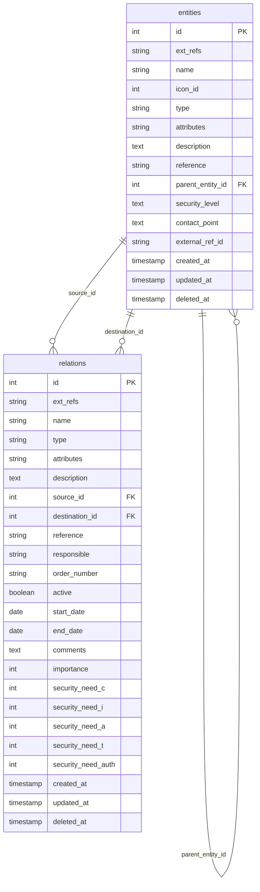
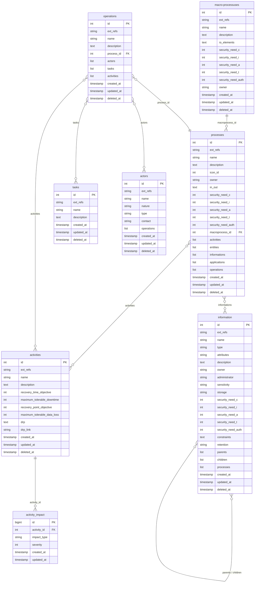
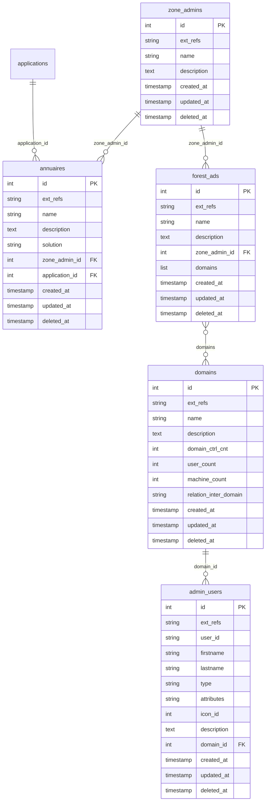
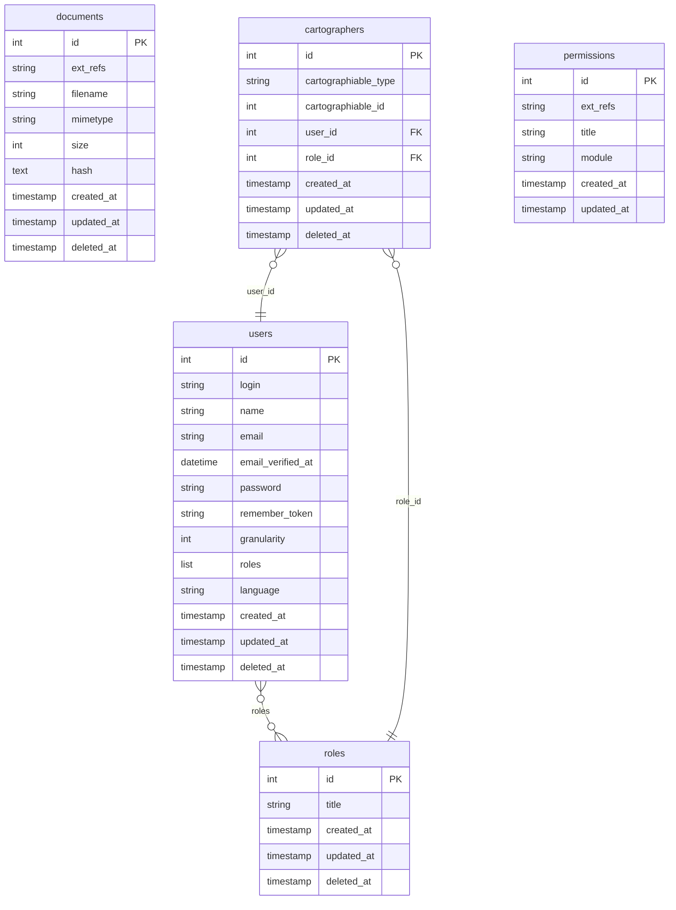

## Data model

This is a simplified data model of the data model of the Mercator.

[](images/model.png)


## GDPR

The GDPR view contains all the data required to maintain the data processing register, and provides a link with the
processes, applications, and information used by the information system.

This view is used to fulfill the obligations set out in article 30 of the GDPR.

There is no direct relation between `data_processing` and `security_controls` within this view: both tables are
linked to processes and applications, which belong to other views (see [Business view](#business) and
[Applications view](#applications)).

### Register

The register of processing activities contains the information required by article 30.1 of the GDPR.

| Table                                               | api                     |
|:----------------------------------------------------|:------------------------|
| <span style="color: blue;">*data_processing*</span> | `/api/data-processings` |

| Field                          | Type         | Description                                                                       |
|:-------------------------------|:-------------|:----------------------------------------------------------------------------------|
| id                             | int unsigned | auto_increment                                                                    |
| ext_refs | varchar(255) | External reference(s) to objects in other systems. Format: {ID_SOURCE}ID_OBJECT, multiple values separated by "\\|" |
| name                           | varchar(255) | Processing Name                                                                   |
| description                    | longtext     | Processing Description                                                            |
| legal_basis                    | varchar(255) | Legal Basis for Processing                                                        |
| responsible                    | longtext     | Data Controller                                                                   |
| purpose                        | longtext     | Purposes of Processing                                                            |
| lawfulness                     | text         | Lawfulness of Processing                                                          |
| lawfulness_consent             | tinyint(1)   | Lawfulness based on consent                                                       |
| lawfulness_contract            | tinyint(1)   | Lawfulness based on contract                                                      |
| lawfulness_legal_obligation    | tinyint(1)   | Lawfulness based on legal obligation                                              |
| lawfulness_vital_interest      | tinyint(1)   | Lawfulness based on vital interest                                                |
| lawfulness_public_interest     | tinyint(1)   | Lawfulness based on public interest                                               |
| lawfulness_legitimate_interest | tinyint(1)   | Lawfulness based on legitimate interest                                           |
| categories                     | longtext     | Categories of recipients                                                          |
| data_source                    | longtext     | Data source                                                                       |
| data_collection_obligation     | longtext     | Mandatory or optional nature of data collection and consequences of non-provision |
| recipients                     | longtext     | Data recipients                                                                   |
| transfer                       | longtext     | Data transfers                                                                    |
| automated_decision_making      | longtext     | Automated decision-making                                                         |
| retention                      | longtext     | Retention periods                                                                 |
| data_subject_rights            | longtext     | Rights of data subjects                                                           |
| update_date                    | date         | Register update date                                                              |
| controls                       | longtext     | Security measures                                                                 |
| information                    | List int [,] | List of related information IDs                                                   |
| applications                   | List int [,] | List of linked application IDs                                                    |
| processes                      | List int [,] | List of linked process IDs                                                        |
| created_at                     | timestamp    | Creation date                                                                     |
| updated_at                     | timestamp    | Update date                                                                       |
| deleted_at                     | timestamp    | Deleted date                                                                      

The field "controls" is not used and therefore is absent in the app.

The data model export lists processes, information, applications and documents
linked to a data processing.

In the app, a process can be linked to a data processing from a data processing object.  
An information can be linked with a data processing from a data processing object.

An application can be linked to a data processing from a data processing object.  
A document can be linked to a data processing from a data processing object.

### Security measures

This table identifies the security measures applied to processes and applications.

By default, this table is populated with the security measures of ISO 27001:2022.

| Table                                                 | api                      |
|:------------------------------------------------------|:-------------------------|
| <span style="color: blue;">*security_controls*</span> | `/api/security-controls` |

| Field       | Type         | Description         |
|:------------|:-------------|:--------------------|
| id          | int unsigned | auto_increment      |
| ext_refs | varchar(255) | External reference(s) to objects in other systems. Format: {ID_SOURCE}ID_OBJECT, multiple values separated by "\|" |
| name        | varchar(255) | measure name        |
| description | longtext     | measure description |
| created_at  | timestamp    | Date of creation    |
| updated_at  | timestamp    | Date of update      |
| deleted_at  | timestamp    | Date of deletion    |

## Ecosystem

The ecosystem view describes all the entities or systems that revolve around the information system considered in the
mapping.

This view not only delimits the scope of the mapping, but also provides an overall view of the ecosystem without being
limited to the individual study of each entity.



### Entities

Entities are a part of the organization (e.g.: subsidiary, department, etc.) or related to the information system to be
mapped.

Entities are departments, suppliers, partners with whom information is exchanged through relationships.

| Table                                        | api             |
|:---------------------------------------------|:----------------|
| <span style="color: blue;">*entities*</span> | `/api/entities` |

| Field            | Type         | Description                                |
|:-----------------|:-------------|:-------------------------------------------|
| id               | int unsigned | Unique identifier of the entity            |
| ext_refs | varchar(255) | External reference(s) to objects in other systems. Format: {ID_SOURCE}ID_OBJECT, multiple values separated by "\|" |
| name             | varchar(255) | Name of entity                             |
| icon_id          | int unsigned | Reference to a specific image              |
| type             | varchar(255) | Type of entity                             |
| attributes       | varchar(255) | Attributes (#tag...). An entity external to the organization carries the `extern` attribute |
| description      | longtext     | Entity description                         |
| reference        | varchar(255) | Reference the billing number of the entity |
| parent_entity_id | int unsigned | Pointer to the parent entity               |
| security_level   | longtext     | Security level                             |
| contact_point    | longtext     | Contact point                              |
| external_ref_id  | varchar(255) | Link to connected external entities        |
| created_at       | timestamp    | Date of creation                           |
| updated_at       | timestamp    | Date of update                             |
| deleted_at       | timestamp    | Date of deletion                           |

The "external_ref_id" field is not used and therefore is missing in the app.

The data model export lists processes and applications linked with an entity.

In the app, a process can be linked with an entity from these two objects.  
An application can be linked with an entity (as operations manager) from these two objects.

In the app, a database can be linked with an entity (as operations manager) from these two objects.

### Relationships

Relationships represent a link between two entities or systems.

Relationships are contracts, service agreements, legal obligations... that have an influence on the information system.

| Table                                         | api              |
|:----------------------------------------------|:-----------------|
| <span style="color: blue;">*relations*</span> | `/api/relations` |

| Field              | Type         | Description                                |
|:-------------------|:-------------|:-------------------------------------------|
| id                 | int unsigned | auto_increment                             |
| ext_refs | varchar(255) | External reference(s) to objects in other systems. Format: {ID_SOURCE}ID_OBJECT, multiple values separated by "\|" |
| name               | varchar(255) | Relationship name                          |
| type               | varchar(255) | Type of relationship                       |
| attributes         | varchar(255) | Attributes / #tags of the relationship     |
| description        | longtext     | Description of relationship                |
| source_id          | int unsigned | Reference to source entity                 |
| destination_id     | int unsigned | Reference to destination entity            |
| reference          | varchar(255) | Reference number of the relation (billing) |
| responsible        | varchar(255) | Responsible of the relation                |
| order_number       | varchar(255) | Ordre number (billing)                     |
| active             | tinyint(1)   | Is the reation still active                |
| start_date         | date         | Start date of the relation                 |
| end_date           | date         | End date of the relation                   |
| comments           | text         | Comment on the status of the relation      |
| importance         | int          | Importance of relationship                 |
| security_need_c    | int          | Confidentiality level needed               |
| security_need_i    | int          | Integrity level needed                     |
| security_need_a    | int          | Available level needed                     |
| security_need_t    | int          | Traceability level needed                  |
| security_need_auth | int          | Authenticity level needed                  |
| created_at         | timestamp    | Date of creation                           |
| updated_at         | timestamp    | Date of update                             |
| deleted_at         | timestamp    | Date of deletion                           |

In the app, the field for the authenticity need ("security_need_auth") is hidden by default. It is mandatory for
entities subject to the regulation (EU) 2022/2554 (DORA).  
This default configuration can be changed in the menu Configuration > Parameters.

The data model export lists the reference documents attached to a relationship.  
In the application, a document can be attached to a relationship from a relationships object.

The financial values of a contract can be indicated in dedicated fields.

---

## Business

The business view of the information system describes all the organization's business processes and the players
involved, independently of the technological choices made by the organization and the resources made available to it.

The business view is essential, as it allows you to reposition technical elements in their business environment, and
thus understand their context of use.



*Note: entities, applications and databases referenced by processes/activities/information belong to other views
(Ecosystem, Applications) and are therefore not represented in this diagram.*

### Macro-processes

Macro-processes represent sets of processes.

| Table                                                 | api                      |
|:------------------------------------------------------|:-------------------------|
| <span style="color: blue;">*macro-processuses*</span> | `/api/macro-processuses` |

| Field              | Type         | Description                    |
|:-------------------|:-------------|:-------------------------------|
| id                 | int unsigned | auto_increment                 |
| ext_refs | varchar(255) | External reference(s) to objects in other systems. Format: {ID_SOURCE}ID_OBJECT, multiple values separated by "\|" |
| name               | varchar(255) | Name of macro process          |
| description        | longtext     | Description of macro-process   |
| io_elements        | longtext     | Incoming and outgoing elements |
| security_need_c    | int          | Confidentiality                |
| security_need_i    | int          | Integrity                      |
| security_need_a    | int          | Availability                   |
| security_need_t    | int          | Traceability                   |
| security_need_auth | int          | Authenticity                   |
| owner              | varchar(255) | Owner                          |
| created_at         | timestamp    | Date of creation               |
| updated_at         | timestamp    | Date of update                 |
| deleted_at         | timestamp    | Date of deletion               |

In the app, the field for the authenticity need ("security_need_auth") is hidden by default. It is mandatory for
entities subject to the regulation (EU) 2022/2554 (DORA).  
This default configuration can be changed in the menu Configuration > Parameters.

In the application, a process can be linked with a macro-process from these two objects.

### Processes

Processes are a set of activities designed to achieve a goal. The process produces value-added information (
output) (in the form of deliverables) from information (input) produced by other processes.

Processes are made up of activities, entities involved in this process, and information processed by this process.

| Table                                         | api              |
|:----------------------------------------------|:-----------------|
| <span style="color: blue;">*processes*</span> | `/api/processes` |

| Field              | Type         | Description                      |
|:-------------------|:-------------|:---------------------------------|
| id                 | int unsigned | auto_increment                   |
| ext_refs | varchar(255) | External reference(s) to objects in other systems. Format: {ID_SOURCE}ID_OBJECT, multiple values separated by "\|" |
| name               | varchar(255) | Process name                     |
| description        | longtext     | Process description              |
| icon_id            | int unsigned | Reference to a specific image    |
| owner              | varchar(255) | Process owner                    |
| in_out             | longtext     | incoming and outgoing elements   |
| security_need_c    | int          | Confidentiality                  |
| security_need_i    | int          | Integrity                        |
| security_need_a    | int          | Availability                     |
| security_need_t    | int          | Traceability                     |
| security_need_auth | int          | Authenticity                     |
| macroprocess_id    | int unsigned | Reference to macro-process       |
| activities         | List int [,] | IDs list of related activities   |
| entities           | List int [,] | IDs list of related entities     |
| informations       | List int [,] | IDs list of related informations |
| applications       | List int [,] | IDs list of related applications |
| operations         | List int [,] | IDs list of related operations   |
| created_at         | timestamp    | Date of creation                 |
| updated_at         | timestamp    | Date of update                   |
| deleted_at         | timestamp    | Date of deletion                 |

In the app, the field for the authenticity need ("security_need_auth") is hidden by default. It is mandatory for
entities subject to the regulation (EU) 2022/2554 (DORA).  
This default configuration can be changed in the menu Configuration > Parameters.

The data model export lists:

- entities,
- activities,
- information,
- applications,
- data processing,
- and security measures

linked to a process.

In the application, an entity associated with a process can be linked with a process from these two objects.  
An activity can be linked with a process from these two objects.  
An information can be linked with a process from these two objects.

An application can be linked with a process from these two objects.  
A GDPR registry data processing can be linked with a process from a registry data processing object.

A security measure can be linked with an application from the "Assign security controls" button.  
This button is in the GDPR view and visible in the list of Security controls objects.

### Activities

An activity is a step required to carry out a process. It corresponds to a specific know-how and not necessarily to an
organizational structure of the company.

| Table                                          | api               |
|:-----------------------------------------------|:------------------|
| <span style="color: blue;">*activities*</span> | `/api/activities` |

| Field                       | Type         | Description                                     |
|:----------------------------|:-------------|:------------------------------------------------|
| id                          | int unsigned | auto_increment                                  |
| ext_refs | varchar(255) | External reference(s) to objects in other systems. Format: {ID_SOURCE}ID_OBJECT, multiple values separated by "\|" |
| name                        | varchar(255) | activity name                                   |
| description                 | longtext     | Activity description                            |
| recovery_time_objective     | int signed   | RTO, Recovery Time Objective                    |
| maximum_tolerable_downtime  | int signed   | Maximum tolerable downtime                      |
| recovery_point_objective    | int signed   | RPO, Recovery Point Objective                   |
| maximum_tolerable_data_loss | int signed   | Maximum tolerable Data Loss                     |
| drp                         | text         | Description of the disaster recovery plan (DRP) |
| drp_link                    | varchar(255) | Link (URL) to the DRP                           |
| created_at                  | timestamp    | Date of creation                                |
| updated_at                  | timestamp    | Date of update                                  |
| deleted_at                  | timestamp    | Date of deletion                                |

The maximum tolerable downtime is the limit after which the downtime effets are critical or unacceptable.  
The maximum tolerable data loss is the limit after which the data loss is critical or unacceptable.

The data model export lists processes, operations, and applications linked with an activity.

In the app, a process can be linked with an activity from these two objects.  
An operation can be linked with an activity from these two objects.  
An application can be linked with an activity from these two objects.

In the app, the "Impact Type" and "Severity" fields are managed in a separate table.

#### Impacts

Impacts are the consequences of the occurrence of a risk during an activity.  
Impacts are only accessible through "activities" objects.

| Table                                                | api |
|:-----------------------------------------------------|:----|
| <span style="color: blue;">*activity_impact*</span> | N/A |

| Field       | Type          | Description                                              |
|:------------|:--------------|:---------------------------------------------------------|
| id          | bigint signed | auto_increment                                           |
| activity_id | int unsigned  | Link to the activity related to this impact              |
| impact_type | varchar(255)  | Kind of impact (finance, brand, environnement, other...) |
| severity    | tinyint(4)    | Impact description                                       |
| created_at  | timestamp     | Date of creation                                         |
| updated_at  | timestamp     | Date of update                                           |

| Champ       | Type          | Description                                              |
|:------------|:--------------|:---------------------------------------------------------|
| id          | bigint signed | auto_increment                                           |
| activity_id | int unsigned  | Link to the activity related to this impact              |
| impact_type | varchar(255)  | Kind of impact (finance, brand, environnement, other...) |
| severity    | tinyint(4)    | Impact description                                       |
| created_at  | timestamp     | Date of creation                                         |
| updated_at  | timestamp     | Date of update                                           |

### Operations

An operation is made up of actors and tasks.

| Table                                          | api               |
|:-----------------------------------------------|:------------------|
| <span style="color: blue;">*operations*</span> | `/api/operations` |

| Field       | Type         | Description                                             |
|:------------|:-------------|:--------------------------------------------------------|
| id          | int unsigned | auto_increment                                          |
| ext_refs | varchar(255) | External reference(s) to objects in other systems. Format: {ID_SOURCE}ID_OBJECT, multiple values separated by "\|" |
| name        | varchar(255) | Name of operation                                       |
| description | longtext     | Description of operation                                |
| process_id  | int unsigned | Reference to the process of which the operation is part |
| actors      | List int [,] | IDs list of related actors                              |
| tasks       | List int [,] | IDs list of related tasks                               |
| activities  | List int [,] | IDs list of related activities                          |
| created_at  | timestamp    | Date of creation                                        |
| updated_at  | timestamp    | Date of update                                          |
| deleted_at  | timestamp    | Date of deletion                                        |

The data model export lists activities, actors, and tasks linked to an operation.

In the app, an activity can be linked with an operation from these two objects.  
An actor can be linked to an operation from the object "operation".  
A task can be linked to an operation from the object "operation".

### Tasks

A task is an elementary activity performed by an organizational function and constituting an indivisible unit of work in
the value-added chain of a process.

| Table                                     | api          |
|:------------------------------------------|:-------------|
| <span style="color: blue;">*tasks*</span> | `/api/tasks` |

| Field       | Type         | Description      |
|:------------|:-------------|:-----------------|
| id          | int unsigned | auto_increment   |
| ext_refs | varchar(255) | External reference(s) to objects in other systems. Format: {ID_SOURCE}ID_OBJECT, multiple values separated by "\|" |
| name        | varchar(255) | Task name        |
| description | longtext     | Task description |
| created_at  | timestamp    | Date of creation |
| updated_at  | timestamp    | Date of update   |
| deleted_at  | timestamp    | Date of deletion |

The data model export lists operations linked to a task.

In the app, an operation can be linked to a task from the object "operation".

### Actors

An actor is a representative of a business role who performs operations, uses applications, and makes decisions within
processes. This role can be carried by a person, a group of people, or an entity.

| Table                                      | api           |
|:-------------------------------------------|:--------------|
| <span style="color: blue;">*actors*</span> | `/api/actors` |

| Field      | Type         | Description                    |
|:-----------|:-------------|:-------------------------------|
| id         | int unsigned | auto_increment                 |
| ext_refs | varchar(255) | External reference(s) to objects in other systems. Format: {ID_SOURCE}ID_OBJECT, multiple values separated by "\|" |
| name       | varchar(255) | actor's name                   |
| nature     | varchar(255) | Nature of actor                |
| type       | varchar(255) | Type of actor                  |
| contact    | varchar(255) | Actor contact                  |
| operations | List int [,] | IDs list of related operations |
| created_at | timestamp    | Date of creation               |
| updated_at | timestamp    | Date of update                 |
| deleted_at | timestamp    | Date of deletion               |

The data model export lists operations linked with an actor.

In the app, an operation can be linked with an actor from the object "operation".

### Information

Information is data processed by a computer.
Information can be inherited from another information.
Information can be linked to multiple information.

| Table                                           | api                |
|:------------------------------------------------|:-------------------|
| <span style="color: blue;">*information*</span> | `/api/information` |

| Field              | Type         | Description                                    |
|:-------------------|:-------------|:-----------------------------------------------|
| id                 | int unsigned | auto_increment                                 |
| ext_refs | varchar(255) | External reference(s) to objects in other systems. Format: {ID_SOURCE}ID_OBJECT, multiple values separated by "\|" |
| name               | varchar(255) | Name of information                            |
| type               | varchar(255) | Type of information                            |
| attributes         | varchar(255) | Attributes (#tag...)                           |
| description        | longtext     | Description of information                     |
| owner              | varchar(255) | Owner of information                           |
| administrator      | varchar(255) | Information administrator                      |
| sensitivity        | varchar(255) | Sensitivity of information                     |
| storage            | varchar(255) | Information storage                            |
| security_need_c    | int          | Confidentiality                                |
| security_need_i    | int          | Integrity                                      |
| security_need_a    | int          | Availability                                   |
| security_need_t    | int          | Traceability                                   |
| security_need_auth | int          | Authenticity                                   |
| constraints        | longtext     | Legal and regulatory constraints               |
| retention          | varchar(255) | Information retention period                   |
| parents            | List int [,] | IDs list of linked parents information         |
| children           | List int [,] | IDs list of linked children information        |
| processes          | List int [,] | IDs list of used processes by this information |
| created_at         | timestamp    | Date of creation                               |
| updated_at         | timestamp    | Date of update                                 |
| deleted_at         | timestamp    | Date of deletion                               |

The field "retention" is not used and therefore is absent in the app.

In the app, the field for the authenticity need ("security_need_auth") is hidden by default. It is mandatory for
entities subject to the regulation (EU) 2022/2554 (DORA).  
This default configuration can be changed in the menu Configuration > Parameters.

The data model export lists databases and processes linked with information.

In the app, a database can be linked with an information from the object "database".  
A process can be linked to an information from these two objects.

*Note: The link to processes is a view of the result generated through the endpoint [processes](#processes) and its
field **informations***

---

## Applications

The application view is used to describe part of what is classically referred to as the "computer system".

This view describes the technological solutions that support business processes, mainly applications.

```mermaid
erDiagram
    "application-blocks" {
        int id PK
        string ext_refs
        string name
        text description
        string responsible
        timestamp created_at
        timestamp updated_at
        timestamp deleted_at
    }
    applications {
        int id PK
        string ext_refs
        string name
        int application_block_id FK
        string attributes
        text description
        int icon_id
        string status
        string responsible
        string functional_referent
        string editor
        string users
        string technology
        string type
        string external
        date install_date
        date prod_date
        date update_date
        date next_update
        string documentation
        int security_need_c
        int security_need_i
        int security_need_a
        int security_need_t
        int security_need_auth
        int rto
        int rpo
        string vendor
        string product
        string version
        int patching_frequency
        string hosting
        string urls
        list entities
        list processes
        list services
        list databases
        list logical_servers
        list activities
        list containers
        timestamp created_at
        timestamp updated_at
        timestamp deleted_at
    }
    application_events {
        int id PK
        string ext_refs
        int user_id FK
        int application_id FK
        text message
        timestamp created_at
        timestamp updated_at
    }
    application_services {
        int id PK
        string ext_refs
        string name
        text description
        string exposition
        list modules
        list applications
        timestamp created_at
        timestamp updated_at
        timestamp deleted_at
    }
    application_modules {
        int id PK
        string ext_refs
        string name
        text description
        list entities
        list application_services
        timestamp created_at
        timestamp updated_at
        timestamp deleted_at
    }
    databases {
        int id PK
        string ext_refs
        string name
        text description
        string type
        int entity_resp_id FK
        string responsible
        int icon_id
        int security_need_c
        int security_need_i
        int security_need_a
        int security_need_t
        int security_need_auth
        string external
        timestamp created_at
        timestamp updated_at
        timestamp deleted_at
    }
    application_flows {
        int id PK
        string ext_refs
        string name
        string attributes
        text description
        int application_source_id FK
        int service_source_id FK
        int module_source_id FK
        int database_source_id FK
        int application_dest_id FK
        int service_dest_id FK
        int module_dest_id FK
        int database_dest_id FK
        boolean crypted
        boolean bidirectional
        string type
        timestamp created_at
        timestamp updated_at
        timestamp deleted_at
    }

    "application-blocks" ||--o{ applications : "application_block_id"
    applications ||--o{ application_events : "application_id"
    applications }o--o{ application_services : "services"
    applications }o--o{ databases : "databases"
    application_services }o--o{ application_modules : "modules"
    application_flows }o--|| applications : "source / destination"
    application_flows }o--|| application_services : "source / destination"
    application_flows }o--|| application_modules : "source / destination"
    application_flows }o--|| databases : "source / destination"
```



*Note: entities, processes, activities, logical_servers and containers referenced by applications belong to other
views and are therefore not represented in this diagram.*

### Applications blocks

An application block represents a set of applications.

An application block can be: office applications, management applications, analysis applications, development
applications, etc.

| Table                                                  | api                       |
|:-------------------------------------------------------|:--------------------------|
| <span style="color: blue;">*application-blocks*</span> | `/api/application-blocks` |

| Field       | Type         | Description                       |
|:------------|:-------------|:----------------------------------|
| id          | int unsigned | auto_increment                    |
| ext_refs | varchar(255) | External reference(s) to objects in other systems. Format: {ID_SOURCE}ID_OBJECT, multiple values separated by "\|" |
| name        | varchar(255) | Name of information               |
| description | longtext     | Description of application block  |
| responsible | varchar(255) | Responsible for application block |
| created_at  | timestamp    | Date of creation                  |
| updated_at  | timestamp    | Date of update                    |
| deleted_at  | timestamp    | Date of deletion                  |

In the app, an application can be linked to an application block from these two objects.

### Applications

An application is a coherent set of IT objects (executables, programs, data, etc.). It is a grouping of application
services.

An application can be deployed on one or more logical servers.

When there is no virtualized environment, there are not several logical servers per physical server, but one logical
server per physical server.

| Table                                            | api                 |
|:-------------------------------------------------|:--------------------|
| <span style="color: blue;">*applications*</span> | `/api/applications` |

| Field                | Type         | Description                         |
|:---------------------|:-------------|:------------------------------------|
| id                   | int unsigned | auto_increment                      |
| ext_refs             | varchar(255) | External reference(s) to objects in other systems. Format: {ID_SOURCE}ID_OBJECT, multiple values separated by "\|" |
| name                 | varchar(255) | Name of the application             |
| application_block_id | int unsigned | Group of application                |
| attributes           | varchar(255) | Attributes of the application       |
| description          | longtext     | Description                         |
| icon_id              | int unsigned | Reference to a specific image       |
| responsible          | varchar(255) | Person/team responsible             |
| functional_referent  | varchar(255) | Functional referent                 |
| editor               | varchar(255) | Application's editor                |
| users                | varchar(255) | Number of users and type            |
| technology           | varchar(255) | Technology                          |
| type                 | varchar(255) | Type of application                 |
| external             | varchar(255) | External                            |
| status               | varchar(255) | Status of the application           |
| prod_date            | date         | Production date                     |
| install_date         | datetime     | Date of installation                |
| update_date          | datetime     | Date of upgrade                     |
| next_update          | datetime     | Date of next planned upgrade        |
| documentation        | varchar(255) | Link to documentation               |
| security_need_c      | int          | Confidentiality                     |
| security_need_i      | int          | Integrity                           |
| security_need_a      | int          | Availability                        |
| security_need_t      | int          | Traceability                        |
| ecurity_need_auth    | int          | authentication                      |
| rto                  | int          | Recovery Time Objective             |
| rpo                  | int          | Recovery Point Objective            |
| vendor               | varchar(255) | Application's vendor                |
| product              | varchar(255) | Product name                        |
| version              | varchar(255) | Version of the application          |
| patching_frequency   | int          | Patching frequency                  |
| hosting              | varchar(255) | Hosting                             |
| urls                 | varchar(255) | Application's URLs                  |
| entities             | List int [,] | IDs list of related entities        |
| processes            | List int [,] | IDs list of related processes       |
| services             | List int [,] | IDs list of related services        |
| databases            | List int [,] | IDs list of related dataabses       |
| logical_servers      | List int [,] | IDs list of related logical_servers |
| activities           | List int [,] | IDs list of related activities      |
| containers           | List int [,] | IDs list of related containers      |
| created_at           | timestamp    | Date of creation                    |
| updated_at           | timestamp    | Date of update                      |
| deleted_at           | timestamp    | Date of deletion                    |

RTO : *Recovery Time Objective*  
RPO : *Recovery Point Objective*

The "patching_frequency" and "next_update" fields are not used at the moment and are therefore missing from the
application.

In the app, the need for authentication is hidden by default. It is mandatory in the case
from an entity subject to EU Directive 2022/2554 (DORA).  
It is activated from the Configuration > Settings menu.

Export of reference data model:

- user entities (*entities* field),
- supported processes,
- supported activities,
- application services,
- databases,
- workstations,
- logical servers,
- logical security devices,
- administrators ("Users" object of the administration view),
- and security measures

linked with an application.

In the app, an entity using the application can be linked with an application from an application object.  
A process can be linked with an application from these two objects.  
An activity can be linked with an application from these two objects.

An application service can be linked with an application from these two objects.  
A database can be linked to an application from these two objects.  
A workstation can be linked to an application from a workstation object.

A logical server can be linked with an application from these two objects.  
A logical security device can be linked with an application from these two objects.  
An administrator can be linked with an application from an application object.

A security measure can be linked to an application from the "Assign a security measure" button.  
This button is present in the GDPR view and visible in the list of Security controls objects.

In the app, a container can be linked with an application from these two objects.  
In the app, the *major events* field is managed in a separate table.

#### Major events

Major events are the main events undergone by an application during its operation.  
Major events are only accessible through application objects.

They are neither importable nor exportable through the graphics tool.

| Table                                                  | api |
|:-------------------------------------------------------|:----|
| <span style="color: blue;">*application_events*</span> | N/A |

| Field          | Type         | Description                                                    |
|:---------------|:-------------|:---------------------------------------------------------------|
| id             | int unsigned | auto_increment                                                 |
| ext_refs | varchar(255) | External reference(s) to objects in other systems. Format: {ID_SOURCE}ID_OBJECT, multiple values separated by "\|" |
| user_id        | int unsigned | Mercator user id who has register the event                    |
| application_id | int unsigned | Reference to the id of the application that suffered the event |
| message        | longtext     | Description of the event                                       |
| created_at     | timestamp    | Date of creation                                               |
| updated_at     | timestamp    | Date of update                                                 |

### Applications services

An application service is a specific service provided to a user to perform specific tasks related to their role in the
organisation.

Eg. an application service could be a Cloud service or platform.

| Table                                                    | api                         |
|:---------------------------------------------------------|:----------------------------|
| <span style="color: blue;">*application_services*</span> | `/api/application-services` |

| Champ        | Type         | Description                             |
|:-------------|:-------------|:----------------------------------------|
| id           | int unsigned | auto_increment                          |
| ext_refs | varchar(255) | External reference(s) to objects in other systems. Format: {ID_SOURCE}ID_OBJECT, multiple values separated by "\|" |
| name         | varchar(255) | Name of the application service         |
| description  | longtext     | Description of the application service  |
| exposition   | varchar(255) | Exposure of the application service     |
| modules      | List int [,] | IDs list of related application modules |
| applications | List int [,] | IDs list of related application         |
| created_at   | timestamp    | Date of creation                        |
| updated_at   | timestamp    | Date of update                          |
| deleted_at   | timestamp    | Date of deletion                        |

The data model export lists the applications and application modules linked with an application service.

In the app, an application can be linked with an application service from these two objects.  
In the app, an application module can be linked with an application service from these two objects.

There are two fields containing the same information in the data model export, *servicesApplications* and
*applications*.  
The connection with application objects is made through the *applications* field.

### Application modules

An application module is a component of an application characterized by functional coherence and technological
homogeneity.

| Table                                                   | api                        |
|:--------------------------------------------------------|:---------------------------|
| <span style="color: blue;">*application_modules*</span> | `/api/application-modules` |

| Field                | Type         | Description                               |
|:---------------------|:-------------|:------------------------------------------|
| id                   | int unsigned | auto_increment                            |
| ext_refs | varchar(255) | External reference(s) to objects in other systems. Format: {ID_SOURCE}ID_OBJECT, multiple values separated by "\|" |
| name                 | varchar(255) | Name of the application module            |
| description          | longtext     | Description of the application module     |
| entities             | List int [,] | IDs list of related entities              |
| application_services | List int [,] | IDs list of related applications-services |
| created_at           | timestamp    | Date of creation                          |
| updated_at           | timestamp    | Date of update                            |
| deleted_at           | timestamp    | Date of deletion                          |

The export of the data model lists application services linked with an application module.

In the app, an application service can be linked to an application module from these two objects.

### Databases

A database is a set of structured and ordered information meant for computed processing.

| Table                                         | api              |
|:----------------------------------------------|:-----------------|
| <span style="color: blue;">*databases*</span> | `/api/databases` |

| Champ              | Type         | Description                  |
|:-------------------|:-------------|:-----------------------------|
| id                 | int unsigned | auto_increment               |
| ext_refs | varchar(255) | External reference(s) to objects in other systems. Format: {ID_SOURCE}ID_OBJECT, multiple values separated by "\|" |
| name               | varchar(255) | Name of the database         |
| description        | longtext     | Description of the database  |
| type               | varchar(255) | Technology used              |
| entity_resp_id     | int unsigned | Entity responsible           |
| responsible        | varchar(255) | Responsible entity           |
| icon_id            | int unsigned | Reference to a specific icon |
| security_need_c    | int          | Confidentiality              |
| security_need_i    | int          | Integrity                    |
| security_need_a    | int          | Availability                 |
| security_need_t    | int          | Traceability                 |
| security_need_auth | int          | Authenticity                 |
| external           | varchar(255) | External                     |
| created_at         | timestamp    | Date of creation             |
| updated_at         | timestamp    | Date of update               |
| deleted_at         | timestamp    | Date of deletion             |

In the app, the field for the authenticity need ("security_need_auth") is hidden by default. It is mandatory for
entities subject to the regulation (EU) 2022/2554 (DORA).  
This default configuration can be changed in the menu Configuration > Parameters.

The data model export references the specific icon of a database.  
In the app, a specific icon can be linked with a database from a database object.

The data model export lists entities using the database (*entities* field), applications, information,
logical servers and containers linked with a database.

In the app, a user entity can be linked with a database from a database object.  
In the app, an information can be linked with a database from a database object.

In the app, an application can be linked with a database from these two objects.  
In the app, a logical server can be linked with a database from these two objects.  
In the app, a container can be linked with a database from these two objects.

### Application Flows

An application flow is an exchange of information between a sender and a receiver (application, application service,
application module, or database).

An application flow represents an exchange of information between two elements of the information system. It is
important to avoid representing all firewall filtering rules in terms of flows.

For example, DNS or NTP requests should not be represented as flows.

| Table                                                 | api                      |
|:------------------------------------------------------|:-------------------------|
| <span style="color: blue;">*application_flows*</span> | `/api/application-flows` |

| Champ                  | Type         | Description                             |
|:-----------------------|:-------------|:----------------------------------------|
| id                     | int unsigned | auto_increment                          |
| ext_refs | varchar(255) | External reference(s) to objects in other systems. Format: {ID_SOURCE}ID_OBJECT, multiple values separated by "\|" |
| name                   | varchar(255) | Name of the flow                        |
| attributes             | varchar(255) | Attributs (tags) du flux                |
| description            | longtext     | Description of the flow                 |
| ***device***_source_id | int unsigned | Link to the source_id                   |
| ***device***_dest_id   | int unsigned | Link to the destination id              |
| crypted                | tinyint(1)   | The flow is encrypted (1=yes, O=no)     |
| bidirectional          | tinyint(1)   | The flow is bidirectional (1=yes, O=no) |
| type                   | varchar(255) | Type of the application flow            |
| created_at             | timestamp    | Date of creation                        |
| updated_at             | timestamp    | Date of update                          |
| deleted_at             | timestamp    | Date of deletion                        |

The  ***device***_ for source_id or dest_id can be: :

| Active (*device*)   | Source | Destination | Source field name | dest field name |
|:--------------------|:------:|:-----------:|-------------------|-----------------|
| Application         | ✅ | ✅ | application_source_id | application_dest_id |
| Application service | ✅ | ✅ | service_source_id | service_dest_id |
| Application module  | ✅ | ✅ | module_source_id | module_dest_id |
| Database            | ✅ | ✅ | database_source_id | database_dest_id |

In the app, an information can be linked with an application flow from an application flow object.

## Administration

The administration view lists the management of resources, directories, and user privilege levels within the information system.

Having directories and centralized user access rights is strongly recommended for operators of vital importance (OIVs).

*Nota*: OVI is coming from the French military programme law. The closest equivalents in EU regulations are OES
(Operators of Essential Services, EU 2016/1148, NIS) and EE (Essential Entities, EU 2022/2555, NIS 2).




### Administration zone

An administration zone is a set of resources (people, data, equipment) under the responsibility of one (or more)
administrator(s).

An administration zone is made up of Active Directory (AD) directory services and forests, or LDAP trees.

| Table                                           | api                |
|:------------------------------------------------|:-------------------|
| <span style="color: blue;">*zone_admins*</span> | `/api/zone-admins` |

| Champ       | Type         | Description      |
|:------------|:-------------|:-----------------|
| id          | int unsigned | auto_increment   |
| ext_refs | varchar(255) | External reference(s) to objects in other systems. Format: {ID_SOURCE}ID_OBJECT, multiple values separated by "\|" |
| name        | varchar(255) | Name of the area |
| description | longtext     | Description area |
| created_at  | timestamp    | Date of creation |
| updated_at  | timestamp    | Date of update   |
| deleted_at  | timestamp    | Date of deletion |

### Administration directory services

An administration directory service is an application that collects data on a company's users or IT equipment, enabling
them to be administered.

It can be an inventory tool used to manage changes or tickets, or a mapping tool such as Mercator. It can optionally be
linked to the application implementing it.

| Table                                         | api              |
|:----------------------------------------------|:-----------------|
| <span style="color: blue;">*annuaires*</span> | `/api/annuaires` |

| Champ         | Type         | Description                      |
|:--------------|:-------------|:---------------------------------|
| id            | int unsigned | auto_increment                   |
| ext_refs | varchar(255) | External reference(s) to objects in other systems. Format: {ID_SOURCE}ID_OBJECT, multiple values separated by "\|" |
| name          | varchar(255) | Name of the directory            |
| description   | longtext     | Description of the directory     |
| solution      | varchar(255) | Techinical solution              |
| zone_admin_id | int unsigned | Reference to administration area |
| application_id | int unsigned | Reference to the application managing this directory |
| created_at    | timestamp    | Date of creation                 |
| updated_at    | timestamp    | Date of update                   |
| deleted_at    | timestamp    | Date of deletion                 |

### Active Directory forests / LDAP tree structure

These objects represent an organized grouping of Active Directory domains or LDAP trees.

| Table                                          | api               |
|:-----------------------------------------------|:------------------|
| <span style="color: blue;">*forest_ads*</span> | `/api/forest-ads` |

| Champ         | Type         | Description                                     |
|:--------------|:-------------|:------------------------------------------------|
| id            | int unsigned | auto_increment                                  |
| ext_refs | varchar(255) | External reference(s) to objects in other systems. Format: {ID_SOURCE}ID_OBJECT, multiple values separated by "\|" |
| name          | varchar(255) | Name of Active Directory or LDAP forests        |
| description   | longtext     | Description of Active Directory or LDAP forests |
| zone_admin_id | int unsigned | Reference to Administration zone                |
| domains       | List int [,] | IDs list of related active directory domains    |
| created_at    | timestamp    | Date of creation                                |
| updated_at    | timestamp    | Date of update                                  |
| deleted_at    | timestamp    | Date of deletion                                |

### Active Directory domains / LDAP

Active Directory domains / LDAP are company IT directories. They contains user and computer accounts, contacts,
objects rights, and a part of IT policies (e.g. Group Policy Object - GPO).

| Table                                           | api                |
|:------------------------------------------------|:-------------------|
| <span style="color: blue;">*domains*</span> | `/api/domains` |

| Champ                 | Type         | Description                             |
|:----------------------|:-------------|:----------------------------------------|
| id                    | int unsigned | auto_increment                          |
| ext_refs | varchar(255) | External reference(s) to objects in other systems. Format: {ID_SOURCE}ID_OBJECT, multiple values separated by "\|" |
| name                  | varchar(255) | AD Domain / LDAP name                   |
| description           | longtext     | Domain description                      |
| domain_ctrl_cnt       | int signed   | Number of domain controllers            |
| user_count            | int signed   | Number of domain users                  |
| machine_count         | int signed   | Number of domain computers              |
| relation_inter_domain | varchar(255) | Cross domains relationships description |
| created_at            | timestamp    | Date of creation                        |
| updated_at            | timestamp    | Date of update                          |
| deleted_at            | timestamp    | Date of deletion                        |

The data model esport lists AD forests / LDAP trees linked with an AD domain / LDAP.

In the app, an AD forest / LDAP tree can be linked with an AD domain / LDAP from these two objects.  
A logical server can be linked with an AD domain / LDAP from these two objects.

### Users

Users are user accounts with privileged rights on IT systems.

| Table                                           | api                |
|:------------------------------------------------|:-------------------|
| <span style="color: blue;">*admin_users*</span> | `/api/admin-users` |

| Champ       | Type         | Description                  |
|:------------|:-------------|:-----------------------------|
| id          | int unsigned | auto_increment               |
| ext_refs | varchar(255) | External reference(s) to objects in other systems. Format: {ID_SOURCE}ID_OBJECT, multiple values separated by "\|" |
| user_id     | varchar(255) | ID number / other of an user | 
| firstname   | varchar(255) | User's first name            |
| lastname    | varchar(255) | User's last name             |
| type        | varchar(255) | User type                    |
| attributes  | varchar(255) | User's tags                  |
| icon_id     | int unsigned | Link to a specific icon      |
| description | longtext     | User description             |
| domain_id   | int unsigned | Link to the users's domain   |
| created_at  | timestamp    | Date of creation             |
| updated_at  | timestamp    | Date of update               |
| deleted_at  | timestamp    | Date of deletion             |

The data model export lists applications which an user is administrator.

In the app, an user can be defined as administrator of an application from an application object.

---

## Logical infrastructure

The logical infrastructure view corresponds to the logical distribution of the network.

It illustrates the partitioning of networks and the logical links between them. It also lists the network equipment that
handles the traffic.

```mermaid
erDiagram
    networks {
        int id PK
        string ext_refs
        string name
        string type
        string attributes
        text description
        string protocol_type
        string responsible
        string responsible_sec
        int security_need_c
        int security_need_i
        int security_need_a
        int security_need_t
        int security_need_auth
        timestamp created_at
        timestamp updated_at
        timestamp deleted_at
    }
    subnetworks {
        int id PK
        string ext_refs
        string name
        string type
        string attributes
        text description
        int network_id FK
        int subnetwork_id FK
        int connected_subnets_id
        string address
        string default_gateway
        int gateway_id FK
        int vlan_id FK
        string ip_allocation_type
        string zone
        string dmz
        string wifi
        string responsible_exp
        timestamp created_at
        timestamp updated_at
        timestamp deleted_at
    }
    gateways {
        int id PK
        string ext_refs
        string name
        text description
        string ip
        string authentification
        timestamp created_at
        timestamp updated_at
        timestamp deleted_at
    }
    external_connected_entities {
        int id PK
        string ext_refs
        string name
        string type
        text description
        int entity_id FK
        int network_id FK
        list subnetworks
        string contacts
        string src
        string src_desc
        string dest
        string dest_desc
        text security
        timestamp created_at
        timestamp updated_at
        timestamp deleted_at
    }
    network_switches {
        int id PK
        string ext_refs
        string name
        text description
        string ip
        timestamp created_at
        timestamp updated_at
        timestamp deleted_at
    }
    routers {
        int id PK
        string ext_refs
        string name
        string type
        text ip_addresses
        text description
        text rules
        timestamp created_at
        timestamp updated_at
        timestamp deleted_at
    }
    security_devices {
        int id PK
        string ext_refs
        string name
        string type
        string attributes
        int icon_id
        text description
        string address_ip
        string vendor
        string product
        string version
        timestamp created_at
        timestamp updated_at
        timestamp deleted_at
    }
    dhcp_servers {
        int id PK
        string ext_refs
        string name
        text description
        string address_ip
        timestamp created_at
        timestamp updated_at
        timestamp deleted_at
    }
    dnsservers {
        int id PK
        string ext_refs
        string name
        text description
        string address_ip
        timestamp created_at
        timestamp updated_at
        timestamp deleted_at
    }
    clusters {
        int id PK
        string ext_refs
        string name
        string type
        int icon_id
        text description
        string attributes
        string address_ip
        timestamp created_at
        timestamp updated_at
        timestamp deleted_at
    }
    logical_servers {
        int id PK
        string ext_refs
        string name
        int icon_id
        string type
        boolean active
        string attributes
        text description
        string operating_system
        datetime install_date
        datetime update_date
        int patching_frequency
        date next_update
        string net_services
        string environment
        string address_ip
        int domain_id FK
        string cpu
        string memory
        int disk
        int disk_used
        text configuration
        list databases
        list cluster_id
        list physical_servers
        list applications
        list containers
        timestamp created_at
        timestamp updated_at
        timestamp deleted_at
    }
    backups {
        int id PK
        string ext_refs
        string name
        string type
        string attributes
        list logical_server_ids
        list storage_device_ids
        int backup_frequency
        int backup_cycle
        int backup_retention
        timestamp created_at
        timestamp updated_at
        timestamp deleted_at
    }
    containers {
        int id PK
        string ext_refs
        string name
        text description
        string type
        int icon_id
        list applications
        list databases
        list logical_servers
        timestamp created_at
        timestamp updated_at
        timestamp deleted_at
    }
    logical_flows {
        int id PK
        string ext_refs
        string name
        string type
        string attributes
        text description
        string chain
        string interface
        int router_id FK
        int priority
        string action
        string protocol
        string source_ip_range
        string dest_ip_range
        string source_port
        string dest_port
        int device_source_id FK
        int device_dest_id FK
        string users
        string schedule
        timestamp created_at
        timestamp updated_at
        timestamp deleted_at
    }
    certificates {
        int id PK
        string ext_refs
        string name
        text description
        string type
        date start_validity
        date end_validity
        int status
        list logical_servers
        list applications
        datetime last_notification
        timestamp created_at
        timestamp updated_at
        timestamp deleted_at
    }
    vlans {
        int id PK
        string ext_refs
        string name
        text description
        int vlan_id
        timestamp created_at
        timestamp updated_at
        timestamp deleted_at
    }

    networks ||--o{ subnetworks : "network_id"
    subnetworks ||--o{ subnetworks : "subnetwork_id"
    subnetworks }o--|| gateways : "gateway_id"
    subnetworks }o--|| vlans : "vlan_id"
    networks ||--o{ external_connected_entities : "network_id"
    external_connected_entities }o--o{ subnetworks : "subnetworks"
    routers ||--o{ logical_flows : "router_id"
    clusters }o--o{ logical_servers : "cluster_id"
    logical_servers }o--o{ containers : "containers"
    backups }o--o{ logical_servers : "logical_server_ids"
    logical_flows }o--|| security_devices : "device (poly)"
    logical_flows }o--|| logical_servers : "device (poly)"
    logical_flows }o--|| clusters : "device (poly)"
    logical_flows }o--|| subnetworks : "device (poly)"
    certificates }o--o{ logical_servers : "logical_servers"
```



*Note: entities, administration domains, applications, databases and physical-infrastructure devices referenced
here belong to other views and are therefore not represented in this diagram.*

### Networks

Networks are a set of logically interconnected devices that exchange information.

| Table                                        | api             |
|:---------------------------------------------|:----------------|
| <span style="color: blue;">*networks*</span> | `/api/networks` |

| Champ              | Type         | Description                |
|:-------------------|:-------------|:---------------------------|
| id                 | int unsigned | auto_increment             |
| ext_refs | varchar(255) | External reference(s) to objects in other systems. Format: {ID_SOURCE}ID_OBJECT, multiple values separated by "\|" |
| name               | varchar(255) | Name of network            |
| type               | varchar(255) | Type of network            |
| attributes         | varchar(255) | Attributes (#tag...)       |
| description        | longtext     | Description of the network |
| protocol_type      | varchar(255) | Used protocols             |
| responsible        | varchar(255) | Operation manager          |
| responsible_sec    | varchar(255) | Security manager           |
| security_need_c    | int          | Confidentiality            |
| security_need_i    | int          | Integrity                  |
| security_need_a    | int          | Availability               |
| security_need_t    | int          | Traceability               |
| security_need_auth | int          | Authenticity               |
| created_at         | timestamp    | Date of creation           |
| updated_at         | timestamp    | Date of update             |
| deleted_at         | timestamp    | Date of deletion           |

In the app, the field for the authenticity need ("security_need_auth") is hidden by default. It is mandatory for
entities subject to the regulation (EU) 2022/2554 (DORA).  
This default configuration can be changed in the menu Configuration > Parameters.

### Subnetworks

Subnetworks are a logical subdivision of a larger network.

| Table                                           | api                |
|:------------------------------------------------|:-------------------|
| <span style="color: blue;">*subnetworks*</span> | `/api/subnetworks` |

| Champ                | Type         | Description                          |
|:---------------------|:-------------|:-------------------------------------|
| id                   | int unsigned | auto_increment                       |
| ext_refs | varchar(255) | External reference(s) to objects in other systems. Format: {ID_SOURCE}ID_OBJECT, multiple values separated by "\|" |
| name                 | varchar(255) | Name of the subnet                   |
| type                 | varchar(255) | Type of the subnet                   |
| attributes           | varchar(255) | Attributes (#tag...)                 |
| description          | longtext     | Description of the subnet            |
| network_id           | int unsigned | ID related to parent network         |
| subnetwork_id        | int unsigned | ID related to child network          |
| connected_subnets_id | int unsigned | Network to which this subnet belongs |
| address              | varchar(255) | Addresses range                      |
| default_gateway      | varchar(255) | Default gateway                      |
| gateway_id           | int unsigned | Link to the gateway                  |
| vlan_id              | int unsigned | Associated VLAN                      |
| ip_allocation_type   | varchar(255) | Type of IP address allocation        |
| zone                 | varchar(255) | Name of the firewall zone            |
| dmz                  | varchar(255) | DMZ (Yes/No)                         |
| wifi                 | varchar(255) | Wireless (Yes / No)                  |
| responsible_exp      | varchar(255) | Operations manager                   |
| created_at           | timestamp    | Date of creation                     |
| updated_at           | timestamp    | Date of update                       |
| deleted_at           | timestamp    | Date of deletion                     |

The field "connected_subnets_id" is a foreign key. However, this one doesn't seem to be used.

### External input gateways

Gateways are components used to connect a local network to the outside world.

| Table                                        | api             |
|:---------------------------------------------|:----------------|
| <span style="color: blue;">*gateways*</span> | `/api/gateways` |

| Field            | Type         | Description                |
|:-----------------|:-------------|:---------------------------|
| id               | int unsigned | auto_increment             |
| ext_refs | varchar(255) | External reference(s) to objects in other systems. Format: {ID_SOURCE}ID_OBJECT, multiple values separated by "\|" |
| name             | varchar(255) | Name of the gateway        |
| description      | longtext     | Description of the gateway |
| ip               | varchar(255) | IP address of the gateway  |
| authentification | varchar(255) | Authentication modes       |
| created_at       | timestamp    | Date of creation           |
| updated_at       | timestamp    | Date of update             |
| deleted_at       | timestamp    | Date of deletion           |

In the application, a subnet can be linked with a gateway from these two objects.

### Connected external entities

Connected external entities represent external entities connected to the network.

| Table                                                           | api                                |
|:----------------------------------------------------------------|:-----------------------------------|
| <span style="color: blue;">*external_connected_entities*</span> | `/api/external-connected-entities` |

| Champ       | Type         | Description                                                       |
|:------------|:-------------|:------------------------------------------------------------------|
| id          | int unsigned | auto_increment                                                    |
| ext_refs | varchar(255) | External reference(s) to objects in other systems. Format: {ID_SOURCE}ID_OBJECT, multiple values separated by "\|" |
| name        | varchar(255) | Name of entity/company                                            |
| type        | varchar(255) | Connexion type                                                    |
| description | longtext     | Description of the entity/company and connection reason           |
| entity_id   | int unsigned | Reference to the entity (ecosystem view)                          |
| network_id  | int unsigned | Reference to the internal network(s) connected to the entity      |
| subnetworks | List int [,] | IDs List of linked subnetworks                                    |
| contacts    | varchar(255) | Contacts within the external entity/company                       |
| src         | varchar(255) | Source IP address(es) or source range of the connection           |
| src_desc    | varchar(255) | Description of the source's connection                            |
| dest        | varchar(255) | Destination IP address(es) or destination range of the connection |
| dest_desc   | varchar(255) | Description of the destination's connection                       |
| security    | text         | Security requirements of the system                               |
| created_at  | timestamp    | Date of creation                                                  |
| updated_at  | timestamp    | Date of update                                                    |
| deleted_at  | timestamp    | Date of deletion                                                  |

The data model export lists subnets and documents attached to a connected external entity.

In the app, a subnet can be linked to a connected external entity from a connected external entity object.
A document can be attached to a connected external entity from a connected external entity object.

### Network switches

Network switches are the components that manage connections between the various servers on a network.

| Table                                                | api                     |
|:-----------------------------------------------------|:------------------------|
| <span style="color: blue;">*network_switches*</span> | `/api/network-switches` |

| Champ       | Type         | Description               |
|:------------|:-------------|:--------------------------|
| id          | int unsigned | auto_increment            |
| ext_refs | varchar(255) | External reference(s) to objects in other systems. Format: {ID_SOURCE}ID_OBJECT, multiple values separated by "\|" |
| name        | varchar(255) | Name of the switch        |
| description | longtext     | Description of the switch |
| ip          | varchar(255) | IP address of the switch  |
| created_at  | timestamp    | Date of creation          |
| updated_at  | timestamp    | Date of update            |
| deleted_at  | timestamp    | Date of deletion          |

The data model export lists physical switches and VLANs linked with a network switch.

In the app, a VLAN can be linked with a network switch from these two objects.  
A physical switch can be linked with a network switch from these two objects.

### Logical routers

Logical routers are logical components that manage connections between different networks.

| Table                                       | api            |
|:--------------------------------------------|:---------------|
| <span style="color: blue;">*routers*</span> | `/api/routers` |

| Champ        | Type         | Description                  |
|:-------------|:-------------|:-----------------------------|
| id           | int unsigned | auto_increment               |
| ext_refs | varchar(255) | External reference(s) to objects in other systems. Format: {ID_SOURCE}ID_OBJECT, multiple values separated by "\|" |
| name         | varchar(255) | Name of the router           |
| type         | varchar(255) | router type                  |
| ip_addresses | text         | IP address(es) of the router |
| description  | longtext     | Description of the router    |
| rules        | longtext     | Filtering rules              |
| created_at   | timestamp    | Date of creation             |
| updated_at   | timestamp    | Date of update               |
| deleted_at   | timestamp    | Date of deletion             |

The data model export lists physical routers linked to a logical router.

In the app, a physical router can be linked to a logical router from these two objects.

### Security devices {#security-devices}

Security devices are components used for network supervision, incident detection, equipment protection, and information
system security.

Security equipment includes intrusion detection systems (IDS: Intrusion Detection System), intrusion prevention
systems (IPS: Intrusion Prevention System) and equipment monitoring systems.

| Table                                                | api                     |
|:-----------------------------------------------------|:------------------------|
| <span style="color: blue;">*security_devices*</span> | `/api/security-devices` |

| Champ       | Type         | Description                         |
|:------------|:-------------|:------------------------------------|
| id          | int unsigned | auto_increment                      |
| ext_refs | varchar(255) | External reference(s) to objects in other systems. Format: {ID_SOURCE}ID_OBJECT, multiple values separated by "\|" |
| name        | varchar(255) | Name of the device                  |
| type        | varchar(255) | Device type                         |
| attributes  | varchar(255) | Device attributes                   |
| icon_id     | int unsigned | Reference to a specific icon        |
| description | longtext     | Description of the device           |
| address_ip  | varchar(255) | IP address(es) of the device        |
| vendor      | varchar(255) | Vendor / editor for CPE search      |
| product     | varchar(255) | Editor Product for CPE search       |
| version     | varchar(255) | Version of a product for CPE search |
| created_at  | timestamp    | Date of creation                    |
| updated_at  | timestamp    | Date of update                      |
| deleted_at  | timestamp    | Date of deletion                    |

The "vendor", "product" and "version" fields are not used and therefore are absent in the app.

The data model export lists physical security device and applications linked to a logical security device.

In the app, physical security device can be linked to a logical security device from these two objects.  
An application can be linked a to logical security device from these two objects.

### DHCP servers

```markdown
***NOTE***: The DHCP servers are kept for backward compatibility and to be compliant with ANSSI's guidelines.

- ANSSI is the French cybersecurity regulation authority.
  This object is considered barely useful and obsolete. It's hidden by default.
```

DHCP servers are physical or virtual devices that manage a network's IP addresses.

| Table                                            | api                 |
|:-------------------------------------------------|:--------------------|
| <span style="color: blue;">*dhcp_servers*</span> | `/api/dhcp-servers` |

| Champ       | Type         | Description                     |
|:------------|:-------------|:--------------------------------|
| id          | int unsigned | auto_increment                  |
| ext_refs | varchar(255) | External reference(s) to objects in other systems. Format: {ID_SOURCE}ID_OBJECT, multiple values separated by "\|" |
| name        | varchar(255) | Name of the DHCP server         |
| description | longtext     | Description of the DHCP server  |
| address_ip  | varchar(255) | IP address(es) IP of the server |
| created_at  | timestamp    | Date of creation                |
| updated_at  | timestamp    | Date of update                  |
| deleted_at  | timestamp    | Date of deletion                |

### DNS servers

```markdown
***NOTE***: The DNS servers are kept for backward compatibility and to be compliant with ANSSI's guidelines.

- ANSSI is the French cybersecurity regulation authority.
  This object is considered barely useful and obsolete. It's hidden by default.
```

Domain Name System (DNS) servers are physical or virtual devices that convert a domain name into an IP address.

| Table                                          | api               |
|:-----------------------------------------------|:------------------|
| <span style="color: blue;">*dnsservers*</span> | `/api/dnsservers` |

| Champ       | Type         | Description                   |
|:------------|:-------------|:------------------------------|
| id          | int unsigned | auto_increment                |
| ext_refs | varchar(255) | External reference(s) to objects in other systems. Format: {ID_SOURCE}ID_OBJECT, multiple values separated by "\|" |
| name        | varchar(255) | DNS server's name             |
| description | longtext     | Description of the DNS server |
| address_ip  | varchar(255) | IP address(es) of the server  |
| created_at  | timestamp    | Date of creation              |
| updated_at  | timestamp    | Date of update                |
| deleted_at  | timestamp    | Date of deletion              |

### Clusters

Clusters are a set of logical servers hosted on one or more physical servers.

| Table                                        | api             |
|:---------------------------------------------|:----------------|
| <span style="color: blue;">*clusters*</span> | `/api/clusters` |

| Champ       | Type         | Description                  |
|:------------|:-------------|:-----------------------------|
| id          | int unsigned | auto_increment               |
| ext_refs | varchar(255) | External reference(s) to objects in other systems. Format: {ID_SOURCE}ID_OBJECT, multiple values separated by "\|" |
| name        | varchar(255) | Name of the cluster          |
| type        | varchar(255) | Type of cluster              |
| icon_id     | int unsigned | Reference to a specific icon |
| description | longtext     | Description of the cluster   |
| attributes  | varchar(255) | Cluster attributes           |
| address_ip  | varchar(255) | Cluster's IP address         |
| created_at  | timestamp    | Date of creation             |
| updated_at  | timestamp    | Date of update               |
| deleted_at  | timestamp    | Date of deletion             |

The data model export lists logical routers, logical and physical servers linked with a cluster.

In the app, a logical router can be linked to a cluster from a cluster object.  
A logical server can be linked to a cluster from these two objects.  
A physical server can be linked to a cluster from these two objects.

### Logical servers

Logical servers are a logical breakdown of a physical server. If the physical server is not virtualized, it is split
into a single logical server.

| Table                                               | api                    |
|:----------------------------------------------------|:-----------------------|
| <span style="color: blue;">*logical_servers*</span> | `/api/logical-servers` |

| Champ              | Type         | Description                           |
|:-------------------|:-------------|:--------------------------------------|
| id                 | int unsigned | auto_increment                        |
| ext_refs | varchar(255) | External reference(s) to objects in other systems. Format: {ID_SOURCE}ID_OBJECT, multiple values separated by "\|" |
| name               | varchar(255) | Name of the logical server            |
| icon_id            | int unsigned | Reference to a specific icon          |
| type               | varchar(255) | Server type (applicative, DB, ...)    |
| active             | tinyint(1)   | Active (1) or obsolete (0) status     |
| attributes         | varchar(255) | Server attributes (tags)              |
| description        | longtext     | Description of the logical server     |
| operating_system   | varchar(255) | Operating system                      |
| install_date       | datetime     | Date of server installation           |
| update_date        | datetime     | Date of server upgrade                |
| patching_frequency | int signed   | Recurrence of update                  |
| next_update        | date         | Next planned update date              |
| net_services       | varchar(255) | Active network services               |
| environment        | varchar(255) | Environnement (prod, dev, test, ...)  |
| address_ip         | varchar(255) | IP address(es)                        |
| domain_id          | int unsigned | Administration domain for this server |
| cpu                | varchar(255) | Number of CPU                         |
| memory             | varchar(255) | Quantity of RAM                       |
| disk               | int          | Storage allocated                     |
| disk_used          | int          | Storage used                          |
| configuration      | longtext     | Server configuration                  |
| databases          | List int [,] | IDs list of related database(s)       |
| cluster_id         | List int [,] | IDs list of related cluster(s)        |
| physical_servers   | List int [,] | IDs list of related physical servers  |
| applications       | List int [,] | IDs list of related applications      |
| containers         | List int [,] | IDs list of related containers        |
| created_at         | timestamp    | Date of creation                      |
| updated_at         | timestamp    | Date of update                        |
| deleted_at         | timestamp    | Date of deletion                      |

The "patching_frequency" and "next_update" fields are not used and therefore are absent in the app.

The data model lists:

- applications,
- physical servers,
- documents,
- databases,
- clusters,
- certificates,
- and containers

linked with a logical server.

In the app, an application can be linked with a logical server from these two objects.  
A database can be linked with a logical server from these two objects.

A cluster can be linked with a logical server from these two objects.  
A physical server can be linked with a logical server from these two objects.

A certificate can be linked with a logical server from a certificate object.  
A container can be linked with a logical server from a container object.

The "documents" field doesn't appear to be used in a logical server's data model.


### Backup Plans

Backup plans allow you to associate the **implemented backup strategies** with each **logical server**.  
These strategies describe:  
- the **storage infrastructure** used to receive the backup,  
- the **backup frequency** (daily, weekly, monthly…),  
- the **backup type** (full, incremental…),  
- the **retention period**, expressed in days.

This table serves as the reference for auditing backup compliance, identifying unprotected servers, and verifying that backup strategies match availability and restoration requirements.


| Table | Api |
|-------|------|
| <span style="color: blue;">*backups*</span> | `/api/backups` |

| Field              | Type               | Description |
|--------------------|--------------------|-------------|
| id             | int unsigned       | Unique identifier of the backup plan (auto‑increment). |
| ext_refs       | varchar(255)       | External reference(s) to objects in other systems. Format: {ID_SOURCE}ID_OBJECT, multiple values separated by "\|" |
| name               | varchar(255) | Name of backup                     |
| type               | varchar(255) | Type of backup                     |
| attributes         | varchar(255) | Attributes of backup (#tag...)                     |
| logical_server_ids | List int [,]   | IDs list of related **logical servers** covered by the backup strategy. |
| storage_device_ids | List int [,]   | IDs list of related **storage device** used to store the backup. |
| backup_frequency  | tinyint unsigned | Backup frequency. Encoded value (e.g., hourly, daily, weekly, monthly). |
| backup_cycle      | tinyint unsigned | Backup type. Encoded value (e.g., incremental, full). |
| backup_retention**  | smallint unsigned | Retention period of the backup, expressed in **days**. |
| created_at        | timestamp        | Date and time when the record was created. |
| updated_at        | timestamp        | Date and time of the last update. |
| deleted_at        | timestamp        | Logical deletion date (soft delete). |

*Detail of proposed ids:*

| id backup_frequency | Description  |
|:--:|--------------|
| 1  | Hourly       |
| 2  | Daily        |
| 3  | Weekly       |
| 4  | Monthly      |

| id backup_cycle | Description  |
|:--:|---------------------------|
| 1  | Full                      |
| 2  | Incremental               |
| 3  | Differential              |
| 4  | Full + Incremental        |
| 5  | Full + Differential       |
| 6  | Mirror                    | 


### Containers

Containers are part of virtualization systems. They can operate in clusters or in isolation.
on internal or external (cloud) logical servers.

| Table                                          | api               |
|:-----------------------------------------------|:------------------|
| <span style="color: blue;">*containers*</span> | `/api/containers` |

| Champ       | Type         | Description                                     |
|:------------|:-------------|:------------------------------------------------|
| id          | int unsigned | auto_increment                                  |
| ext_refs | varchar(255) | External reference(s) to objects in other systems. Format: {ID_SOURCE}ID_OBJECT, multiple values separated by "\|" |
| name        | varchar(255) | Container name                                  |
| description | longtext     | Container description                           |
| type        | varchar(255) | Type of the container (docker, Kubernetes, ...) |
| icon_id     | int unsigned | Reference to a specific icon                    |
| applications   | List int [,] | IDs list of related applications             |
| databases      | List int [,] | IDs list of related database(s)              |
| logical_servers | List int [,] | IDs list of related logical servers         |
| created_at  | timestamp    | Date of creation                                |
| updated_at  | timestamp    | Date of update                                  |
| deleted_at  | timestamp    | Date of deletion                                |

The data model export lists applications, databases, and logical servers linked with a container.

In the app, an application can be linked to a container from these two objects.  
A database can be linked to a container from these two objects.  
A logical server can be linked to a container from a container object.

### Logical flows

Logical flows describe relationships at layers 3 and 4 of the OSI model.

| Table                                             | api                  |
|:--------------------------------------------------|:---------------------|
| <span style="color: blue;">*logical_flows*</span> | `/api/logical-flows` |

General principle :

| Champ              | Type         | Description                              |
|:-------------------|:-------------|:-----------------------------------------|
| id                 | int unsigned | auto_increment                           |
| ext_refs | varchar(255) | External reference(s) to objects in other systems. Format: {ID_SOURCE}ID_OBJECT, multiple values separated by "\|" |
| name               | varchar(255) | Name of logical flow                     |
| type               | varchar(255) | Type of logical flow                     |
| attributes         | varchar(255) | Attributes (#tag...)                     |
| description        | text         | Description of logical flow              |
| chain              | varchar(255) | INPUT / OUTPUT / FORWARD                 |
| interface          | varchar(255) | Network interface used                   |
| router_id          | int unsigned | Router used for this logical flow        |
| priority           | int signed   | Priority of the rule / flow              |
| action             | varchar(255) | Rule action (Allow, deny, restrict, ...) |
| protocol           | varchar(255) | Protocol(s) used by this flow            |
| source_ip_range    | varchar(255) | Source IP range                          |
| dest_ip_range      | varchar(255) | Destination IP range                     |
| source_port        | varchar(255) | Logical port of the source               |
| dest_port          | varchar(255) | Logical port of the destination          |
| *device*_source_id | int unsigned | Source device                            |
| *device*_dest_id   | int unsigned | Destination device                       |
| users              | varchar(255) | Users concerned by this flow rule        |
| schedule           | varchar(255) | Period of activity of the rule/flow      |
| created_at         | timestamp    | Date of creation                         |
| updated_at         | timestamp    | Date of update                           |
| deleted_at         | timestamp    | Date of deletion                         |

Source and destination devices can be:

| Active (*device*)         | Source | Destination | Source field name | dest field name |
|:-------------------------|:------:|:-----------:|---------------------------|-------------------------|
| Peripherals              |   ✅    |      ✅      | peripheral_source_id      | peripheral_dest_id      |
| Physical security device |   ✅    |      ✅      | physical_security_device_source_id | 
| Physical server          |   ✅    |      ✅      | physical_server_source_id | physical_server_dest_id |
| Storage infrastructure   |   ✅    |      ✅      | storage_device_source_id  | storage_device_dest_id  |
| Workstations             |   ✅    |      ✅      | workstation_source_id     | workstation_dest_id     |
| Logical security device  |   ✅    |      ✅      | security_device_source_id | security_device_dest_id |
| Logical server           |   ✅    |      ✅      | logical_server_source_id  | logical_server_dest_id  |
| clusters                 |   ✅    |      ✅      | cluster_source_id         | cluster_dest_id         |
| Subnetworks              |   ✅    |      ✅      | subnetwork_source_id      | subnetwork_dest_id      |

### Certificates

Electronic certificates are used to identify and authenticate services and individuals, as well as to encrypt exchanges.

Certificates are SSL keys, HTTPS certificates, etc. They are associated with logical servers or applications.

| Table                                            | api                 |
|:-------------------------------------------------|:--------------------|
| <span style="color: blue;">*certificates*</span> | `/api/certificates` |

| Champ             | Type         | Description                          |
|:------------------|:-------------|:-------------------------------------|
| id                | int unsigned | auto_increment                       |
| ext_refs | varchar(255) | External reference(s) to objects in other systems. Format: {ID_SOURCE}ID_OBJECT, multiple values separated by "\|" |
| name              | varchar(255) | Name of the certificate              |
| description       | longtext     | Description of the certificate       |
| type              | varchar(255) | Type of certificate (SSL, HTTPS ...) |
| start_validity    | date         | Start date of validity               |
| end_validity      | date         | End date of validity                 |
| status            | int          | Certificate status (RFC 6960)        |
| logical_servers   | List int [,] | IDs list of related logical servers  |
| applications      | List int [,] | IDs list of related applications     |
| last_notification | datetime     | Last notification sent               |
| created_at        | timestamp    | Date of creation                     |
| updated_at        | timestamp    | Date of update                       |
| deleted_at        | timestamp    | Date of deletion                     |

* Note:
    * status = 0 : "Good"
    * status = 1 : "Revoked"
    * status = 2 : "Unknown"

The "last_notification" field is not used and therefore is absent in the app.

The data model export lists applications and logical servers linked with a certificate.

### VLANs

A VLAN (Virtual Local Area Network) or virtual LAN enables equipment to be logically grouped together, free from
physical constraints.

| Table                                     | api          |
|:------------------------------------------|:-------------|
| <span style="color: blue;">*vlans*</span> | `/api/vlans` |

| Champ       | Type         | Description         |
|:------------|:-------------|:--------------------|
| id          | int unsigned | auto_increment      |
| ext_refs | varchar(255) | External reference(s) to objects in other systems. Format: {ID_SOURCE}ID_OBJECT, multiple values separated by "\|" |
| name        | varchar(255) | Name of VLAN        |
| description | longtext     | Description of VLAN |
| vlan_id     | int signed   | VLAN number         |
| created_at  | timestamp    | Date of creation    |
| updated_at  | timestamp    | Date of update      |
| deleted_at  | timestamp    | Date of deletion    |

The data model export lists physical routers and logical network switches linked to a VLAN.

In the app, a VLAN can be linked to a physical router from a physical router object.  
In the app, a VLAN can be linked to a subnet from these two objects.  
In the app, a VLAN can be linked to a logic switch from these two objects.

---

## Physical infrastructure

The physical infrastructure view describes the physical equipment that makes up or is used by the information system.

This view corresponds to the geographical distribution of network equipment within the various sites.

```mermaid
erDiagram
    sites {
        int id PK
        string ext_refs
        string name
        string type
        string attributes
        int icon_id
        text description
        timestamp created_at
        timestamp updated_at
        timestamp deleted_at
    }
    buildings {
        int id PK
        string ext_refs
        string name
        int icon_id
        string type
        string attributes
        text description
        int site_id FK
        int building_id FK
        timestamp created_at
        timestamp updated_at
        timestamp deleted_at
    }
    bays {
        int id PK
        string ext_refs
        string name
        text description
        int building_id FK
        int site_id FK
        timestamp created_at
        timestamp updated_at
        timestamp deleted_at
    }
    zones {
        int id PK
        string ext_refs
        string name
        text description
        string type
        string attributes
        timestamp created_at
        timestamp updated_at
        timestamp deleted_at
    }
    physical_servers {
        int id PK
        string ext_refs
        string name
        int icon_id
        text description
        string type
        string cpu
        string memory
        int disk
        int disk_used
        text configuration
        string operating_system
        string address_ip
        datetime install_date
        datetime update_date
        string responsible
        int site_id FK
        int building_id FK
        int bay_id FK
        list clusters
        list logical_servers
        timestamp created_at
        timestamp updated_at
        timestamp deleted_at
    }
    workstations {
        int id PK
        string ext_refs
        string name
        int icon_id
        text description
        string status
        string type
        int entity_id FK
        int domain_id FK
        int user_id FK
        int other_user
        string manufacturer
        string model
        string serial_number
        string cpu
        string memory
        int disk
        string operating_system
        int network_id FK
        string address_ip
        string mac_address
        string network_port_type
        int site_id FK
        int building_id FK
        list applications
        timestamp created_at
        timestamp updated_at
        timestamp deleted_at
    }
    storage_devices {
        int id PK
        string ext_refs
        string name
        string type
        text description
        int site_id FK
        int building_id FK
        int bay_id FK
        string address_ip
        string vendor
        string product
        string version
        timestamp created_at
        timestamp updated_at
        timestamp deleted_at
    }
    peripherals {
        int id PK
        string ext_refs
        string name
        text description
        string type
        int icon_id
        int site_id FK
        int building_id FK
        int bay_id FK
        string responsible
        string address_ip
        string domain
        string vendor
        string product
        string version
        int provider_id FK
        timestamp created_at
        timestamp updated_at
        timestamp deleted_at
    }
    phones {
        int id PK
        string ext_refs
        string name
        text description
        string type
        string vendor
        string product
        string version
        int site_id FK
        int building_id FK
        int physical_switch_id FK
        string address_ip
        timestamp created_at
        timestamp updated_at
        timestamp deleted_at
    }
    physical_switches {
        int id PK
        string ext_refs
        string name
        text description
        string type
        int site_id FK
        int building_id FK
        int bay_id FK
        string vendor
        string product
        string version
        timestamp created_at
        timestamp updated_at
        timestamp deleted_at
    }
    physical_routers {
        int id PK
        string ext_refs
        string name
        text description
        string type
        int site_id FK
        int building_id FK
        int bay_id FK
        list vlans
        list routers
        string vendor
        string product
        string version
        timestamp created_at
        timestamp updated_at
        timestamp deleted_at
    }
    wifi_terminals {
        int id PK
        string ext_refs
        string name
        text description
        string type
        int site_id FK
        int building_id FK
        string address_ip
        string vendor
        string product
        string version
        timestamp created_at
        timestamp updated_at
        timestamp deleted_at
    }
    physical_security_devices {
        int id PK
        string ext_refs
        string name
        int icon_id
        text description
        string type
        int site_id FK
        int building_id FK
        int bay_id FK
        list security_devices
        string address_ip
        timestamp created_at
        timestamp updated_at
        timestamp deleted_at
    }
    physical_links {
        int id PK
        string ext_refs
        string type
        string color
        string attributes
        text description
        int device_src_id FK
        string src_id
        int device_dst_id FK
        string dst_port
        timestamp created_at
        timestamp updated_at
        timestamp deleted_at
    }
    wans {
        int id PK
        string ext_refs
        string name
        list lans
        list mans
        timestamp created_at
        timestamp updated_at
        timestamp deleted_at
    }
    mans {
        int id PK
        string ext_refs
        string name
        int parent_man_id FK
        timestamp created_at
        timestamp updated_at
        timestamp deleted_at
    }
    lans {
        int id PK
        string ext_refs
        string name
        text description
        list mans
        list wans
        timestamp created_at
        timestamp updated_at
        timestamp deleted_at
    }

    sites ||--o{ buildings : "site_id"
    buildings ||--o{ buildings : "building_id"
    buildings ||--o{ bays : "building_id"
    sites ||--o{ bays : "site_id"
    sites ||--o{ physical_servers : "site_id"
    buildings ||--o{ physical_servers : "building_id"
    bays ||--o{ physical_servers : "bay_id"
    sites ||--o{ workstations : "site_id"
    buildings ||--o{ workstations : "building_id"
    sites ||--o{ storage_devices : "site_id"
    buildings ||--o{ storage_devices : "building_id"
    bays ||--o{ storage_devices : "bay_id"
    sites ||--o{ peripherals : "site_id"
    buildings ||--o{ peripherals : "building_id"
    bays ||--o{ peripherals : "bay_id"
    sites ||--o{ phones : "site_id"
    buildings ||--o{ phones : "building_id"
    sites ||--o{ physical_switches : "site_id"
    buildings ||--o{ physical_switches : "building_id"
    bays ||--o{ physical_switches : "bay_id"
    sites ||--o{ physical_routers : "site_id"
    buildings ||--o{ physical_routers : "building_id"
    bays ||--o{ physical_routers : "bay_id"
    sites ||--o{ wifi_terminals : "site_id"
    buildings ||--o{ wifi_terminals : "building_id"
    sites ||--o{ physical_security_devices : "site_id"
    buildings ||--o{ physical_security_devices : "building_id"
    bays ||--o{ physical_security_devices : "bay_id"
    physical_links }o--|| peripherals : "device (poly)"
    physical_links }o--|| phones : "device (poly)"
    physical_links }o--|| physical_routers : "device (poly)"
    physical_links }o--|| physical_security_devices : "device (poly)"
    physical_links }o--|| physical_servers : "device (poly)"
    physical_links }o--|| physical_switches : "device (poly)"
    physical_links }o--|| storage_devices : "device (poly)"
    physical_links }o--|| wifi_terminals : "device (poly)"
    physical_links }o--|| workstations : "device (poly)"
    wans }o--o{ lans : "lans"
    wans }o--o{ mans : "mans"
    mans ||--o{ mans : "parent_man_id"
```



*Note: entities, administration domains, networks, applications, clusters and logical servers referenced here
belong to other views and are therefore not represented in this diagram.*

### Sites

Sites are geographical locations that bring together a group of people and/or resources.

| Table                                     | api          |
|:------------------------------------------|:-------------|
| <span style="color: blue;">*sites*</span> | `/api/sites` |

| Champ       | Type         | Description                  |
|:------------|:-------------|:-----------------------------|
| id          | int unsigned | auto_increment               |
| ext_refs | varchar(255) | External reference(s) to objects in other systems. Format: {ID_SOURCE}ID_OBJECT, multiple values separated by "\|" |
| name        | varchar(255) | Name of the site             |
| type        | varchar(255) | Type of the site             |
| attributes  | varchar(255) | Attributes (#tag...)         |
| icon_id     | int unsigned | Reference to a specific icon |
| description | longtext     | Description of the site      |
| created_at  | timestamp    | Date of creation             |
| updated_at  | timestamp    | Date of update               |
| deleted_at  | timestamp    | Date of deletion             |

In the app, a building / room can be linked with a site from a building / room object.

### Buildings / Rooms

Buildings or rooms represent the location of people or resources within a site.

| Table                                         | api              |
|:----------------------------------------------|:-----------------|
| <span style="color: blue;">*buildings*</span> | `/api/buildings` |

| Champ       | Type         | Description                       |
|:------------|:-------------|:----------------------------------|
| id          | int unsigned | auto_increment                    |
| ext_refs | varchar(255) | External reference(s) to objects in other systems. Format: {ID_SOURCE}ID_OBJECT, multiple values separated by "\|" |
| name        | varchar(255) | Name of building                  |
| icon_id     | int unsigned | Reference to a specific icon      |
| type        | varchar(255) | Type of Room/Building             |
| attributes  | varchar(255) | Attributes of the building / room |
| description | longtext     | Description of the building       |
| site_id     | int unsigned | Reference to the site             |
| building_id | int unsigned | Reference to a building / room    |
| created_at  | timestamp    | Date of creation                  |
| updated_at  | timestamp    | Date of update                    |
| deleted_at  | timestamp    | Date of deletion                  |

In the app, a building / room or a site can be linked with a building / room from a building object /
room.

### Racks

Racks are technical cabinets housing computer network or telephony equipment.

| Table                                    | api         |
|:-----------------------------------------|:------------|
| <span style="color: blue;">*bays*</span> | `/api/bays` |

| Champ       | Type         | Description                  |
|:------------|:-------------|:-----------------------------|
| id          | int unsigned | auto_increment               |
| ext_refs | varchar(255) | External reference(s) to objects in other systems. Format: {ID_SOURCE}ID_OBJECT, multiple values separated by "\|" |
| name        | varchar(255) | Name of the rack             |
| description | longtext     | Description of the rack      |
| building_id | int unsigned | Reference to building / room |
| site_id     | int unsigned | Reference to the site        |
| created_at  | timestamp    | Date of creation             |
| updated_at  | timestamp    | Date of update               |
| deleted_at  | timestamp    | Date of deletion             |

In the app, a rack can be linked to a building / room and to a site from a rack object.

### Security zones

A Security Zone is a physically secured area accessible only with accreditation or specific authorizations.

| Table                                    | api         |
|:-----------------------------------------|:------------|
| <span style="color: blue;">*zones*</span> | `/api/zones` |

| Champ       | Type         | Description                  |
|:------------|:-------------|:-----------------------------|
| id          | int unsigned | auto_increment               |
| ext_refs | varchar(255) | External reference(s) to objects in other systems. Format: {ID_SOURCE}ID_OBJECT, multiple values separated by "\|" |
| name        | varchar(255) | Name of the rack             |
| description | longtext     | Description of the zone      |
| type        | varchar(255) | Type of the Zone             |
| attributes  | varchar(255) | Attributes of the zone       |
| created_at  | timestamp    | Date of creation             |
| updated_at  | timestamp    | Date of update               |
| deleted_at  | timestamp    | Date of deletion             |


### Physical servers

Physical servers are physical machines running a set of IT services.

| Table                                                | api                     |
|:-----------------------------------------------------|:------------------------|
| <span style="color: blue;">*physical_servers*</span> | `/api/physical-servers` |

| Champ            | Type         | Description                               |
|:-----------------|:-------------|:------------------------------------------|
| id               | int unsigned | auto_increment                            |
| ext_refs | varchar(255) | External reference(s) to objects in other systems. Format: {ID_SOURCE}ID_OBJECT, multiple values separated by "\|" |
| name             | varchar(255) | Name of physical server                   |
| icon_id          | int unsigned | Reference to a specific icon              |
| description      | longtext     | Description of physical server            |
| type             | varchar(255) | Type / model of server                    |
| cpu              | varchar(255) | Number of CPU                             |
| memory           | varchar(255) | Quantity of RAM                           |
| disk             | int          | Storage allocated                         |
| disk_used        | int          | Storage used                              |
| configuration    | longtext     | Server configuration                      |
| operating_system | varchar(255) | Operating system                          |
| address_ip       | varchar(255) | IP address                                |
| install_date     | datetime     | Date of server installation               |
| update_date      | datetime     | Date of server upgrade                    |
| responsible      | varchar(255) | Person/Team responsible for the server    |
| site_id          | int unsigned | Reference to the site                     |
| building_id      | int unsigned | Reference to the building / room          |
| bay_id           | int unsigned | Reference to the rack                     |
| clusters         | List int [,] | IDs list of related cluster(s)            |
| logical_servers  | List int [,] | IDs list of related logical(s) servers(s) |
| created_at       | timestamp    | Date of creation                          |
| updated_at       | timestamp    | Date of update                            |
| deleted_at       | timestamp    | Date of deletion                          |

The data model export lists applications, (logical) clusters, and logical servers linked with a physical server.

In the app, an application can be linked with a physical server from a physical server object.  
A cluster can be linked with a physical server from these two types of objects.  
A logical server can be linked with a physical server from these two types of objects.

For readability purpose, fields defined in the data model but unused in the app for the table *physical_servers*
have been gathered into the following table:

| Champ              | Type         | Description                         |
|:-------------------|:-------------|:------------------------------------|
| vendor             | varchar(255) | Vendor / editor for CPE search      |
| product            | varchar(255) | Product of an editor for CPE search |
| version            | varchar(255) | Version of a product for CPE search |
| patching_group     | varchar(255) | Group for upgrade                   |
| patching_frequency | varchar(255) | Frequency of upgrade                |
| next_update        | date         | Date of next upgrade                |
| physical_switch_id | int unsigned | ID of related Physical switch       |

### Workstations

Workstations are physical machines that enable a user to access the information system.

| Table                                            | api                 |
|:-------------------------------------------------|:--------------------|
| <span style="color: blue;">*workstations*</span> | `/api/workstations` |

| Champ             | Type         | Description                                      |
|:------------------|:-------------|:-------------------------------------------------|
| id                | int unsigned | auto_increment                                   |
| ext_refs | varchar(255) | External reference(s) to objects in other systems. Format: {ID_SOURCE}ID_OBJECT, multiple values separated by "\|" |
| name              | varchar(255) | Name of workstation                              |
| icon_id           | int unsigned | Reference to a specific icon                     |
| description       | longtext     | Description of workstation                       |
| status            | varchar(255) | Status of the workstation (lifecycle, incidents) |
| type              | varchar(255) | Type / model of workstation                      |
| entity_id         | int unsigned | ID of the related entity                         |
| domain_id         | int unsigned | ID of the related users identification domain    |
| user_id           | int unsigned | User ID if inside the domain (admin view)        |
| other_user        | int unsigned | Workstation users, if outside of domain          |
| manufacturer      | varchar(255) | Workstation manufacturer                         |
| model             | varchar(255) | Workstation model                                |
| serial_number     | varchar(255) | Workstation serial number                        |
| cpu               | varchar(255) | Workstation CPU                                  |
| memory            | varchar(255) | Workstation RAM                                  |
| disk              | int signed   | Disk size of the workstation                     |
| operating_system  | varchar(255) | Operating system                                 |
| network_id        | int unsigned | ID of the related network                        |
| address_ip        | varchar(255) | IP address(es) of the workstation                |
| mac_address       | varchar(255) | MAC address(es) of the workstation               |
| network_port_type | varchar(255) | Network connector type (RJ45, USB, SFP,...)      |
| site_id           | int unsigned | Reference to site                                |
| building_id       | int unsigned | Reference to building / room                     |
| applications      | List int [,] | IDs list of linked applications                  |
| created_at        | timestamp    | Date of creation                                 |
| updated_at        | timestamp    | Date of update                                   |
| deleted_at        | timestamp    | Date of deletion                                 |

The data model export lists applications linked to a workstation.

In the app, an application can be linked to a workstation from a workstation object.

For readability purpose, fields defined in the data model but unused in the app for the table *workstations* have
been gathered in the following table:

| Champ               | Type         | Description                         |
|:--------------------|:-------------|:------------------------------------|
| vendor              | varchar(255) | Vendor / editor for CPE search      |
| product             | varchar(255) | Product of an editor for CPE search |
| version             | varchar(255) | Version of a product for CPE search |
| warranty            | varchar(255) | Guarantee contract                  |
| warranty_start_date | date         | Guarantee start date                |
| warranty_end_date   | date         | Guarantee end date                  |
| warranty_period     | date         | Guarantee period                    |
| purchase_date       | date         | Purchase date                       |
| fin_value           | decimal      | Financial value.                    | 
| last_inventory_date | date         | Date of last inventory              |
| update_source       | varchar(255) | Source of inventory update          |
| agent_version       | varchar(255) | Inventory agent version             |
| physical_switch_id  | int unsigned | ID related to the physical switch   |

The "vendor", "product" and "version" fields are not used and therefore are absent of the app.

### Storage infrastructures

```markdown
***NOTE***: The storage infrastructures are kept for compatibility, but this table is not maintained anymore.
It is possible to replace this asset by:

- A logical server.
- A physical server.
```

Storage infrastructures are physical media or data storage networks: network attached storage (NAS), storage area
network (SAN), hard disk...

| Table                                               | api                    |
|:----------------------------------------------------|:-----------------------|
| <span style="color: blue;">*storage_devices*</span> | `/api/storage-devices` |

| Champ       | Type         | Description                                       |
|:------------|:-------------|:--------------------------------------------------|
| id          | int unsigned | auto_increment                                    |
| ext_refs | varchar(255) | External reference(s) to objects in other systems. Format: {ID_SOURCE}ID_OBJECT, multiple values separated by "\|" |
| name        | varchar(255) | Name of storage infrastructure                    |
| type        | varchar(255) | Storage infrastructure type (NAS, SAN, HDD, etc.) |
| description | longtext     | Description of the storage infrastructure         |
| site_id     | int unsigned | Reference to the site                             |
| building_id | int unsigned | Reference to building / room                      |
| bay_id      | int unsigned | Reference to the rack                             |
| address_ip  | varchar(255) | IP address of storage infrastructure              |
| vendor      | varchar(255) | Vendor / editor for CPE search                    |
| product     | varchar(255) | Product of an editor for CPE search               |
| version     | varchar(255) | Version of a product for CPE search               |
| created_at  | timestamp    | Date of creation                                  |
| updated_at  | timestamp    | Date of update                                    |
| deleted_at  | timestamp    | Date of deletion                                  |

The "vendor", "product" and "version" fields are not used and therefore are absent of the app.

### Peripherals

Peripherals are physical components connected to a workstation to add new functions (e.g. keyboard, mouse, printer,
scanner, etc.).

| Table                                           | api                |
|:------------------------------------------------|:-------------------|
| <span style="color: blue;">*peripherals*</span> | `/api/peripherals` |

| Champ       | Type         | Description                                         |
|:------------|:-------------|:----------------------------------------------------|
| id          | int unsigned | auto_increment                                      |
| ext_refs | varchar(255) | External reference(s) to objects in other systems. Format: {ID_SOURCE}ID_OBJECT, multiple values separated by "\|" |
| name        | varchar(255) | Name of peripheral                                  |
| description | longtext     | Description of peripheral                           |
| type        | varchar(255) | Type / model of peripheral                          |
| icon_id     | int unsigned | Reference to a specific icon                        |
| site_id     | int unsigned | Reference to site                                   |
| building_id | int unsigned | Reference to building / room                        |
| bay_id      | int unsigned | Reference to rack                                   |
| responsible | varchar(255) | Internal responsible of this peripheral             |
| address_ip  | varchar(255) | IP address of the peripheral                        |
| domain      | varchar(255) | General domain where it fits to (IT, OT, IOT, etc.) |
| vendor      | varchar(255) | Vendor / editor for CPE search                      |
| product     | varchar(255) | Product of an editor for CPE search                 |
| version     | varchar(255) | Version of a product for CPE search                 |
| provider_id | int unsigned | ID related to the provider of this peripheral       |
| created_at  | timestamp    | Date of creation                                    |
| updated_at  | timestamp    | Date of update                                      |
| deleted_at  | timestamp    | Date of deletion                                    |

The data model export lists applications using a peripheral.

In the app, an application can be linked to a peripheral from a peripheral object.

### Phones

Landlines and mobile phones belonging to the organization.

| Champ              | Type         | Description                         |
|:-------------------|:-------------|:------------------------------------|
| id                 | int unsigned | auto_increment                      |
| ext_refs | varchar(255) | External reference(s) to objects in other systems. Format: {ID_SOURCE}ID_OBJECT, multiple values separated by "\|" |
| name               | varchar(255) | Name of telephone                   |
| description        | longtext     | Description of telephone            |
| type               | varchar(255) | Type / model of telephone           |
| vendor             | varchar(255) | Vendor / editor for CPE search      |
| product            | varchar(255) | Product of an editor for CPE search |
| version            | varchar(255) | Version of a product for CPE search |
| site_id            | int unsigned | Reference to site                   |
| building_id        | int unsigned | Reference to building / room        |
| physical_switch_id | int unsigned | ID related to the physical switch   |
| address_ip         | varchar(255) | IP address of the phone             |
| created_at         | timestamp    | Date of creation                    |
| updated_at         | timestamp    | Date of update                      |
| deleted_at         | timestamp    | Date of deletion                    |

The "vendor", "product" and "version" fields are not used and therefore are absent in the app.

The filed "physical_switch_id" is not used and therefore is absent in the app. However, a phone object can be linked
with a network switch (either physical or logical) through a physical link object.

### Physical switches

Physical switches are physical components that manage connections between different servers within a network.

| Table                                                 | api                      |
|:------------------------------------------------------|:-------------------------|
| <span style="color: blue;">*physical_switches*</span> | `/api/physical-switches` |

| Champ       | Type         | Description                         |
|:------------|:-------------|:------------------------------------|
| id          | int unsigned | auto_increment                      |
| ext_refs | varchar(255) | External reference(s) to objects in other systems. Format: {ID_SOURCE}ID_OBJECT, multiple values separated by "\|" |
| name        | varchar(255) | Name of physical switch             |
| description | longtext     | Description of physical switch      |
| type        | varchar(255) | Type / model of physical switch     |
| site_id     | int unsigned | Reference to site                   |
| building_id | int unsigned | Reference to building / room        |
| bay_id      | int unsigned | Reference to rack                   |
| vendor      | varchar(255) | Vendor / editor for CPE search      |
| product     | varchar(255) | Product of an editor for CPE search |
| version     | varchar(255) | Version of a product for CPE search |
| created_at  | timestamp    | Date of creation                    |
| updated_at  | timestamp    | Date of update                      |
| deleted_at  | timestamp    | Date of deletion                    |

The "vendor", "product" and "version" fields are not used and therefore are absent in the app.

The data model export lists logical network switches linked with a physical switch.

In the app, a physical switch can be linked with a logical network switch from these two objects.

### Physical routers

Physical routers are physical components that manage connections between different networks.

| Table                                                | api                     |
|:-----------------------------------------------------|:------------------------|
| <span style="color: blue;">*physical_routers*</span> | `/api/physical-routers` |

| Champ       | Type         | Description                         |
|:------------|:-------------|:------------------------------------|
| id          | int unsigned | auto_increment                      |
| ext_refs | varchar(255) | External reference(s) to objects in other systems. Format: {ID_SOURCE}ID_OBJECT, multiple values separated by "\|" |
| name        | varchar(255) | Name of physical router             |
| description | longtext     | Description of physical router      |
| type        | varchar(255) | Type / model of physical router     |
| site_id     | int unsigned | Reference to site                   |
| building_id | int unsigned | Reference to building / room        |
| bay_id      | int unsigned | Reference to rack                   |
| vlans       | List int [,] | IDs list of linked vlans            |
| routers     | List int [,] | IDs list of linked logical routers  |
| vendor      | varchar(255) | Vendor / editor for CPE search      |
| product     | varchar(255) | Product of an editor for CPE search |
| version     | varchar(255) | Version of a product for CPE search |
| created_at  | timestamp    | Date of creation                    |
| updated_at  | timestamp    | Date of update                      |
| deleted_at  | timestamp    | Date of deletion                    |

The "vendor", "product" and "version" fields are not used and therefore are absent in the app.

The data model export lists logical routers and VLANs linked to a physical router.

In the app, a physical router can be linked to a logical router (denoted as "Routers") from these two types of
objects.  
A VLAN can be linked to a physical router from a physical router object.

### WiFi terminals

WiFi hotspots are hardware devices that enable access to the WiFi wireless network.

| Table                                              | api                   |
|:---------------------------------------------------|:----------------------|
| <span style="color: blue;">*wifi_terminals*</span> | `/api/wifi-terminals` |

| Champ       | Type         | Description                         |
|:------------|:-------------|:------------------------------------|
| id          | int unsigned | auto_increment                      |
| ext_refs | varchar(255) | External reference(s) to objects in other systems. Format: {ID_SOURCE}ID_OBJECT, multiple values separated by "\|" |
| name        | varchar(255) | Name of WiFi hotspot                |
| description | longtext     | Description of WiFi hotspot         |
| type        | varchar(255) | Type / model of WiFi hotspot        |
| site_id     | int unsigned | Reference to site                   |
| building_id | int unsigned | Reference to building / room        |
| address_ip  | varchar(255) | IP address of the wifi terminal     |
| vendor      | varchar(255) | Vendor / editor for CPE search      |
| product     | varchar(255) | Product of an editor for CPE search |
| version     | varchar(255) | Version of a product for CPE search |
| created_at  | timestamp    | Date of creation                    |
| created_at  | timestamp    | Date of creation                    |
| updated_at  | timestamp    | Date of update                      |
| deleted_at  | timestamp    | Date of deletion                    |

### Physical security device {#physical-security-devices}

Physical security device includes components for network supervision, incident detection, equipment protection, and
information system security.

Physical security device includes temperature sensors, cameras, security doors, etc.

| Table                                                         | api                              |
|:--------------------------------------------------------------|:---------------------------------|
| <span style="color: blue;">*physical_security_devices*</span> | `/api/physical-security-devices` |

| Champ            | Type         | Description                                    |
|:-----------------|:-------------|:-----------------------------------------------|
| id               | int unsigned | auto_increment                                 |
| ext_refs | varchar(255) | External reference(s) to objects in other systems. Format: {ID_SOURCE}ID_OBJECT, multiple values separated by "\|" |
| name             | varchar(255) | Name of security device                        |
| icon_id          | int unsigned | Reference to a specific icon                   |
| description      | longtext     | Description of security device                 |
| type             | varchar(255) | Type / model of security device                |
| site_id          | int unsigned | Reference to site                              |
| building_id      | int unsigned | Reference to building / room                   |
| bay_id           | int unsigned | Reference to rack                              |
| security_devices | List int [,] | IDs list of related security devices (logical) |
| address_ip       | varchar(255) | IP address                                     |
| created_at       | timestamp    | Date of creation                               |
| updated_at       | timestamp    | Date of update                                 |
| deleted_at       | timestamp    | Date of deletion                               |

The data model export lists logical security devices linked to a physical security device.

In the app, a logical security device can be linked to a physical security device from these two objects.

### Physical links

Physical links represent the cables between physical or logical objects.  
Logical objects can have physical links, for example within a virtualized network.  
A physical link is different from a logical flow. A physical link describes a relationship at layers 1 or 2 of the OSI
model.  
A logic flow describes a relationship at layers 3 and 4 of the OSI model.

| Table                                              | api                   |
|:---------------------------------------------------|:----------------------|
| <span style="color: blue;">*physical_links*</span> | `/api/physical-links` |

| Field           | Type         | Description                             |
|:----------------|:-------------|:----------------------------------------|
| id              | int unsigned | auto_increment                          |
| ext_refs | varchar(255) | External reference(s) to objects in other systems. Format: {ID_SOURCE}ID_OBJECT, multiple values separated by "\|" |
| type            | varchar(255) | Link type (e.g., Ethernet, fiber, etc.) |
| color           | varchar(255) | Link color                              |
| attributes      | varchar(255) | Attributes (#tag...)                    |
| description     | longtext     | Description of the link                 |
| *device*_src_id | int unsigned | Source                                  |
| src_id          | varchar(255) | Physical port of the source device      |
| *device*_dst_id | int unsigned | Destination                             |
| dst_port        | varchar(255) | Physical port of the destination device |
| created_at      | timestamp    | Date of creation                        |
| updated_at      | timestamp    | Date of update                          |
| deleted_at      | timestamp    | Date of deletion                        |

Source and destination devices can be:

| *device*                 | Source | Destination | Source field name | dest field name |
|:-------------------------|:------:|:-----------:|-------------------|-----------------|
| Peripheral device        | ✅ | ✅ | peripheral_source_id      | peripheral_dest_id      |
| Phone                    | ✅ | ✅ | phone_src_id              | phone_dest_id           |
| Physical router          | ✅ | ✅ | physical_router_src_id    | physical_router_dest_id |
| Physical security device | ✅ | ✅ | physical_security_device_source_id | physical_security_device_dest_id |
| Physical server          | ✅ | ✅ | physical_server_source_id | physical_server_dest_id |
| Physical switch          | ✅ | ✅ | physical_switch_src_id    | physical_switch_dest_id |
| Storage infrastructure   | ✅ | ✅ | storage_device_source_id  | storage_device_dest_id  |
| Wifi terminal            | ✅ | ✅ | wifi_terminal_src_id      | wifi_terminal_dest_id   |
| Workstation              | ✅ | ✅ | workstation_source_id     | workstation_dest_id     |
| Logical server           | ✅ | ✅ | logical_server_source_id  | logical_server_dest_id  |
| Logical switch           | ✅ | ✅ | network_switch_src_id     | network_switch_dest_id  |
| Logical router           | ✅ | ✅ | router_src_id             | router_dest_id          |

### WANs

WANs (Wide Area Networks) are computer networks linking equipment over long distances. They generally interconnect MANs
or LANs.

| Table                                    | api         |
|:-----------------------------------------|:------------|
| <span style="color: blue;">*wans*</span> | `/api/wans` |

| Champ      | Type         | Description      |
|:-----------|:-------------|:-----------------|
| id         | int unsigned | auto_increment   |
| ext_refs | varchar(255) | External reference(s) to objects in other systems. Format: {ID_SOURCE}ID_OBJECT, multiple values separated by "\|" |
| name       | varchar(255) | Name of WAN      |
| lans        | List int [,] | IDs List of related LANs |
| mans        | List int [,] | IDs List of related MANs |
| created_at | timestamp    | Date of creation |
| updated_at | timestamp    | Date of update   |
| deleted_at | timestamp    | Date of deletion |

The data model export lists LANs and MANs linked to a WAN.

In the app, a LAN can be linked to a WAN from a WAN object.  
A MAN can be linked to a WAN from a WAN object.

### MANs

MANs (Middle Area Networks) are computer networks linking equipment over medium-sized distances. They generally
interconnect LANs.

| Table                                    | api         |
|:-----------------------------------------|:------------|
| <span style="color: blue;">*mans*</span> | `/api/mans` |

| Champ      | Type         | Description      |
|:-----------|:-------------|:-----------------|
| id         | int unsigned | auto_increment   |
| ext_refs | varchar(255) | External reference(s) to objects in other systems. Format: {ID_SOURCE}ID_OBJECT, multiple values separated by "\|" |
| name       | varchar(255) | Name of MAN      |
| parent_man_id | int unsigned | ID of the parent of this MAN |
| created_at | timestamp    | Date of creation |
| updated_at | timestamp    | Date of update   |
| deleted_at | timestamp    | Date of deletion |

The data model export lists WANs and LANs linked to a MAN.

In the app, a WAN can be linked to a MAN from a WAN object.  
A LAN can be linked to a MAN from a MAN object.

### LANs

LANs (Local Area Networks) are computer networks linking equipment over a small geographical area.

| Table                                    | api         |
|:-----------------------------------------|:------------|
| <span style="color: blue;">*lans*</span> | `/api/lans` |

| Champ       | Type         | Description        |
|:------------|:-------------|:-------------------|
| id          | int unsigned | auto_increment     |
| ext_refs | varchar(255) | External reference(s) to objects in other systems. Format: {ID_SOURCE}ID_OBJECT, multiple values separated by "\|" |
| name        | varchar(255) | Name of LAN        |
| description | longtext     | Description of LAN |
| mans        | List int [,] | IDs List of related MANs |
| wans        | List int [,] | IDs List of related WANs |
| created_at  | timestamp    | Date of creation   |
| updated_at  | timestamp    | Date of update     |
| deleted_at  | timestamp    | Date of deletion   |

The data model export lists MANs and WANs linked to a LAN.

In the app, a MAN can be linked to a LAN from a MAN object.  
A WAN can be linked to a LAN from a WAN object.

## Configuration

The "documents" section can be found in the configuration menu.



*Note: `documents` is referenced from most of the other views through `icon_id` fields, and `cartographiable_id`
is a polymorphic reference resolved by `cartographiable_type` — these cross-view links are not represented here.*

### documents

This part allow to see all attached documents, including specific image (icons)

| Table                                         | api              |
|:----------------------------------------------|:-----------------|
| <span style="color: blue;">*documents*</span> | `/api/documents` |

| Champ      | Type         | Description                                     |
|------------|--------------|-------------------------------------------------|
| id         | int unsigned | auto_increment                                  |
| ext_refs | varchar(255) | External reference(s) to objects in other systems. Format: {ID_SOURCE}ID_OBJECT, multiple values separated by "\|" |
| filename   | varchar(255) | file name including extension                   |
| mimetype   | varchar(255) | Type of document. Filled automatically          |
| size       | int unsigned | filled automatically                            |
| hash       | longtext     | Document Hash. Filled automatically |
| created_at | timestamp    | Date of creation                                |
| updated_at | timestamp    | Date of update                                  |
| deleted_at | timestamp    | Date of deletion                                |

- The document is created in docs directory, referenced by its ID
- The document is not inserted in the database.

### Example of a document fields for a specific image of firewall:

```json
    "id": 1,
"filename": "fw.png",
"mimetype": "image/png",
"size": 5295,
"hash": "71ffcf1b3cfdbf2c0920abbbfcc472ae92d05a355967b0faed88c97e5c4187b0",
"deleted_at": null,
"created_at": "2026-03-30T08:05:46.000000Z",
"updated_at": "2026-03-30T08:05:46.000000Z"
```

⚠️ From user interface of Mercator, if a document of specific image (personalized icon) is created, This icon might be used by another asset of the same category as soon as there is, a least, one asset in the category.

### users

This part allows to see the Mercator users list and their associated link to roles.

| Table                                         | api              |
|:----------------------------------------------|:-----------------|
| <span style="color: blue;">*users*</span> | `/api/users` |


| Field             | Type             | Description               |
|-------------------|------------------|---------------------------|
| id                | int(10) unsigned | auto_increment            |
| login             | varchar(255)     | Login User Id |
| name              | varchar(255)     | Username  |
| email             | varchar(255)     | User email |
| email_verified_at | datetime         | Email verification date |
| password          | varchar(255)     | User password   |
| remember_token    | varchar(255)     | Session duration           |
| granularity       | int(11)          | Display level by default for results (1, 2, 3) |
| roles             | List int [,]     | IDs list of associated roles |
| language          | varchar(2)       | User Language ( english, french, german,) |
| created_at        | timestamp        | Date of creation                       |
| updated_at        | timestamp        | Date of update                         |
| deleted_at        | timestamp        | Date of deletion                       |

### Roles

This part allows to see Mercator roles list.

| Table                                         | api              |
|:----------------------------------------------|:-----------------|
| <span style="color: blue;">*roles*</span> | `/api/roles` |

| Field      | Type             | Description          |
|------------|------------------|----------------------|
| id         | int(10) unsigned | auto_increment       |
| title      | varchar(255)     | Role title           |
| created_at | timestamp        | Date of creation     |
| updated_at | timestamp        | Date of update       |
| deleted_at | timestamp        | Date of deletion     |

### Cartography

This section allows you to define access rules on objects, applicable to roles or users.

| Table                                         | api              |
|:----------------------------------------------|:-----------------|
| <span style="color: blue;">*cartographers*</span> | `/api/cartographers` |

| Champ      | Type             | Description          |
|------------|------------------|----------------------|
| id         | int(10) unsigned | auto_increment       |
| cartographiable_type     | varchar(255)     | Type d'objet        |
| cartographiable_id | int(10)        | ID of the selected object     |
| user_id | int(10)        | ID of the assigned user (may be null if a role is assigned)  |
| role_id | int(10)        | ID of the assigned role (may be null if a user is assigned)  |
| created_at | timestamp        | Date of creation     |
| updated_at | timestamp        | Date of deletion  |
| deleted_at | timestamp        | Date of deletion     |

### Permissions

This part allows to see all Mercator permissions than can be allocated to roles.

| Table                                         | api              |
|:----------------------------------------------|:-----------------|
| <span style="color: blue;">*permissions*</span> | `/api/permissions` |

| Field      | Type             | Description          |
|------------|------------------|----------------------|
| id         | int(10) unsigned | auto_increment       |
| ext_refs | varchar(255)     | External reference(s) to objects in other systems. Format: {ID_SOURCE}ID_OBJECT, multiple values separated by "\|" |
| title      | varchar(255)     | Role title           |
| module     | varchar(255)     |                      |
| created_at | timestamp        | Date of creation     |
| updated_at | timestamp        | Date of update       |
